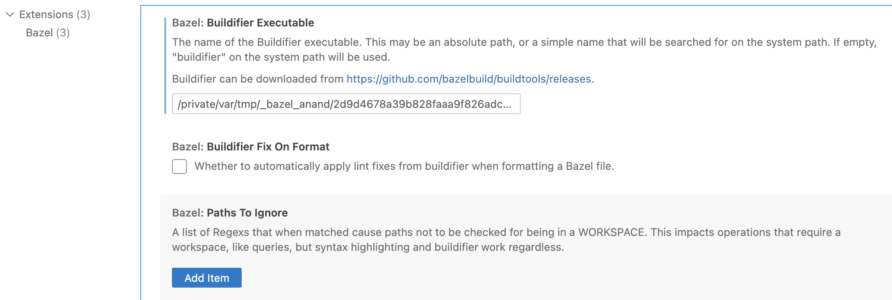

##### What is it

A linting/formatting tool for formatting Bazel files. Its a part of the [buildtools](https://github.com/bazelbuild/buildtools/tree/master) GH repo.

##### How to install it

Not too clear, but looks like - Clone the above repo, and the build the executable. It can be done by running the below command (there is also a way to install it using Go).

`````shell
bazel build //buildifier
bazel run //buildifier 
`````

The run command seems to have produced the executable here

`````
bazel-bin/buildifier/buildifier_/buildifier
`````

And then (not too clear, but) looks like the above exe can be used just like any other exe.

```shell
/private/var/tmp/_bazel_anand/2d9d4678a39b828faaa9f826adc4892a/execroot/buildtools/bazel-out/darwin_arm64-fastbuild/bin/buildifier/buildifier_/buildifier -r /Users/anand/Projects/iOS/Bazel/Mastodon
```

Add it to `PATH`. For example, if using zsh, add the below in .zprofile.

```shell
PATH="/private/var/tmp/_bazel_anand/2d9d4678a39b828faaa9f826adc4892a/execroot/buildtools/bazel-out/darwin_arm64-fastbuild/bin/buildifier/buildifier_:${PATH}"
```

> When using Visual Studio Code, I was repeatedly getting the below message - <br> <br>'Buildifier was not found; linting and formatting of Bazel files will not be available. Please download it from https://github.com/bazelbuild/buildtools/releases and install it on your system PATH or set its location in Settings.'
>
> It seems to have gone away after generating a Buildifier exe and configuring that in VSC's Bazel settings. <br> 