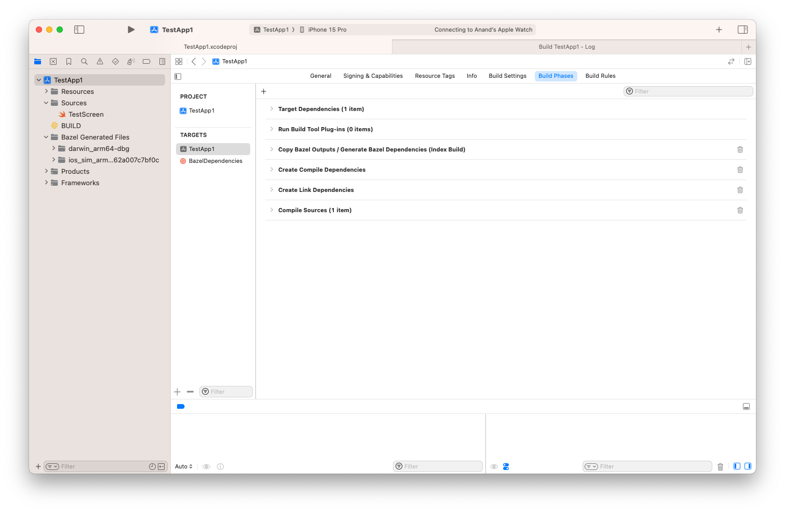

[toc]


([Reference](https://github.com/bazelbuild/rules_apple/blob/master/doc/tutorials/ios-app.md#update-the-workspace-file))

##### Create workspace file

In case of products meant for [Apple platform](https://github.com/bazelbuild/rules_apple/blob/master/doc/tutorials/ios-app.md#update-the-workspace-file), Bazel pulls the [Apple build rules](https://github.com/bazelbuild/rules_apple) from Bazel's GH repo. For that to happen, it has to be specified in the `WORKSPACE` file.

```
load("@bazel_tools//tools/build_defs/repo:http.bzl", "http_archive")

http_archive(
    name = "build_bazel_rules_apple",
    sha256 = "34c41bfb59cdaea29ac2df5a2fa79e5add609c71bb303b2ebb10985f93fa20e7",
    url = "https://github.com/bazelbuild/rules_apple/releases/download/3.1.1/rules_apple.3.1.1.tar.gz",
)

load(
    "@build_bazel_rules_apple//apple:repositories.bzl",
    "apple_rules_dependencies",
)

apple_rules_dependencies()

load(
    "@build_bazel_rules_swift//swift:repositories.bzl",
    "swift_rules_dependencies",
)

swift_rules_dependencies()

load(
    "@build_bazel_rules_swift//swift:extras.bzl",
    "swift_rules_extra_dependencies",
)

swift_rules_extra_dependencies()

load(
    "@build_bazel_apple_support//lib:repositories.bzl",
    "apple_support_dependencies",
)

apple_support_dependencies()

# The below is needed only if you also want to generate the xcodeproj
http_archive(
    name = "rules_xcodeproj",
    sha256 = "f5c1f4bea9f00732ef9d54d333d9819d574de7020dbd9d081074232b93c10b2c",
    url = "https://github.com/MobileNativeFoundation/rules_xcodeproj/releases/download/1.13.0/release.tar.gz",
)

load(
    "@rules_xcodeproj//xcodeproj:repositories.bzl",
    "xcodeproj_rules_dependencies",
)

xcodeproj_rules_dependencies()

load("@bazel_features//:deps.bzl", "bazel_features_deps")

bazel_features_deps()
```

##### Add source files and an Info.plist file

In a folder named Sources, add a Swift file that can be the entry point to the app (a simple SwiftUI file works too). Add a basic Info.plist file too.

##### Create build file

Create `BUILD` file with these contents. It loads appropriate rules, and then has project specs in `xcodeproj` part. There are also `swift_library` and `ios_application` rules to configure in those parts.

```
# The xcodeproj part here is needed only if you want to create an xcodeproj file
load(
    "@rules_xcodeproj//xcodeproj:defs.bzl",
    "top_level_target",
    "xcodeproj",
)

xcodeproj(
    name = "xcodeproj",
    build_mode = "bazel",
    project_name = "iOSApp",
    tags = ["manual"],
    top_level_targets = [
        ":iOSApp",
    ],
)

load("@build_bazel_rules_apple//apple:ios.bzl", "ios_application")
load("@build_bazel_rules_swift//swift:swift.bzl", "swift_library")

swift_library(
    name = "lib",
    srcs = glob(["Sources/*.swift"]),
)

ios_application(
    name = "iOSApp",
    bundle_id = "build.bazel.rules-apple-example",
    families = [
        "iphone",
        "ipad",
    ],
    infoplists = ["Resources/Info.plist"],
    minimum_os_version = "17.0",
    visibility = ["//visibility:public"],
    deps = [":lib"],
)
```

##### Build and run the app

A server is run on shell. This automatically launches the app in simulator. 

The commands basically do a build/run for the target having the specified name. So the build file may have several targets, the name helps identifying the specific one. 

```
bazel build //:iOSApp
bazel run //:iOSApp
```

##### Generate an Xcode project

To generate an xcodeproj file, the `xcodeproj` rule needs to be included in the BUILD file (there in the snippet above).

The standard steps however were not enough and there were errors, possibly due to missing specs for initial UI file, etc. An xcodeproj would help. Generated by adding more content in the workspace and build files (there in above snippet) and then running this.

```
bazel run //:xcodeproj
```

> I probably still had to edit the Info.plist to indicate there is no storyboard file.

The generated xcodeproj looks like this.

Build Phase - `$BAZEL_INTEGRATION_DIR/generate_bazel_dependencies.sh`<br>Build Phase - `Create swift_debug_settings.py`



##### Observations

Create WORKSPACE (make sure it has rules_xcodeproj), BUILD, Sources (add a .swift file), Resources (add an Info.plist file) - bazel build, bazel run - Works. No xcodeproj

Craete WORKSPACE (no rules_xcodeproj), BUILD (no xcodeproj references), Sources (add a .swift file), Resources (add an Info.plist file) - bazel build, bazel run.  - Works. No xcodeproj

Craete WORKSPACE (no rules_xcodeproj), BUILD (no xcodeproj references, no info.plist reference), Sources (add a .swift file), Resources (no Info.plist file) - bazel build - Does not work. Needs info.plist

##### Misc.

When a `BUILD` file changes, the xcodeproj must usually be regenerated using `xcodeproj`.  So, run 'bazel build' again?
