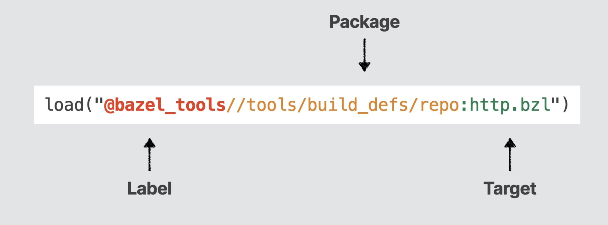

The `WORKSPACE` and `BUILD` files are written in a language known as [Starlark](https://github.com/bazelbuild/starlark/blob/master/spec.md#load-statements). Its a dialect of Python and is designed to be a configuration language for Bazel. 

##### load ([link](https://github.com/bazelbuild/starlark/blob/master/spec.md#load-statements))

Loads another Starlark module, extracts one or more values from it, and binds them to names in the current module.

```
load("@build_bazel_rules_swift//swift:swift.bzl", "swift_library")

swift_library(
    name = "lib",
    srcs = glob(["Sources/*.swift"]),
)
```

A load statement within a function is a static error.

> Not too sure if the nomenclature in below diagram from Kodeco tutorial is correct. But the 'label' below denotes the repo to use for locating the package, and then the target. Also, there will always be another argument to specify what values/symbols need to be extracted.


##### http_archive - ([link](https://bazel.build/rules/lib/repo/http#http_archive))

A rule in Bazel that downloads a Bazel repository as a compressed archive file, decompresses it, and makes its targets available for binding. Commonly used in WORKSPACE files.

```
load("@bazel_tools//tools/build_defs/repo:http.bzl", "http_archive")

http_archive(
    name = "build_bazel_rules_apple",
    sha256 = "34c41bfb59cdaea29ac2df5a2fa79e5add609c71bb303b2ebb10985f93fa20e7",
    url = "https://github.com/bazelbuild/rules_apple/releases/download/3.1.1/rules_apple.3.1.1.tar.gz",
)

load(
    "@build_bazel_rules_apple//apple:repositories.bzl",
    "apple_rules_dependencies",
)

apple_rules_dependencies()
```

> A typical sequence of boilerplate code in WORKSPACE files ☝️. Load a module using `load` and extract the `http_archive` function.  Use that function to download repositories like `build_bazel_rules_apple` and then load those modules to be able to extract functions like `apple_rules_dependencies` and the finally invoke those functions.

##### Misc.

