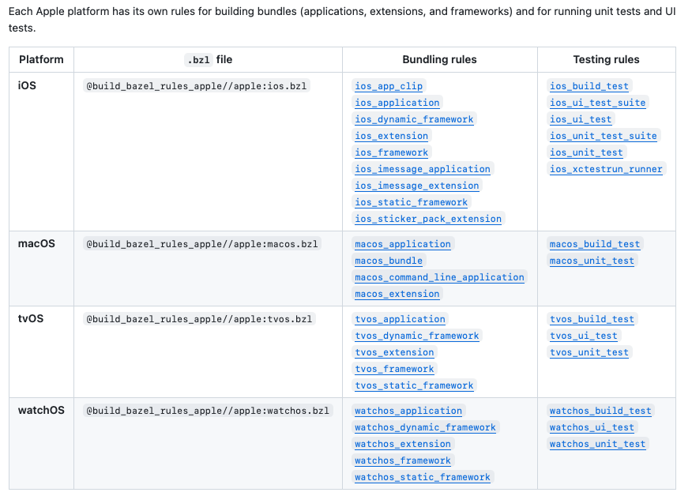
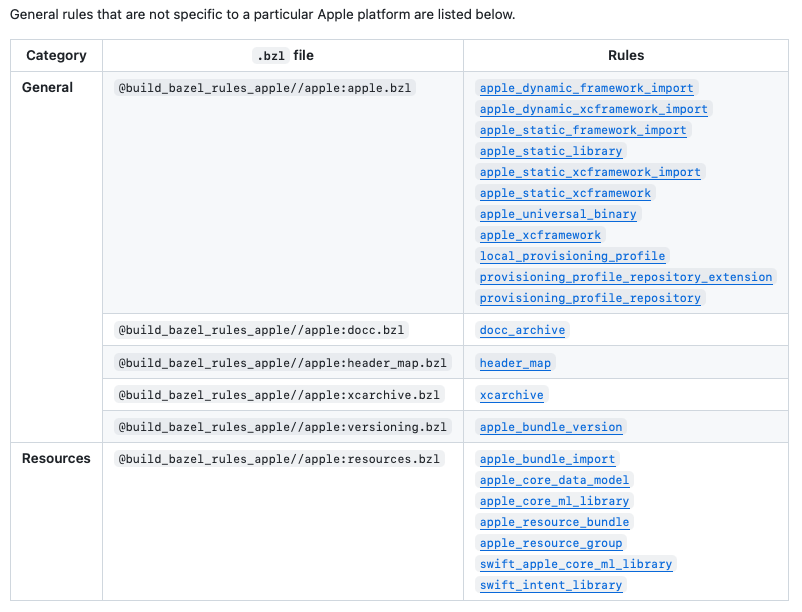
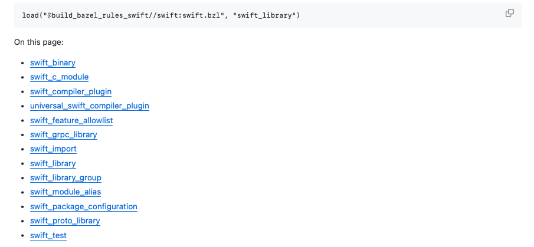

[toc]

#### rules_apple ([link](https://github.com/bazelbuild/rules_apple/tree/master))

A repo in bazelbuild that has rules for bundling applications (i.e. linking, bundling, etc.) for Apple platforms. [Here](https://github.com/bazelbuild/rules_apple/tree/master/doc#apple-bazel-definitions) are all the rules in this repo.

##### Platform specific rules 



##### General rules that apply to all Apple platforms



##### Specific examples

###### ios_application ([link](https://github.com/bazelbuild/rules_apple/blob/master/doc/rules-ios.md#ios_application))

Builds and bundles an iOS app. Has arguments for things like target's name, dependent targets that will need to be linked to this target, resurce files, devices it should support, etc.

###### `ios_dynamic_framework` ([link](https://github.com/bazelbuild/rules_apple/blob/master/doc/rules-ios.md#ios_dynamic_framework))

Builds and bundles an iOS dynamic framework. Has similar arguments as 'iOS_application'.

#### rules_swift  ([link](https://github.com/bazelbuild/rules_swift/tree/df21d3ff036c6e7d71e01aa14725d347c9b87c56))

A repo in bazelbuild that has rules for building Swift libraries, and executables. Here are the rules it has.



##### Specific examples

###### swift_library ([link](https://github.com/bazelbuild/rules_swift/blob/df21d3ff036c6e7d71e01aa14725d347c9b87c56/doc/rules.md#swift_library))

Compiles and links specified Swift code into a static library and Swift module.

###### swift_binary ([link](https://github.com/bazelbuild/rules_swift/blob/df21d3ff036c6e7d71e01aa14725d347c9b87c56/doc/rules.md#swift_binary))

Compiles and links Swift code into an executable binary. Mainly useful for creating Swift tools intended to run on the local build machine.

#### rules-ios ([link](https://github.com/bazel-ios/rules_ios))

A repo in bazel-ios to do Bazel builds on existing iOS applications already written in Xcode. Reuses plenty of ideas from rules_apple and rules_swift.

##### Specific examples

###### iOS_application

Creates an iOS app ([link](https://github.com/bazel-ios/rules_ios?tab=readme-ov-file#ios-applications))

###### xcodeproj ([link](https://github.com/bazel-ios/rules_ios?tab=readme-ov-file#xcode-project-generation))

Generates Xcode projecs that build with Bazel.

```
load("@build_bazel_rules_ios//rules:xcodeproj.bzl", "xcodeproj")

xcodeproj(
    name = "MyXcode",
    bazel_path = "bazelisk",
    deps = [ ":iOS-App"]
)
```

> [rules_xcodeproj](https://github.com/MobileNativeFoundation/rules_xcodeproj) was another Xcodeproj generator for Bazel that exisited outside rules_ios and is now being integrated in rules_ios.

###### apple_framework ([link](https://github.com/bazel-ios/rules_ios?tab=readme-ov-file#frameworks))

Can generate static or dynamic framework.

```
# Builds a static framework
apple_framework(
    name = "Static",
    srcs = glob(["static/*.swift"]),
    bundle_id = "com.example.b",
    data = ["Static.txt"],
    infoplists = ["Info.plist"],
    platforms = {"ios": "12.0"},
    deps = ["//tests/ios/frameworks/dynamic/c"],
)
```

