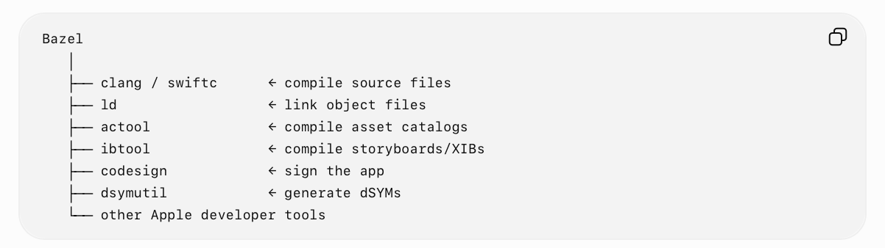
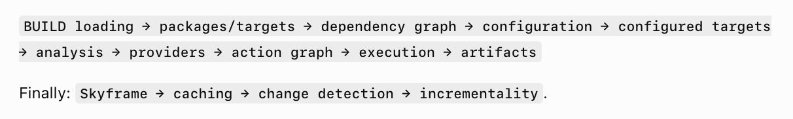
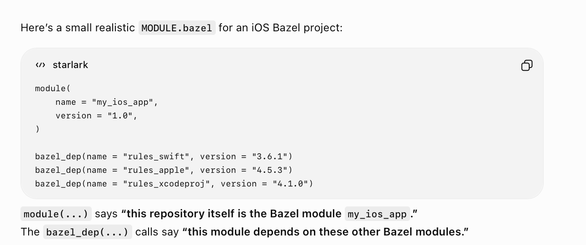
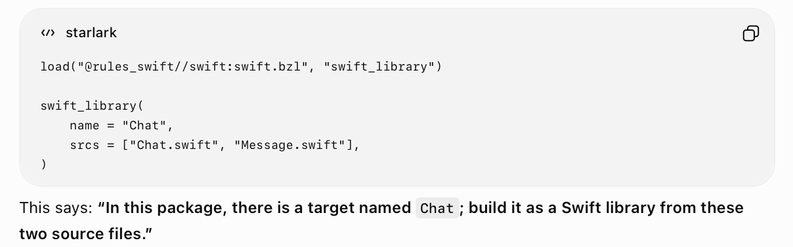

Apple's lower level toolchain directly.

Under the hood

**MODULE.bazel** - Describes a Bazel repository, and its dependencies. Inside this repository there might be multiple packages, and then multiple targets within any package. **bazel_dep()** is how dependencies for a module are specified.

**BUILD.bazel** - Defines the Bazel targets in a given package. **load()** imports Starlark symbols from another .bzl file into the current BUILD.bazel file.

**Toolchains** - The low level platform primitives that a rule can opt to use ([reference](https://bazel.build/extending/toolchains?utm_source=chatgpt.com)). For example, rules_swift has also defined a toolchain named **xcode_swift_toolchain.bzl** and inside this toolchain things like swiftc, etc. are specified as what to use for any complication.

##### Some common rules

**swift_library** - Compiles Swift source files into a reusable Swift library/module. ([reference](https://github.com/bazelbuild/rules_swift/blob/master/doc/rules.md?utm_source=chatgpt.com#swift_library))

**swift_binary** - Compiles and links Swift source code into an executable binary. ([reference](https://github.com/bazelbuild/rules_swift/blob/master/doc/rules.md?utm_source=chatgpt.com#swift_binary))

**ios_application** - Builds and bundles an iOS application, i.e. into a .app. ([reference](https://github.com/bazelbuild/rules_apple/blob/master/doc/rules-ios.md?utm_source=chatgpt.com#ios_application))

**xcodeproj** - Generates Xcode project from Bazel targets ([reference](https://github.com/MobileNativeFoundation/rules_xcodeproj/blob/main/docs/usage.md?utm_source=chatgpt.com)). Note that it also adds a `bazel build` command as a run script phase, so a Cmd R still uses bazel and not xcodebuild.