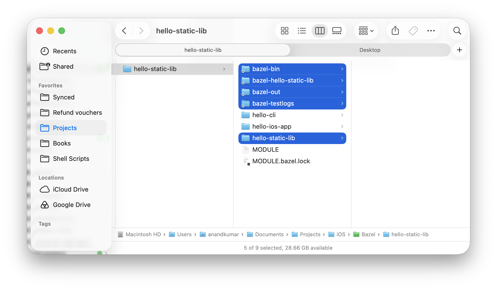
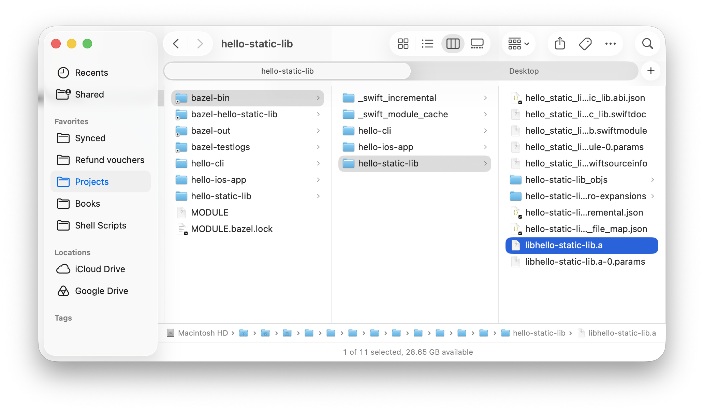
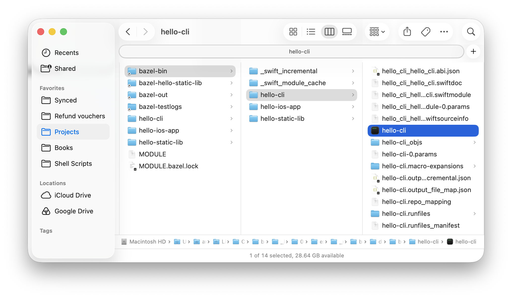
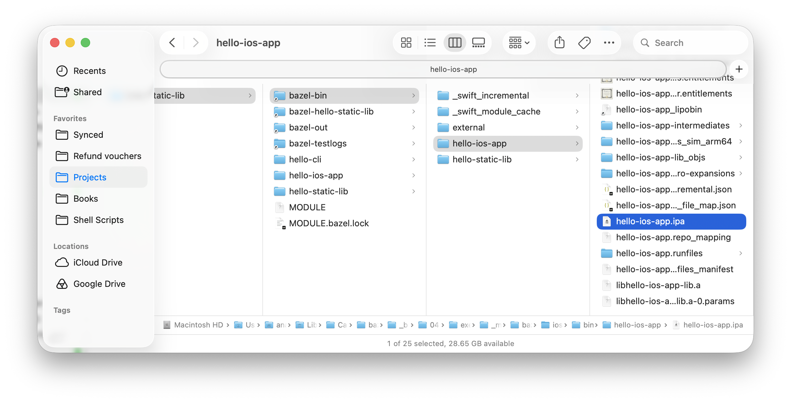
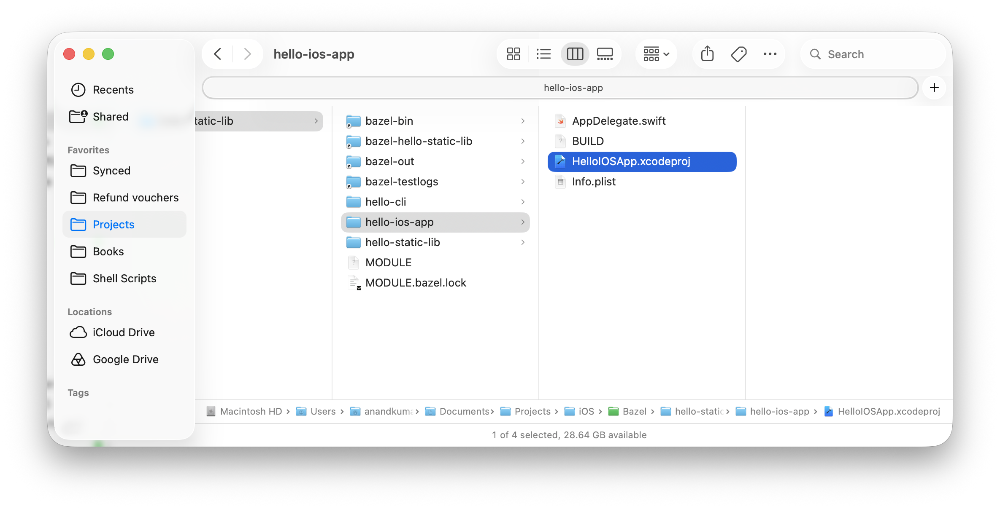

[toc]

##### Creating a static lib

Create the below folders and files

```
BazelAppleTutorial/
├── MODULE.bazel
└── hello-static-lib/
    ├── BUILD.bazel
    └── Hello.swift
```

Put the below code in Hello.swift

```
public func hello() -> String {
    "Hello from hello-static-lib"
}
```

Put the below in MODULE.bazel.

```
bazel_dep(name = "rules_swift", version = "3.6.1")
```

And the below in BUILD.bazel.

```
load("@rules_swift//swift:swift_library.bzl", "swift_library")

swift_library(
    name = "hello-static-lib",
    srcs = ["Hello.swift"],
    visibility = ["//visibility:public"],
)
```

And then run the bazel build from root.

```
bazel build //hello-static-lib:hello-static-lib
```

This creates a whole bunch of folders and there symlinks are placed in root. And probably also creates a MODULE.bazel.lock. The static lib (.a) itself gets placed in bazel-bin folder.

| Several folders get created                                  | Output in bazel-bin                                          |
| ------------------------------------------------------------ | ------------------------------------------------------------ |
|  |  |

##### Creating a CLI app that uses above lib

Create a folder structure for the CLI app.

```
hello-static-lib/
├── MODULE.bazel
├── hello-static-lib/
└── hello-cli/
    ├── BUILD.bazel
    └── main.swift
```

Put this in main.swift

```
import hello_static_lib_hello_static_lib
print(hello())
```

And this in BUILD.bazel. See how it has the static lib mentioned as a dependency.

```
load("@rules_swift//swift:swift_binary.bzl", "swift_binary")

swift_binary(
    name = "hello-cli",
    srcs = ["main.swift"],
    deps = ["//hello-static-lib:hello-static-lib"],
)
```

Run the bazel build.

```
bazel run //hello-cli:hello-cli
```

And that's it, the CLI app gets created.



##### Creating an iOS app that uses above lib

Add these to MODULE.bazel

```
bazel_dep(name = "rules_swift", version = "3.6.1")
bazel_dep(name = "rules_apple", version = "4.5.3")
```

Create this file structure.

````
hello-ios-app/
├── BUILD.bazel
├── AppDelegate.swift
└── Info.plist
````

Put this in BUILD.bazel.

```
load("@rules_swift//swift:swift_library.bzl", "swift_library")
load("@rules_apple//apple:ios.bzl", "ios_application")

swift_library(
    name = "hello-ios-app-lib",
    srcs = ["AppDelegate.swift"],
    deps = ["//hello-static-lib:hello-static-lib"],
)

ios_application(
    name = "hello-ios-app",
    bundle_id = "com.example.hello-ios-app",
    families = ["iphone"],
    infoplists = ["Info.plist"],
    minimum_os_version = "16.0",
    deps = [":hello-ios-app-lib"],
    visibility = ["//visibility:public"],
)
```

Put this in AppDelegate.swift (yes this too is functional code inspite of creating no VC)

```
import UIKit
import hello_static_lib_hello_static_lib

@main
class AppDelegate: UIResponder, UIApplicationDelegate {
    func application(_ application: UIApplication,
                     didFinishLaunchingWithOptions launchOptions: [UIApplication.LaunchOptionsKey: Any]?) -> Bool {
        print(hello())
        return true
    }
}
```

And this in Info.plist

```
<?xml version="1.0" encoding="UTF-8"?>
<!DOCTYPE plist PUBLIC "-//Apple//DTD PLIST 1.0//EN"
  "http://www.apple.com/DTDs/PropertyList-1.0.dtd">
<plist version="1.0">
<dict>
    <key>CFBundleName</key>
    <string>HelloIOSApp</string>
    <key>CFBundleShortVersionString</key>
    <string>1.0</string>
    <key>CFBundleVersion</key>
    <string>1</string>
</dict>
</plist>
```

And the do the bazel build

```
bazel build //hello-ios-app:hello-ios-app --ios_simulator_device="iPhone 17 Pro"
```

It generates the ipa.



The ipa then needs to be unzipped, simulator app opened, the app installed, and then run. And it does work.

```
unzip -q ../bazel-bin/hello-ios-app/hello-ios-app.ipa -d /tmp/hello-ios-app
Open Simulator app
xcrun simctl install booted /tmp/hello-ios-app/Payload/hello-ios-app.app
xcrun simctl launch booted com.example.hello-ios-app
```

##### Creating an xcode project for above iOS app

This requires rules_xcodeproj. Add it in MODULE.bazel.

```
bazel_dep(name = "rules_xcodeproj", version = "4.1.0")
```

And then add it in BUILD.bazel.

```
load("@rules_xcodeproj//xcodeproj:defs.bzl", "xcodeproj")

xcodeproj(
    name = "hello-ios-xcodeproj",
    project_name = "HelloIOSApp",
    top_level_targets = [":hello-ios-app"],
)
```

Make sure the visibility of ios_application rule in the BUILD.bazel is public.

```
ios_application(
    name = "hello-ios-app",
    ...
    visibility = ["//visibility:public"],
)
```

And then do a bazel run.

```
bazel run //hello-ios-app:hello-ios-xcodeproj
```

And that is it, an xcodeproject is indeed generated which can then be open and run (note that when run from Xcode, it will do its own build and not try to reuse any object files, etc. that bazel build generated).



##### Resources

ChatGPT tutorial ([link](https://chatgpt.com/g/g-p-6a3c8dbc95448191b06b36d292074647-bazel/c/6a777e22-ad00-83ea-bd4b-cfe6efcdd005)) <br>

Sample code -  <br>Bazel/hello-static-lib/hello-static-lib <br>Bazel/hello-static-lib/hello-ios-app