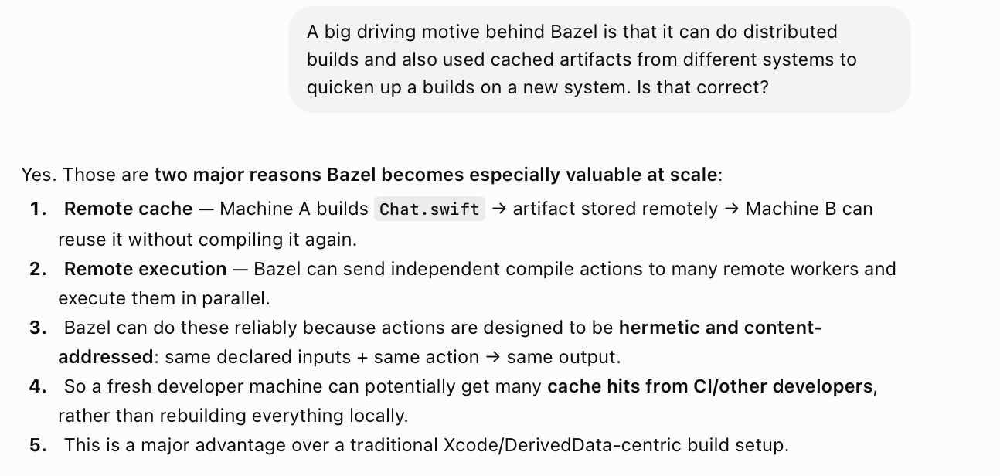
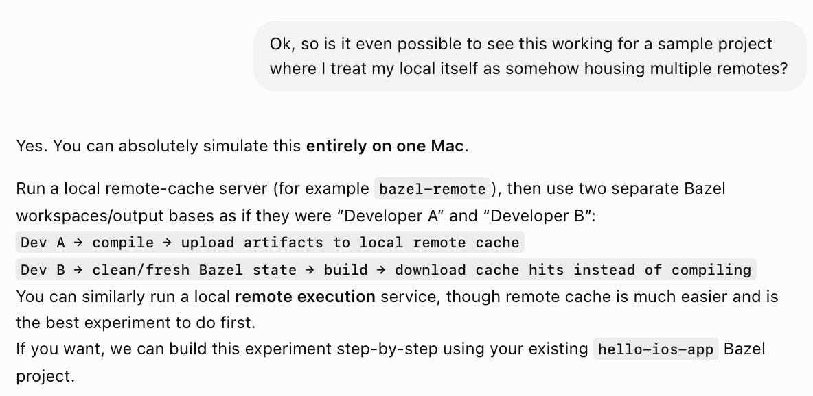

Bazel is capable of using caches from multiple remotes for a given build, and also for distributing a build process to multple remotes. Yet to try it though, but it can indeed be simulated on one local.

[ChatGPT link](https://chatgpt.com/g/g-p-6a3c8dbc95448191b06b36d292074647-bazel/c/6a77f895-1478-83ea-9472-9d52a835e961)