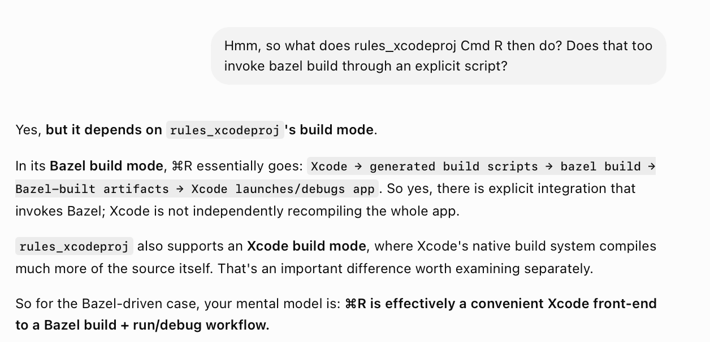
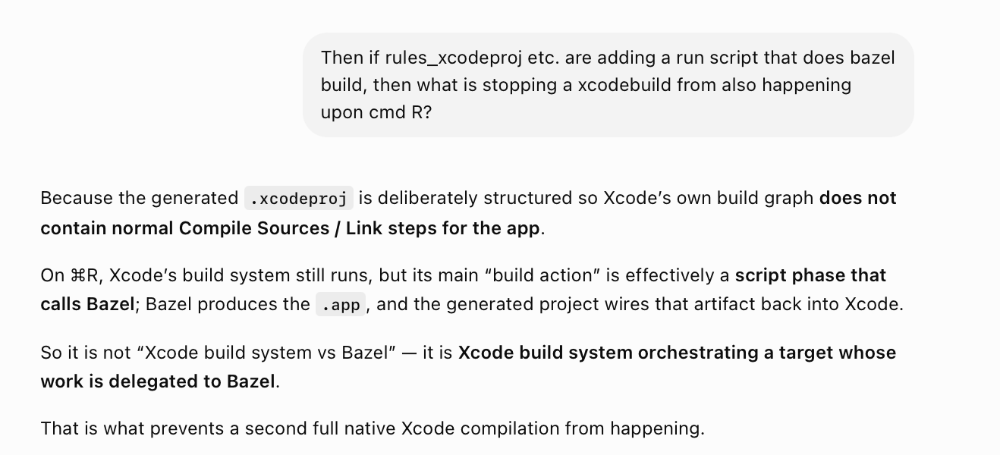
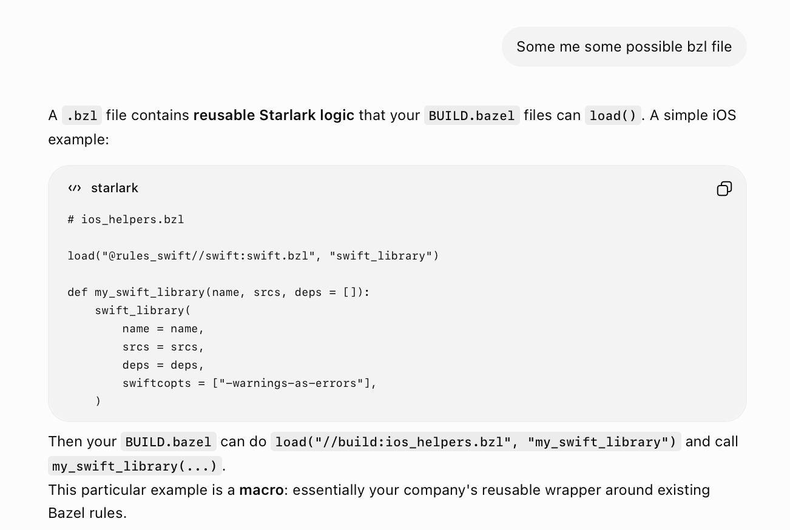
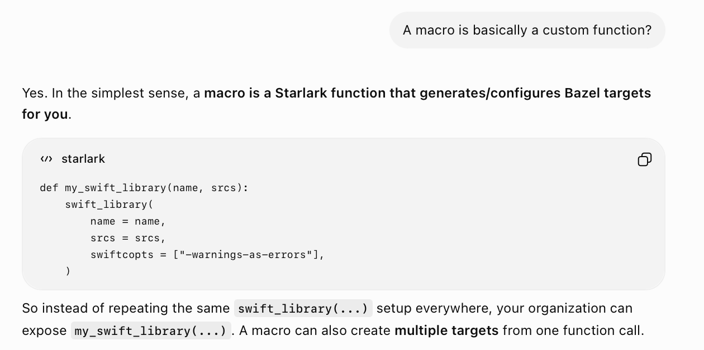
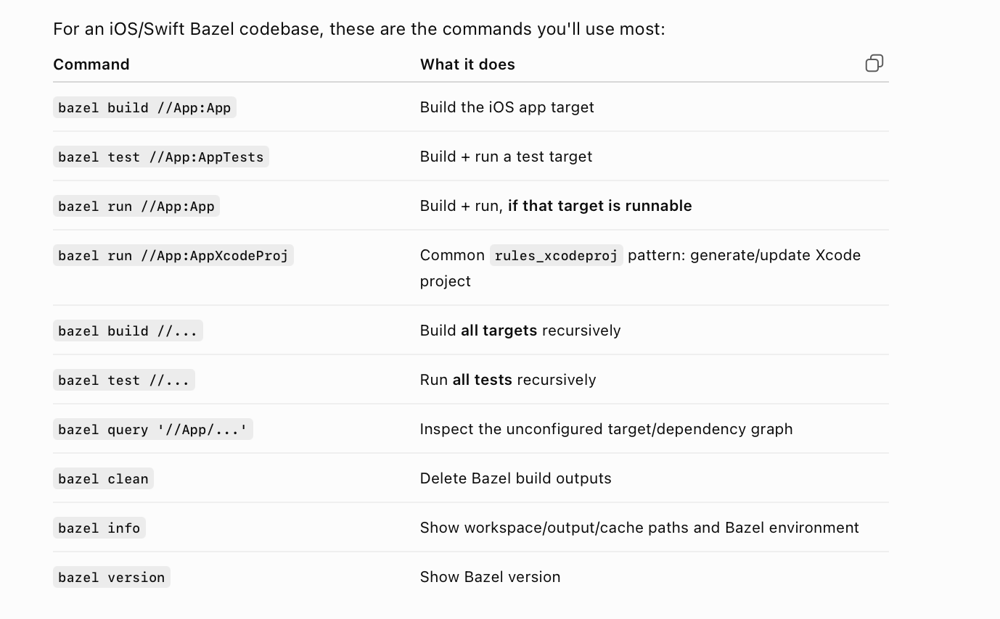
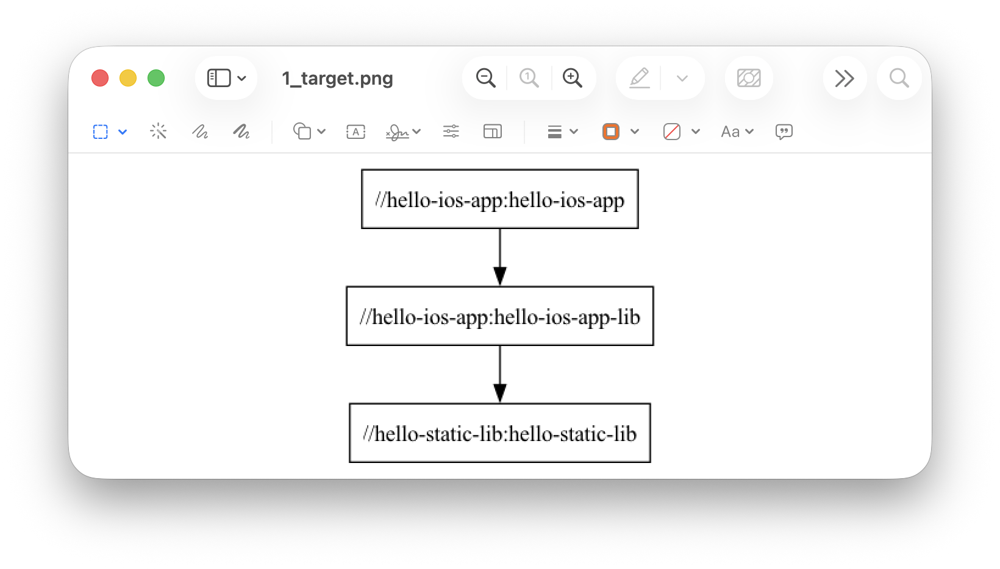
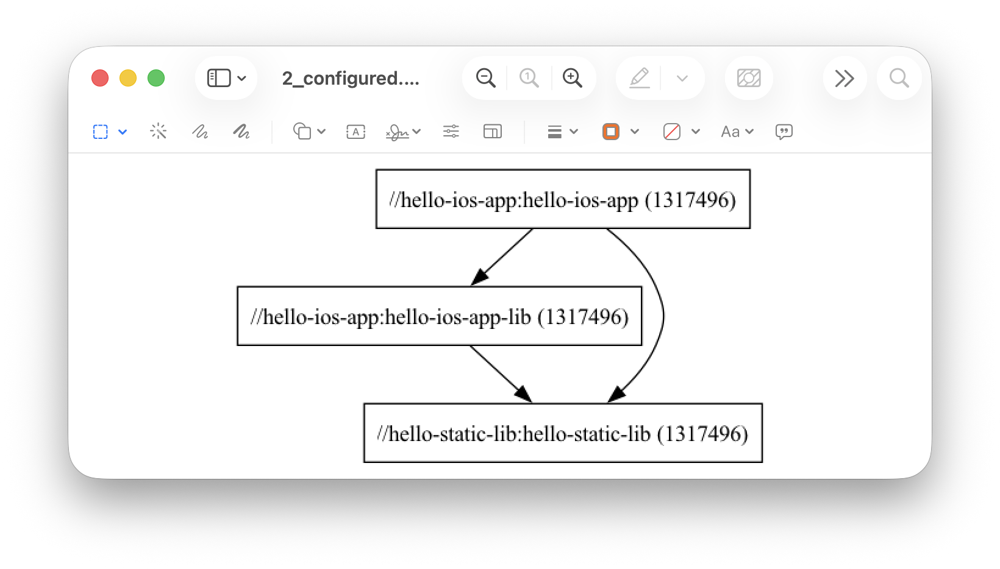

[toc]

##### Generating Xcode projects

When it comes to generating Xcode projects through Bazel, there have been 3 solutions over time. Tulsi (Google's) > Tulsi (Pinterest's) > rules_xcodeproj (Google's). 

Note that even with the generated Xcodeproject, doing a Cmd R still uses `bazel build` and not `xcodebuild`. That is because, 1. they actually remove all the files from Compile Sources in Xcode thereby making xcodebuild irrelevant, and then 2. there is a run script phase that then uses bazel build. And somehow with all this debugger still works.





[ChatGPT link](https://chatgpt.com/g/g-p-6a3c8dbc95448191b06b36d292074647/c/6a777d17-cdc8-83ea-99f5-3fc10fa2a964)

##### Bazelisk

A version manager for Bazel. Like rbenv or rvm are for Ruby.

**.bazelrc**

A config file where you put some default Bazel command-line options so that you don't have to provide them repeatedly. Its usually placed in root. Here is a sample bazelrc file.

```
build --apple_platform_type=ios
build:simulator --ios_multi_cpus=sim_arm64
build:device --ios_multi_cpus=arm64
test --test_output=errors
```

**.bzl**

Your own reusable Starlark code goes here - custom rules, macros, helpers.



##### Macros

Custom functions, that's it. Which can then be called from different places i.e. BAZEL.build, etc.



##### Common Bazel commands

Its things such as `bazel build`, `bazel test`, `bazel run`, etc.



##### Generating pngs for various graphs

The basic idea is to use certain bazel commands for generating `.dot` files (a graphviz format that you need to install using Homebrew, etc.) and then converting it to a png.

For Target Graph - Use **bazel query** (Note that if //.. is not used it will get resursive even for system libs and will be too noisy.)

```
bazel query 'deps(//hello-ios-app:hello-ios-app) intersect //...' \
  --output=graph > simple.dot

dot -Tpng simple.dot -o simple.png
```



For Configured Targets graph - Use **bazel cquery**

```
bazel cquery 'deps(//hello-ios-app:hello-ios-app) intersect //...' --output=graph > configured.dot
dot -Tpng configured.dot -o configured.png
```



For Actions Graph - Use **bazel aquery**, but this does not support output=graph, so you'd need to convert it to a jsonproto, and then make a DOT from it. Yet to try it.

```
bazel aquery 'deps(//hello-ios-app:hello-ios-app)' --output=jsonproto > actions.json
dot -Tpng actions.dot -o actions.png
```

##### Resources

ChatGPT Bazel project (link) <br>1. Build systems basics ([link](https://chatgpt.com/g/g-p-6a3c8dbc95448191b06b36d292074647-bazel/c/6a3c90dc-1640-83ea-b27c-7aff8864f5c0)) <br>2. Bazel fundamentals ([link](https://chatgpt.com/g/g-p-6a3c8dbc95448191b06b36d292074647-bazel/c/6a69709a-95dc-83ea-8ef5-17c40a3a2b62)) <br>3. Bazel build - phases ([link](https://chatgpt.com/g/g-p-6a3c8dbc95448191b06b36d292074647-bazel/c/6a76b48c-1f0c-83ea-bcf0-a55157156c1b)) <br>5. Bazel - iOS ecosystem ([link](https://chatgpt.com/g/g-p-6a3c8dbc95448191b06b36d292074647-bazel/c/6a777d17-cdc8-83ea-99f5-3fc10fa2a964)) <br>Bazel iOS hands-on tutorial ([link](https://chatgpt.com/g/g-p-6a3c8dbc95448191b06b36d292074647-bazel/c/6a777e22-ad00-83ea-bd4b-cfe6efcdd005))
