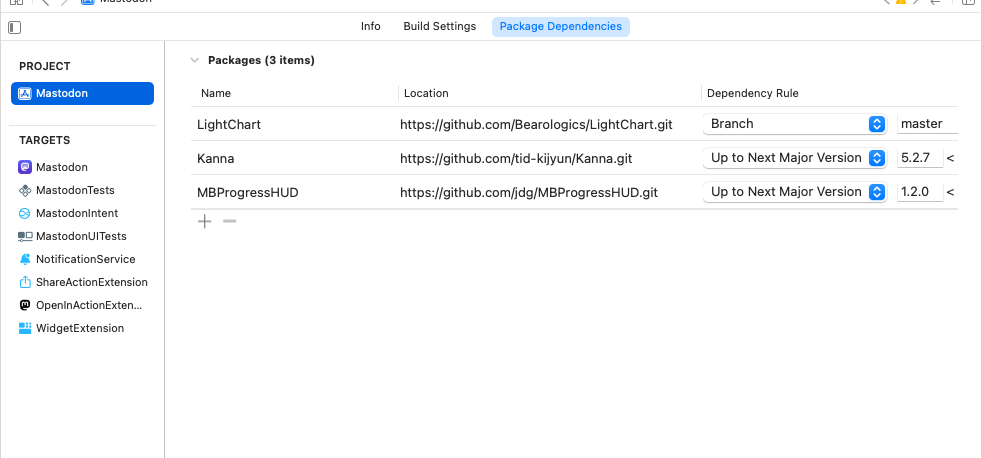
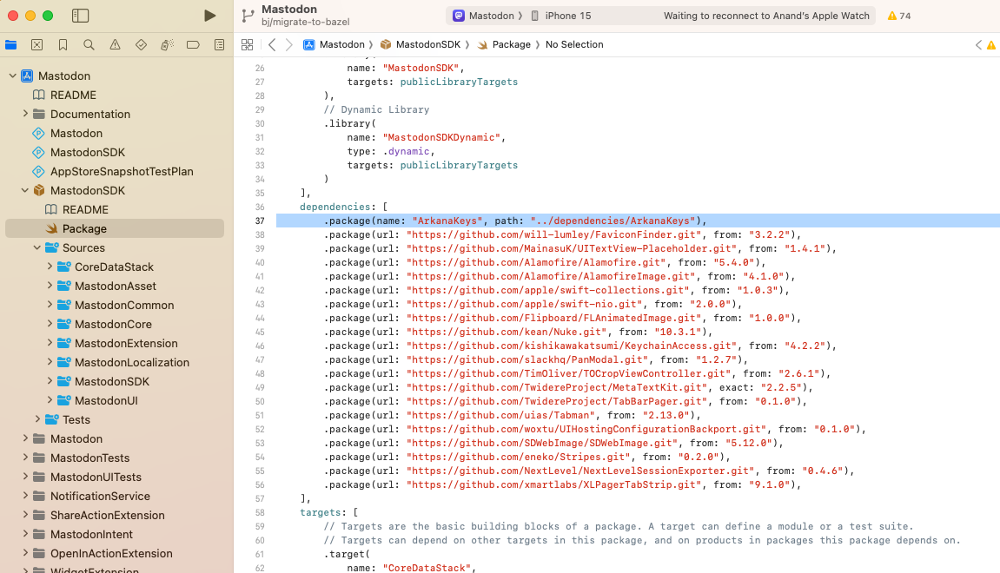
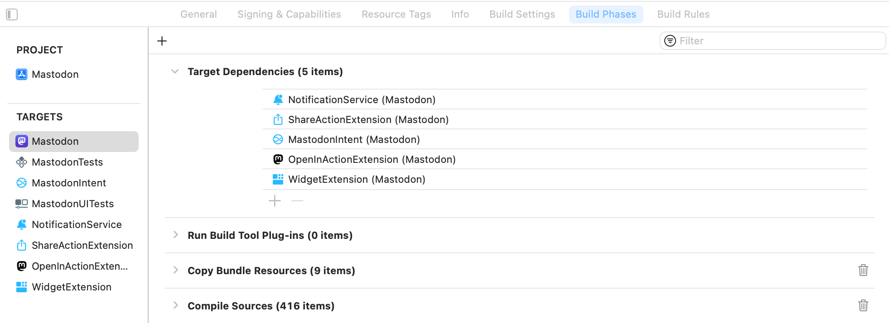
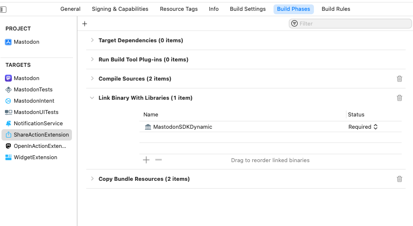
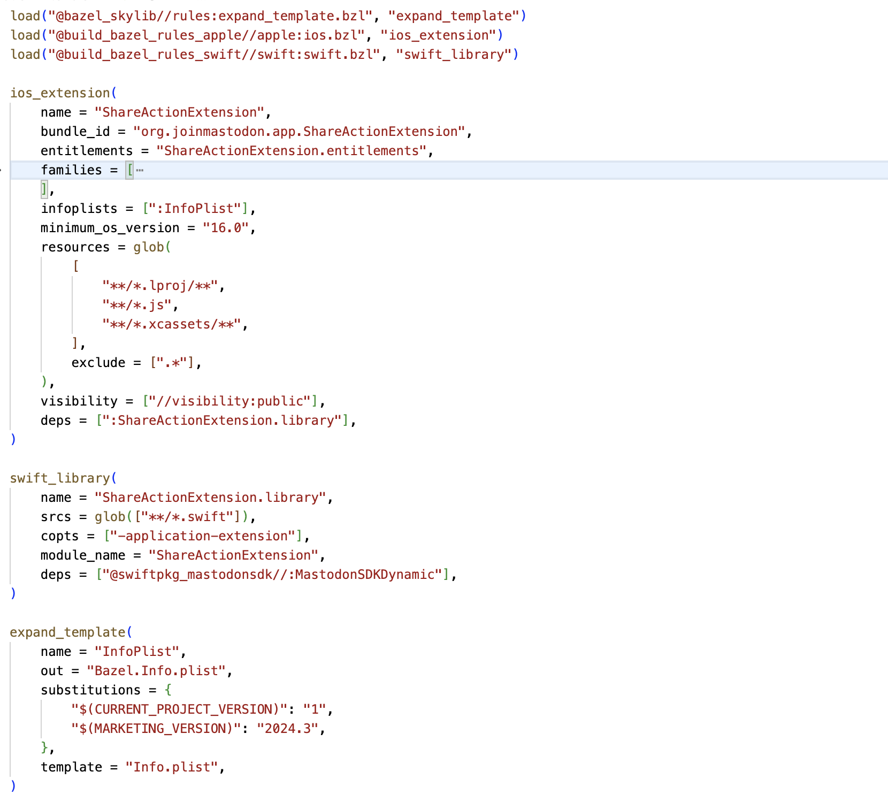
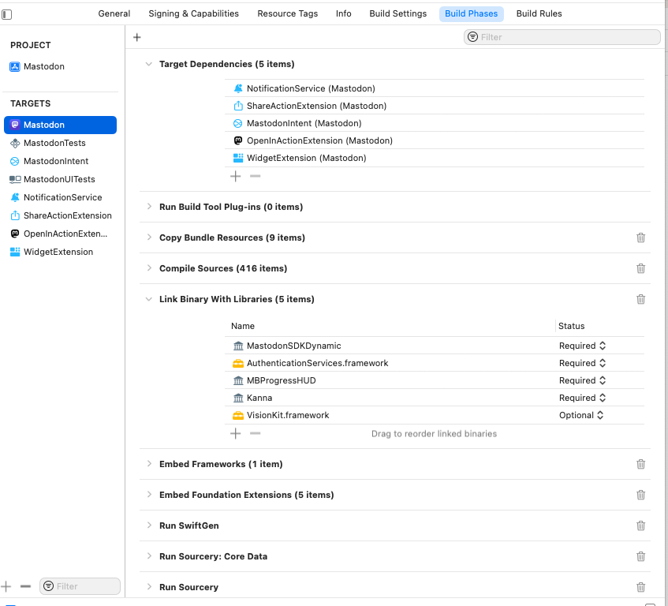

[toc]

#### Handling Swift Package dependencies (`rules_swift_package_manager`)

The actual project has these dependencies.

| Declared Package Dependencies                                | Local SDK (MastodonSDK) which in turn depends on another local dependency (ArkanaKeys) |
| ------------------------------------------------------------ | ------------------------------------------------------------ |
|  |  |

Swift package dependencies are supported using `rules_swift_package_manager` ([link](https://github.com/cgrindel/rules_swift_package_manager)).  

This rule requires all Swift package dependencies to be declared in a `Package.swift` file. So a 'Package.swift' file needs to be created and all of these 3 dependencies as well as any local SDKs that project has need to be put in that. Mastodon code has a 'MastodonSDK' embedded in it too which in turn has a dependency on other local package named ArkanaKeys. So the Package.swift file will need to have 5 dependencies (and no 'product' in it).

##### Create `Package.swift`

So all those 5 package dependencies need to be in there in the Package.swift.

`````
// swift-tools-version:5.7

import PackageDescription

let package = Package(
    name: "Mastodon-iOS",
    defaultLocalization: "en",
    platforms: [
        .iOS(.v16),
    ],
    dependencies: [
        .package(name: "ArkanaKeys", path: "Dependencies/ArkanaKeys"),
        .package(name: "MastodonSDK", path: "MastodonSDK"),
        .package(
            url: "https://github.com/Bearologics/LightChart.git",
            branch: "master"
        ),
        .package(
            url: "https://github.com/jdg/MBProgressHUD.git",
            from: "1.2.0"
        ),
        .package(
            url: "https://github.com/tid-kijyun/Kanna.git",
            from: "5.2.7"
        ),
    ]
)
`````

##### Update MODULE.bazel (add Gazelle too)

 `rules_swift_package_manager` actually requires something known as `Gazelle` ([link](https://github.com/bazelbuild/bazel-gazelle)) so the below need to be specified in MODULE.bazel (if using Bazelmod). Note that even all the dependencies need to be specified here. And a `swift_deps_index.json` file too needs to be mentioned.

`````
bazel_dep(name = "rules_swift_package_manager", version = "0.28.0")
bazel_dep(name = "gazelle", version = "0.35.0")

# swift_deps START
swift_deps = use_extension(
    "@rules_swift_package_manager//:extensions.bzl",
    "swift_deps",
)
swift_deps.from_file(
    deps_index = "//:swift_deps_index.json",
)
use_repo(
    swift_deps,
    "swiftpkg_arkanakeys",
    "swiftpkg_arkanakeysinterfaces",
    "swiftpkg_kanna",
    "swiftpkg_lightchart",
    "swiftpkg_mastodonsdk",
    "swiftpkg_mbprogresshud",
)
# swift_deps END
`````

##### Add targets in root BUILD file

And then the Gazelle targets need to be put in root BUILD file.

`````
load("@gazelle//:def.bzl", "gazelle", "gazelle_binary")
load(
  "@rules_swift_package_manager//swiftpkg:defs.bzl",
  "swift_update_packages",
)

gazelle_binary(
    name = "gazelle_bin",
    languages = [
        "@rules_swift_package_manager//gazelle",
    ],
)

swift_update_packages(
    name = "swift_update_pkgs",
    gazelle = ":gazelle_bin",
    generate_swift_deps_for_workspace = False,
    patches_yaml = "patches/swiftpkgs.yaml",
    update_bzlmod_stanzas = True,
)

gazelle(
    name = "update_build_files",
    gazelle = ":gazelle_bin",
)
`````

##### Generate `swift_deps_index.json` by running a target

And then the `swift_deps_index.json` file needs to be generated, which can be done using below command. This also updates the MODULE.bazel file.

`````
bazel run //:swift_update_pkgs
`````

> Package.swift <br>MODULE.bazel (`use_extension`,  `swift_deps.from_file`, `use_repo`) <br>BUILD (`gazelle_binary`, `swift_update_packages`, `gazelle`)

#### Handling app extensions

The actual project has 5 app extensions.



>  rules_apple doesn't use build settings. What does that mean, that standard build settings can't be set or that xcconfigs can't be used?

Let's take the 'ShareActionExtension' extension as an example. In the actual xcodeproj, it has just one dependency listed, i.e. 'MastodonSDKDynamic'.



##### `ios_extension` rule, source code in a lib using `swift_library` rule

It gets translated to Bazel this way in a BUILD file that's put in the extension's source code folder. First `ios_extension` rule is used to define an iOS extension, the bundle ID, entitlements, etc configured in it but then for the source code its not put directly in it and instead another library created for all the source code using `swift_library` rule and then this library declared as a dependency for the iOS extension. The swift library does specify the `-application-extension`  in its`copts` flags. 

Also, the library declares MastodonSDKDynamic lib as a dependency. See how the actual xcode project too has it, and hence its been translated here.

> The static library rule needs to have `-application-extension` (for Swift) or` -fapplication-extension` (for Objective-C) copt set.



##### Using xcconfig variables

Not too sure but it looks like `rules_apple` does not substitute most of the standard build setting variables it finds in Info.plist and entitlements file. There are some attributes on bundling rules that rules_apple will substitute in place of a build setting, such as bundle_id for 'PRODUCT_BUNDLE_IDENTIFIER', but usually it does not and hence build setting references mostly need to be removed from Info.plist and entitlements files.

#### Handling main application target

The main app target in the actual project looks like this.



#### Misc

`copt` - A flag passed by Bazel to compiler while working with C, C++, or assembler code. ([reference](https://bazel.build/docs/user-manual#tool-flags), [SO link](https://stackoverflow.com/a/50414313))