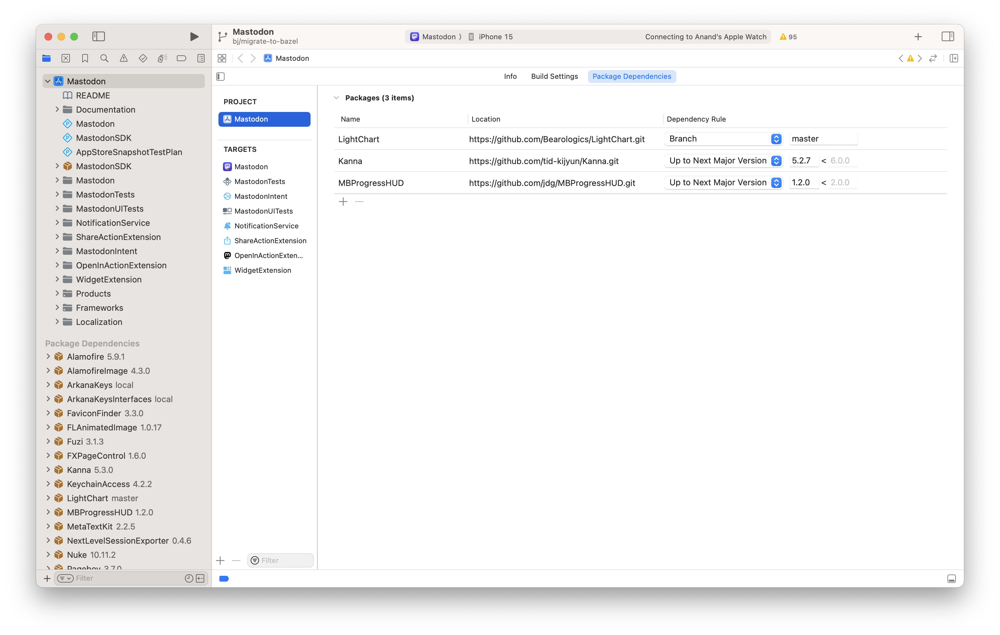

##### Compiling Mastodon's iOS code

~ 2024 Mar

Needed for the Buildbuddy tutorial ([source code link](https://github.com/mastodon/mastodon-ios/blob/develop/Documentation/Setup.md)).

Have Homebrew installed, and then.

```swift
brew install swiftgen
brew install sourcery
```

Have Rbenv installed and configured

```swift
# install the rbenv
brew install rbenv

# configure the terminal
which ruby
# > /usr/bin/ruby
echo 'eval "$(rbenv init -)"' >> ~/.zprofile
source ~/.zprofile

# Also, setup $PATH (check Rbenv notes)

which ruby
# > /Users/mainasuk/.rbenv/shims/ruby
```

And then

```swift
rbenv install
bundle install
```

Finally setup Arkana (important, this is what creates required Arkana dependencies folder. Without this Swift packages will not load).

```swift
bundle exec arkana -e ./env/.env
```

Open xcproject, it will load the dependencies.

