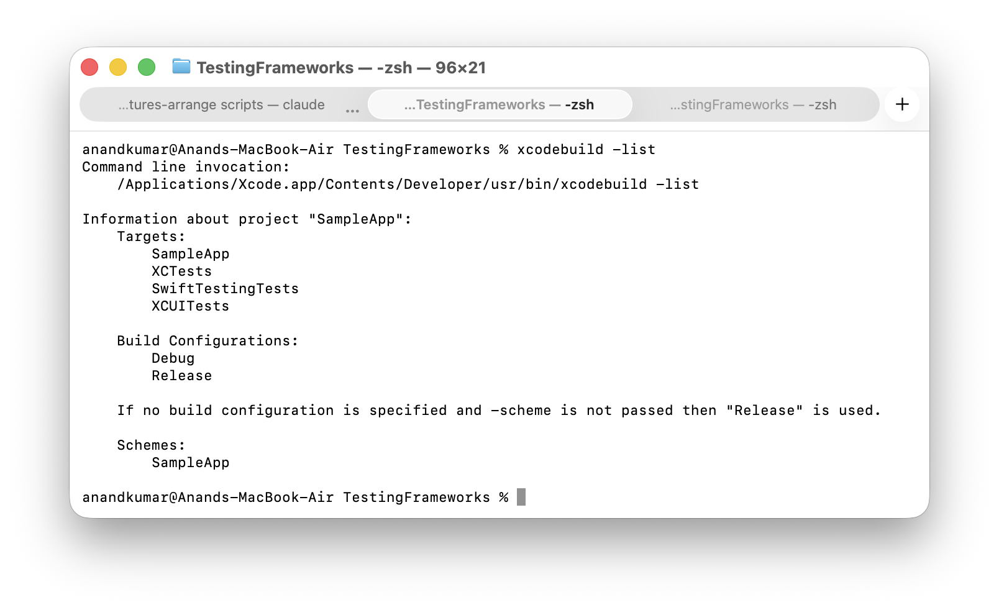
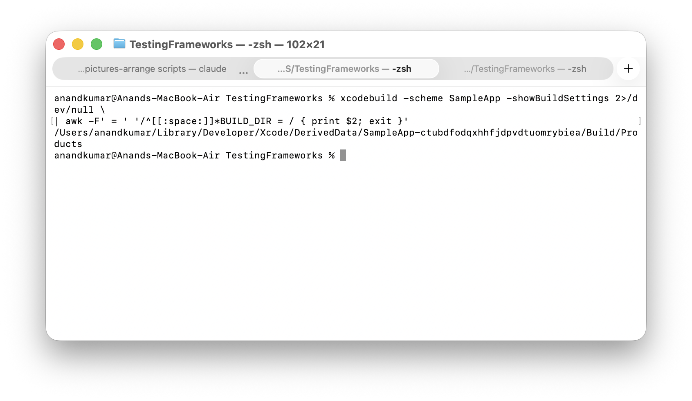

##### Get a list of all targets and schemes

```
xcodebuild -list
```



##### Get the derived data folder

Its important to pass the **-scheme** otherwise you will not get the accurate value. Use **-showBuildSettings** to print all build settings of the scheme and then use **awk** to extract the derived data folder.

```
xcodebuild -scheme <SCHEME_NAME> -showBuildSettings 2>/dev/null \
| awk -F' = ' '/^[[:space:]]*BUILD_DIR = / { print $2; exit }'
```



##### Old: Building a project (`xcodebuild`)

For building a workspace (which will be the case with projects built using Cocoapods)
```
xcodebuild -workspace "Enterprise.xcworkspace" -scheme Enterprise build
```

Outputting the logs to a file or to clipboard (these are just UNIX things)
```
xcodebuild -workspace "Enterprise.xcworkspace" -scheme Enterprise build >> Log.txt
xcodebuild -workspace "Enterprise.xcworkspace" -scheme Enterprise build | pbcopy
```

###### Various options

`sdk` Specifies which SDK to use for building.
```
xcodebuild -sdk "iphonesimulator" -scheme Sandbox build
```
> But shouldn't sdk also include the iOS version somewhere

`showBuildTimingSummary` shows the time taken for each of the build phases (but not the time it takes to build each of the files).

```
xcodebuild -showBuildTimingSummary -sdk "iphonesimulator" -scheme Sandbox build
```

`destination` specifies the run destination.
```
xcodebuild -scheme Sandbox -destination "platform=iOS Simulator,name=iPhone 11 Pro Max" build
```