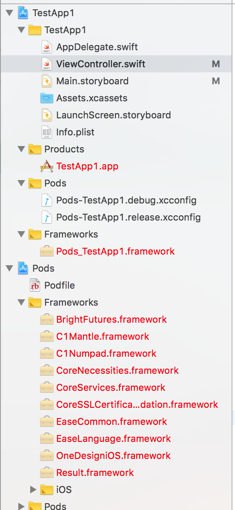
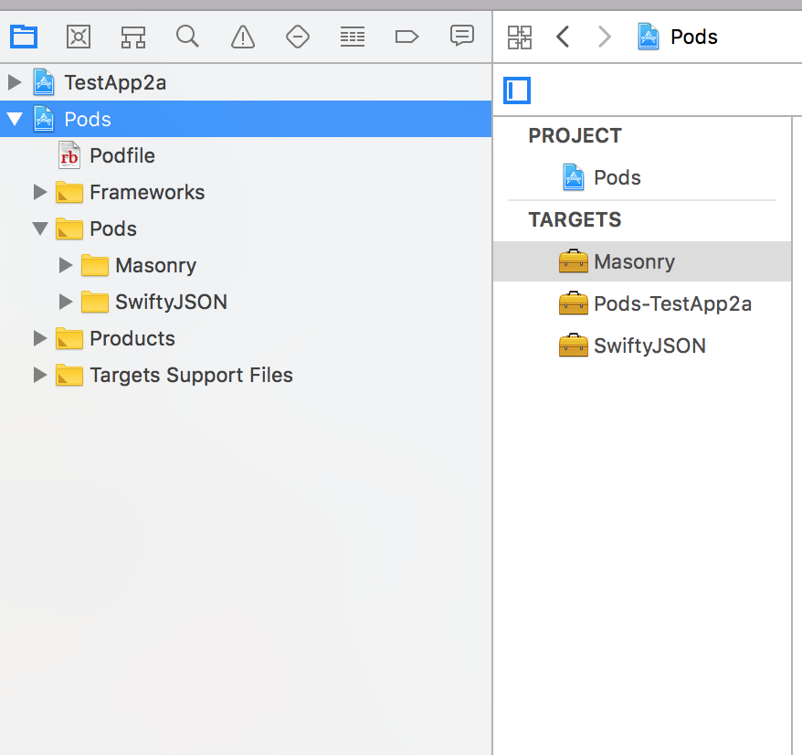
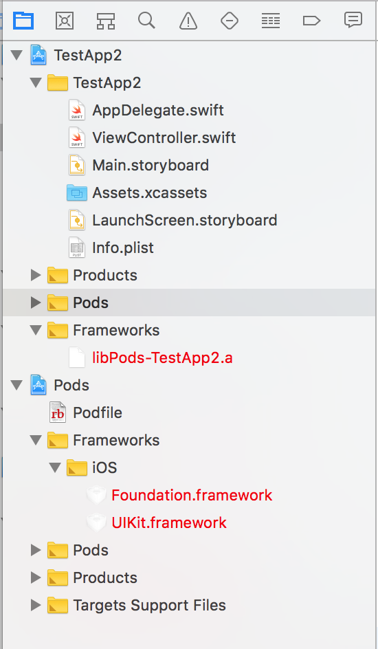
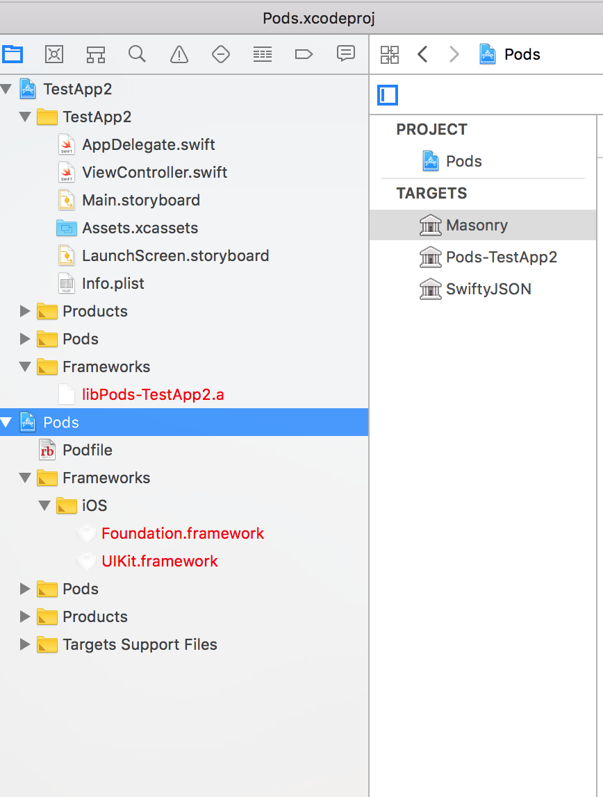
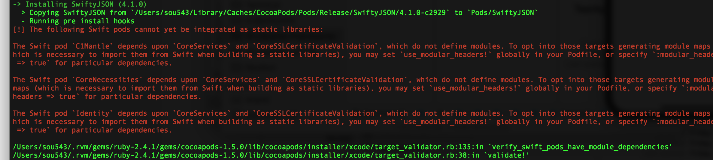

##### use_frameworks! -

Causes the dependencies to be added as frameworks instead of static libraries.

###### How I tested it

*** | *** | *** | ***
--- | --- | --- | ---
Added 3 frameworks with flag `use_frameworks!` in `podfile`.   Hence, as shown below the concerned target has everything included as `Pods_TestApp1.framework`. | Adding the dependencies as frameworks.    As expected, they show up as frameworks in the `Pods.xcproj` portion of the project navigator. | Added 2 frameworks without flag `use_frameworks!` in `podfile`.   Hence, as shown below the concerned target has everything included as `libPods_TestApp2.a`. | Adding the dependencies as libraries.   This causes them to  show up as libraries in the pod portion of the project navigator.
 |  |  | 

Added 3 frameworks without flag `use_frameworks!` in `podfile`. One of them was indeed a framework with assets included. Two of its further dependencies caused the error -

> The following Swift pods cannot yet be integrated as static libraries: The Swift pod `Identity` depends upon `CoreServices` and `CoreSSLCertificateValidation`, which do not define modules.     How to get past it?

