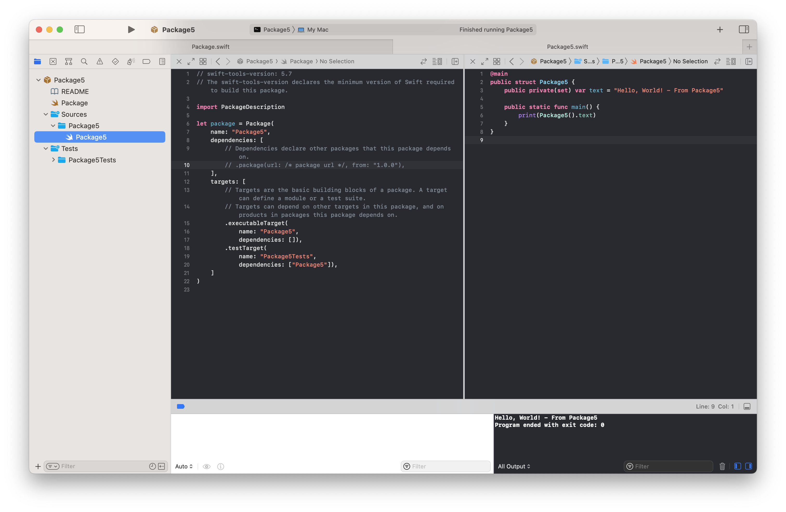
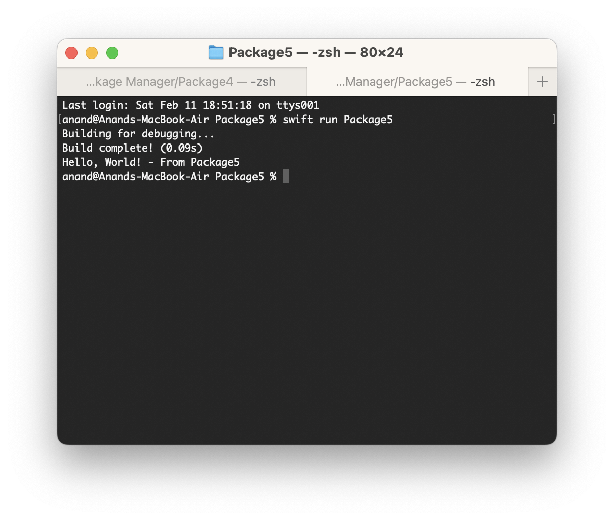
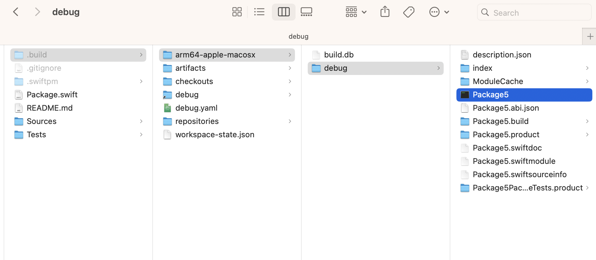

[toc]

#### Using the macOS executable built with SPM

##### Running from Xcode

It can be simply run from Xcode using 'Cmd + R'.

##### Running using `swift run` command

A more real way of using it is actually running the exe is by simply doing a `swift run ExecutableName` from the SPM repository root.

##### Running the raw exe

The raw exe actually gets created and saved in a directory such as `.build/arm64-apple-macosx/debug/`. It can then be run like any normal executable, i.e. either by double clicking it or by typing its fully qualified name in shell (or if its already in `$PATH` then by simply typing its name).

