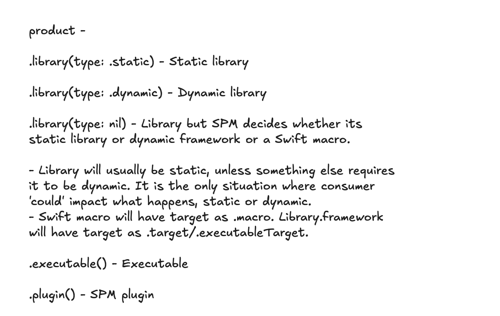
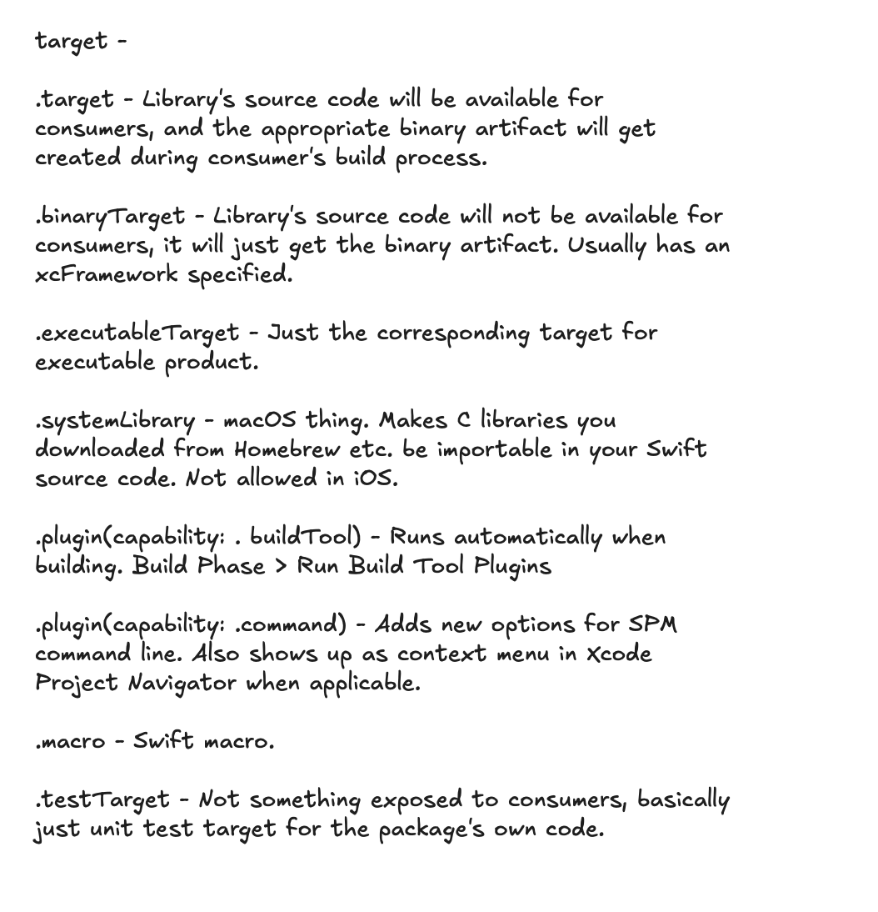
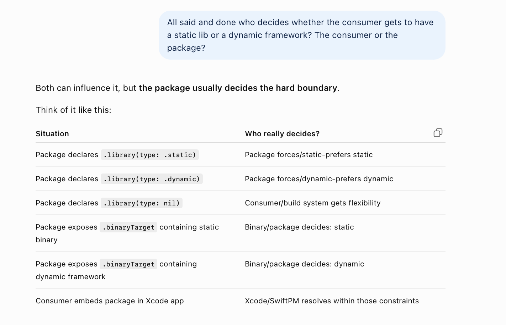
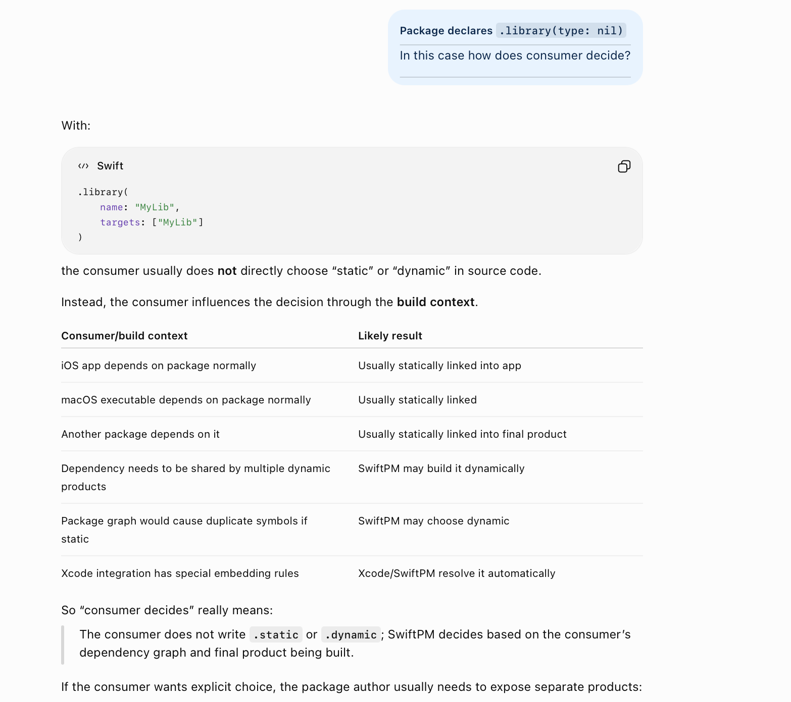

##### products

What gets producted. Be careful though, invariably you have to look at 'products + targets' to know what is actually getting produced.

##### targets

A build-able piece in the package build system, has a lot of influence on what gets eventually produced.

##### Package or Consumer - Who decides static or dynamic linking

Its usually the package.

When can consumer decide.

##### Resources

targets and products ([ChatGPT main](https://chatgpt.com/g/g-p-6a92357133908191bd26a40dc7c1a8dd-xcodegen-spm/c/6a944216-2cac-83ea-abc4-1bc467a57c6a), [ChatGPT companion](https://chatgpt.com/g/g-p-6a92357133908191bd26a40dc7c1a8dd-xcodegen-spm/c/6a944b05-0170-83ea-ae26-377e66b086e0))