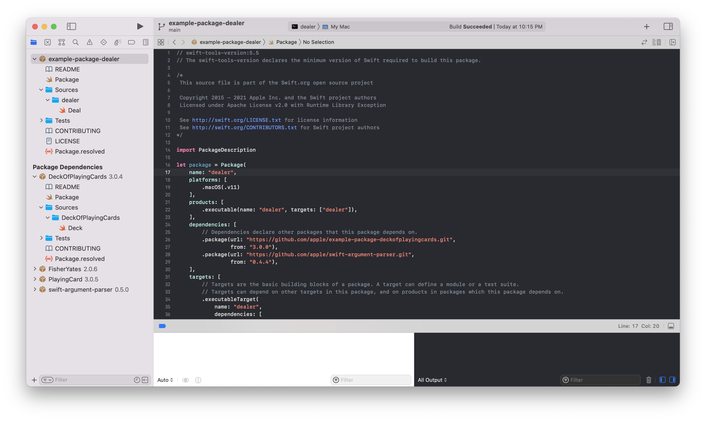
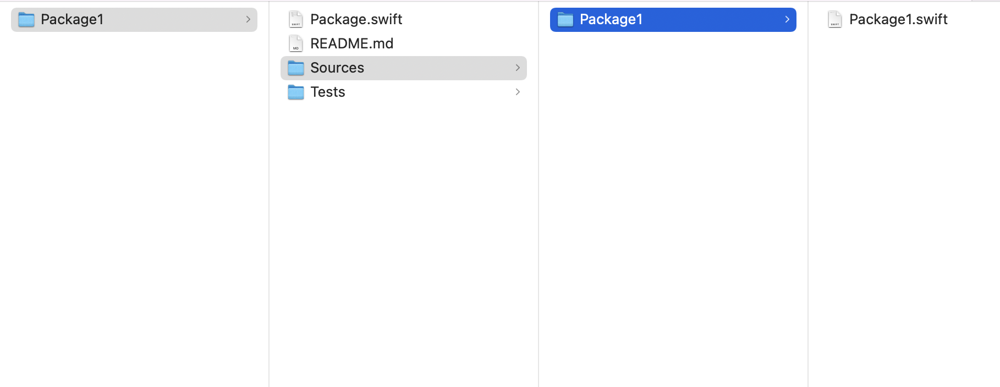
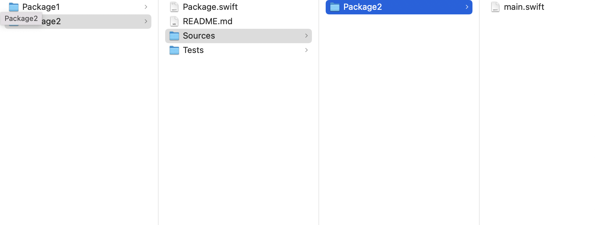
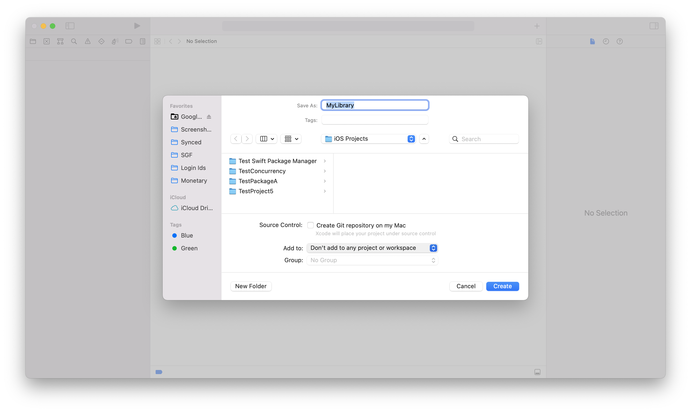
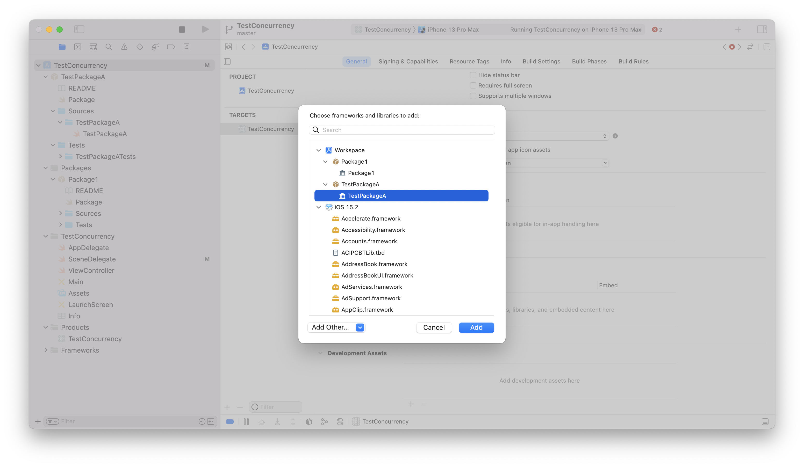
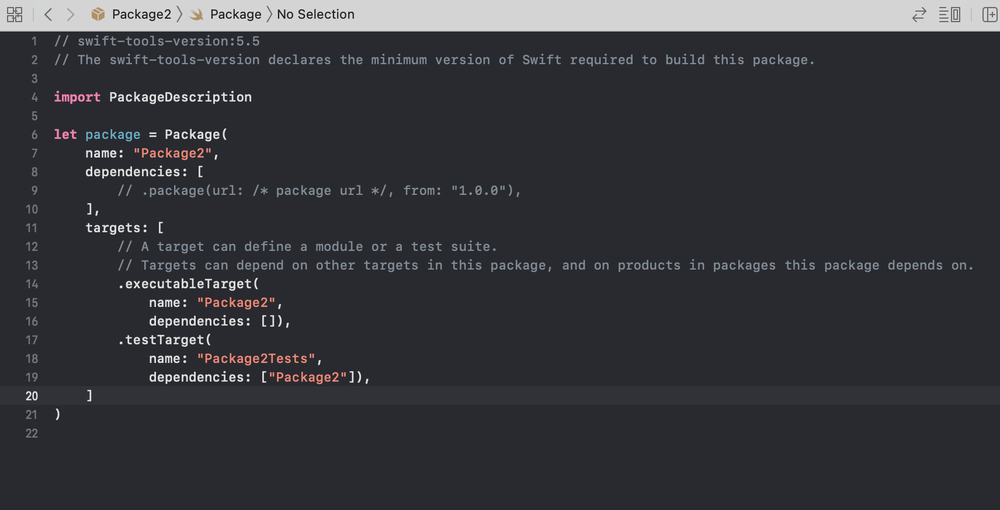
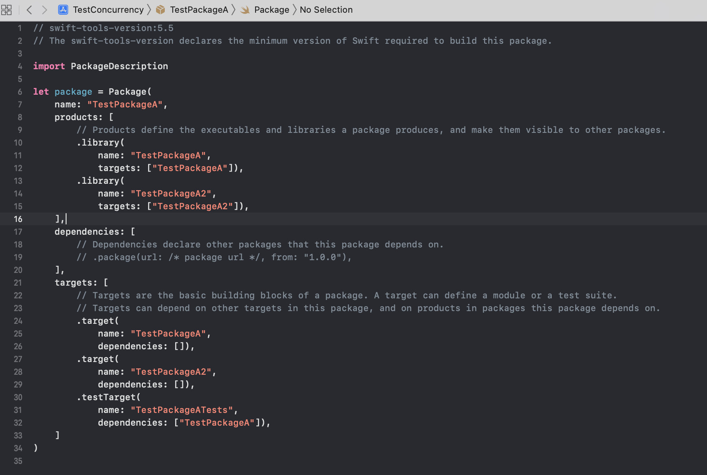
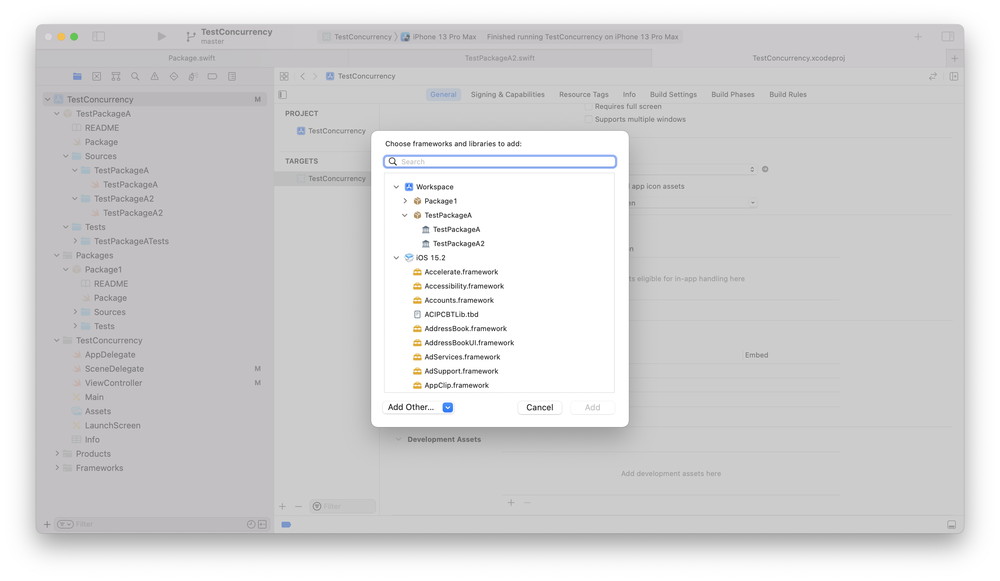
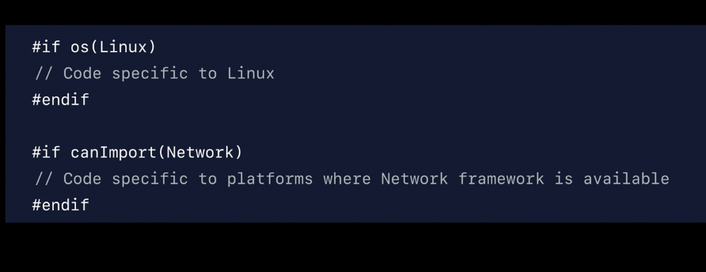
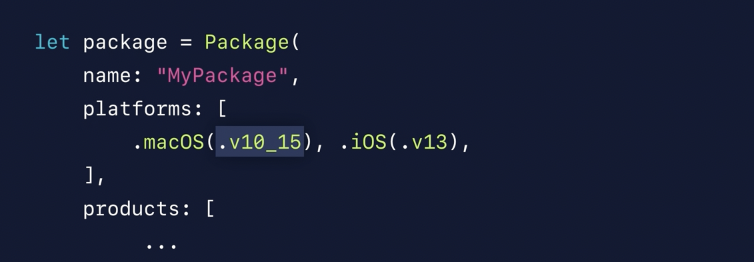

[toc]

##### What is Swift Package Manager

`Swift Package Manager` allows to create static/dynamic libraries (but not frameworks?), executables (i.e. applications), plugins (i.e. SPM plugins) and manage the dependencies automtically.

Basic Commands

```
swift package init <--type xyz> (Initializes a new package)
swift build                     (Build code into a new product, i.e. library?)
swift run xyz <arguments>       (Builds and runs an executable product)
swift test											(Builds and runs tests)
swift package update
```

The peculiar thing about Swift Package Manager is that it seems to do away with xcodeproj and its visual interface altogether. When I open a project that is using Swift Package Manager, it looks like this. No xcodeproj, build phases, embedded binaries, etc.

Just opening the Package.swift file too opens the entire package btw.



##### Creating and building a package

There are at least 3 types of packages that can be created.
1. library
2. executable
3. system module

`swift package init` is the command used to create a new package. By default it creates a library, but if the argument `--type executable` is passed it creates an executable (i.e. a (command line?) app) instead. Library is also what gets used to create a SPM plugin.

File system created with library package | File system created with executable package
--- | ---
 | 

Another possible type is `system-module` and it creates a modulemap, Package.swift and a Readme.md.

It is also possible to create a new package using Xcode menu option 'File > New > Package'. While doing this, it can also be specified if the package should automaticaly get added in any existing project/respository too (the checkbox in the 'create package' modal). Therefater for actually using the package in that project though, the package should still be added in the repository's 'Frameworks, Libraries, and Embedded Content' though.

Menu option to create new package | Add package in consuming repo's framework/libs/embedded content
--- | ---
 | 

`CommandLine.arguments` is how command line arguments can be accessed in a command line tool.

`swift build` builds the package.

`swift run xyz <arguments>` runs the xyz package. If no package name is specified, it runs the only available package. If arguments are to be given, package name has to be specified too.

`swift test` runs the tests for the package.

###### When is a target considered to be an excutable

A target is considered as an executable if it contains a file named `main.swift`. The package manager will compile that file (just that file?) into a binary executable. (But then the test executable I created worked fine without it too, there did however need to be a `main()` inside a file that has the same name as the intended executable name.)

###### Manifest file

`Package.swift` is known as a package's manifest file and it contains all the information regarding the package. That is things like its name, list of dependencies, its targets, etc.



There can be multiple targets, with each target specifying a product.

##### Exposing multiple modules through a single package

A single package can create multiple modules (i.e. libs, etc.) if needed.

The manifest file, needs to have corresponding targets and products. And then when used in a consumer app, they literally show up as two different modules.

Manifest file | While importing
--- | ---
 | 

In the file system, each target should have its own sub-directory.

##### Specifying version number while publishing

Version numbers for a package to be published are specified using git tags.

```
$ git commit -m "Initial Commit"
$ git tag 1.0.0
```

Prerelease versions can also be used. Such versions are typically used for testing before cementing the corresponding final version. They typically look like `5.0.0-beta.1` (the '-beta1' there to be precise). If a cosumer specifies a prerelease version though (typically done by specifying an exact version). Once a newer stable version is released it automatically gets downloaded, but the version should be manualy updated to not have prerelease identifier anymore.

##### Packages are platform independent while developing

Swift packages are always platform independent. If some platform specific code needs to be included, it can be done using conditional compilation.



However the products generated by platform can be limited for specific platforms. This is done using `platforms` argument, and not actually `products` argument.



> Say `.macOS(.v14)` is listed in manifest but the Swift tools version listed in the beginning does not recognize that, in such a case explicit string (`.macOS`("10.14")) versions can also be used.

##### Misc.

SwiftPM does not allow executing arbitrary commands, or shell scripts, as part of the build. This makes it easier for SwiftPM to understand the package's build graph.
