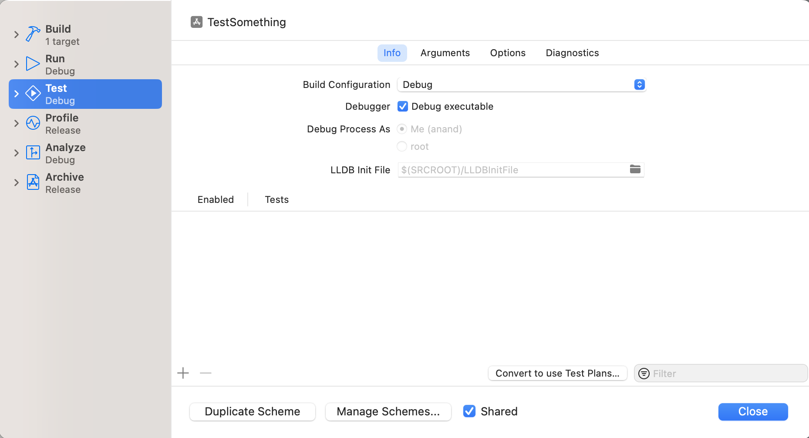
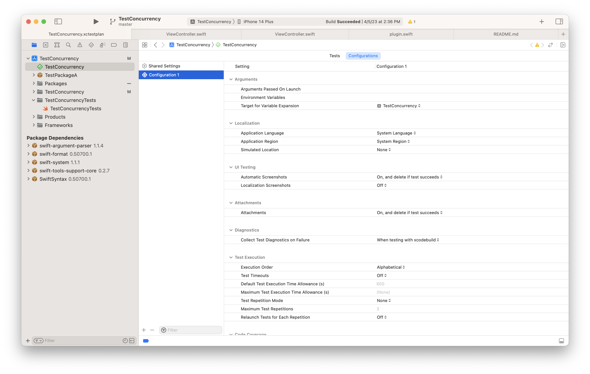
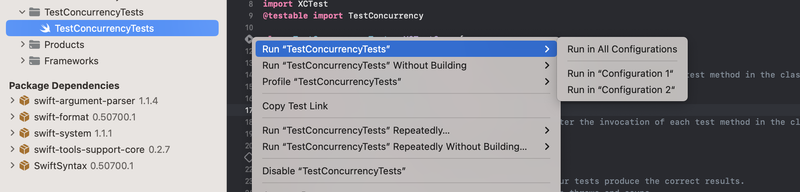
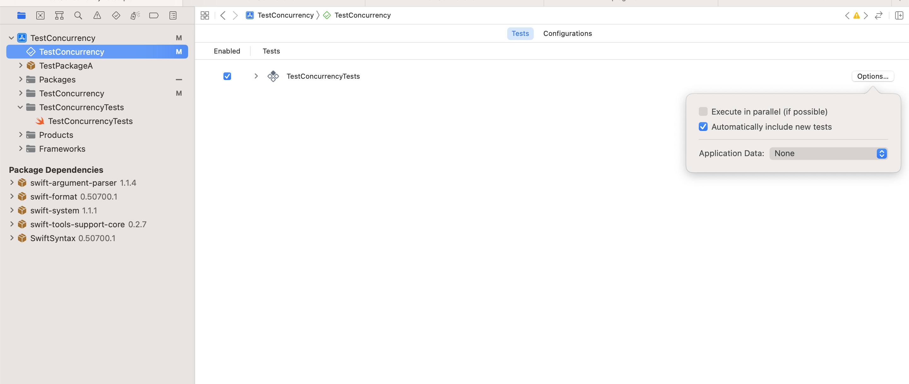
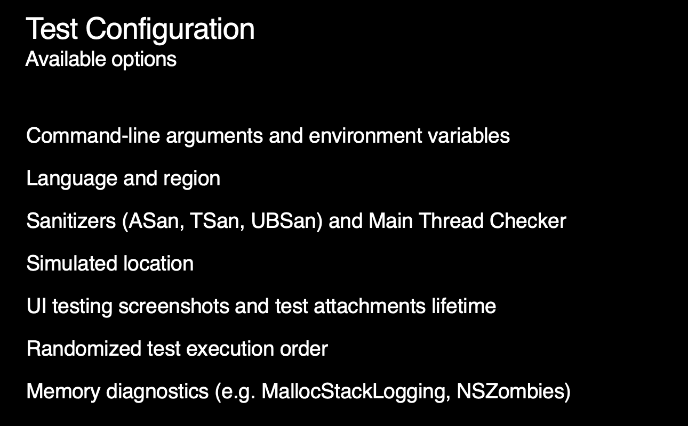

[toc]

##### Opting for test plans in scheme's test action settings

Test Plans (`.xctestplan` files) are a newer thing (introduced sometime around 2019?). They are an alternate to old fashion test targets. They make it possible to run a set of test plans instead of set of tests when a target's test action is run.

And one test plan can have tests from multiple test targets. Further there can be multiple configurations associated with a test plan and tests run once each for all the specified configurations.

Test plans can in fact even be shared between multiple schemes.


For targets that don't use the older UI is shown, with there being an option to 'Convert to use Test Plans'. There is also a menu option `Product > Scheme > Convert Scheme to use Test Plans` to move existing test targets to testplan.



Note how a scheme's test action settings UI looks dramatically different depending on whether test plans are being used or not. 

##### Testplan document

The testplan document looks like this.


Internally its just a json file.

##### Configurations

Configurations have options to specify commonly used things like environment variables, launch arguments, current localization language, current location, using address sanitizer, code coverage, etc. 

> Previously most of these things were specifiable in scheme's test settings Argument and Options tabs. But of course there could just be one set for a given test target.

'Shared Settings' is where all the default options shared by all the configurations in a given test plan resides. Any setting of 'Shared Settings' can be overridden in the individual configuration. Keep in mind that any option can setting be changed right withing 'Shared Settings' in which case it then starts serving as the new default.



If a test plan has multiple configurations tied to it, by default the tests are run in all the configurations. However, when run directly from the test file configurations can be selectively used (this can also be done in the Test Navigator using the context menu on any test).



Its also possible to state that the tests in a given target of a given testplan, should be run in parallel.



List of things that can be set in a test configuration (as of 2019).



##### Command line options

Listing all test plans in a given scheme.

```
$ xcodebuild -scheme SchemeName -showTestPlans
Test plans associated with the scheme "ToDo":
        UnitTest
        FullTests
        PerfTests
```

Run a specific test plan in a given simulator.

```
$ xcodebuild test -scheme SchemeName 
  -destination 'platform=iOS Simulator,OS=13.3,name=iPhone 8'
  -testPlan PerfTests
```

Build for testing.

```
$ xcodebuild build-for-testing
-project MyProject.xcodeproj
-scheme MyScheme
-destination 'platform=iOS,name=My iPhone'
```

Test without building. 

>  Does it mandatorily need a xctestrun, how to get it (checkWWDC 2019: Testing in Xcode at around 45:00 mark. )

```
$ xcodebuild test-without-building 
-xctestrun MyProject.xctestrun 
-destination 'platform=iOS,name=My iPhone'
```


##### Useful resources

[WWDC 2019: Testing in Xcode](https://developer.apple.com/videos/play/wwdc2019/413/)<br>[UseYourLoaf article (link)](https://useyourloaf.com/blog/xcode-test-plans/)<br>
