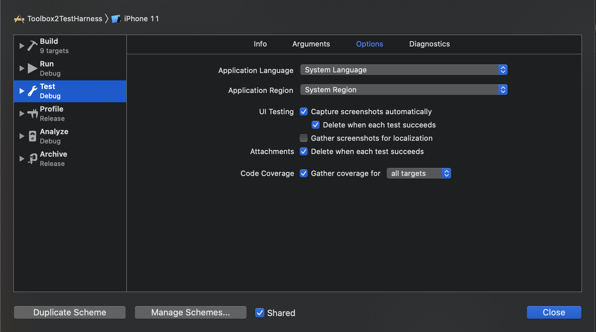
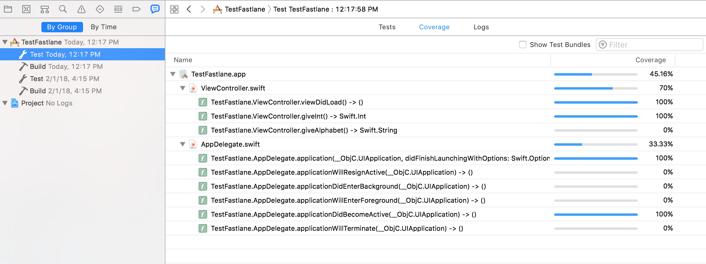
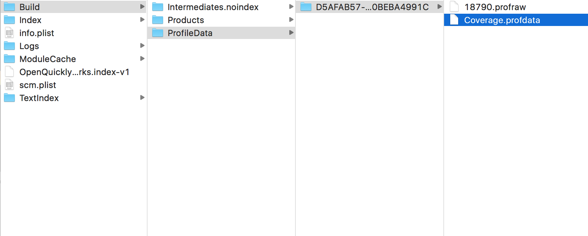
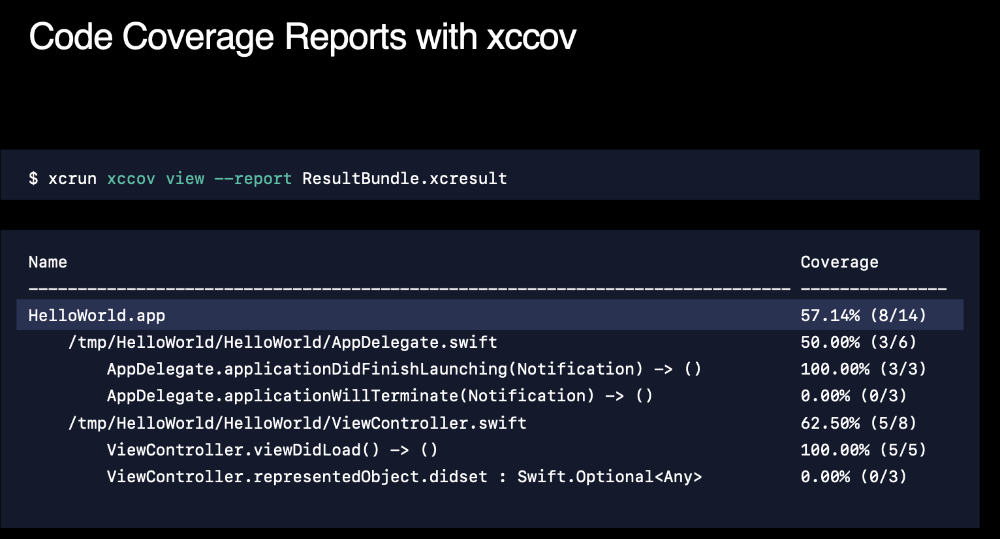

[toc]

##### How to capture code coverage

Code coverage reports can also be generated after unit tests have run. For that firstly, Code Coverage checkbox must be checked in the scheme's test action.



And then after the tests have run, the reports can be seen in Report Navigator.



This actually leverages LLVM. The report data is placed in Derived Data folder (typically in Build/ProfileData folder). The concerned files are Coverage.profdata and .profraw.



If you want to convert these files into other better known formats, other tools such as [gcovr](http://gcovr.com/guide.html) or [slather](https://github.com/SlatherOrg/slather) need to be used.

##### Using slather

Its a Ruby gem that can be installed the usual way, by either installing the gem from command line (gem install slather) or by executing the bundle (bundle install/update) after adding the gem in application's gemfile (gem 'slather').

It just converts any existing code coverage data into well known formats. So for it to work, code coverage data should already be there in the derived data directory.

###### Running slather from command line -

```
slather coverage --scheme TestFastlane --show ./TestFastlane.xcodeproj/
```

Results can be generated in various formats. By default the results are just printed in command line. However they can be also generated in other formats, two of them being `html` file and `cobertura.xml` file (an xml file with all the code coverage data).

Various options can be specified either in the command itself or in a config file called `.slather.yml` (just create this file and place the contents). The [wiki](https://github.com/SlatherOrg/slather) page mentions how various arguments can be specified.


If the Xcode's default derived data location is not being used (which can well happen if the project is built using Carthage), then the derived data location must be specified in a .slather.yml file. This should be placed in the project's home folder.

###### build_directory -

```
/Users/sou543/Library/Developer/Xcode/DerivedData/TestFastlane-codurfaaziznhthehhkbgfpxdpot/
```
coverage_service: `cobertura_xml` <br>
output_directory: `/Users/sou543/Documents/Anand/Technical/Random/39. Fastlane/TestFastlane/`

###### Command line argument for generating xml report -

slather coverage -x --output-directory path/to/xml_report

###### Command line argument for generating html report -

slather coverage --html --scheme YourXcodeSchemeName path/to/project.xcodeproj

##### Using xccov

Since 2019, `xccov` is the tool provided by Apple to get programmatic access to code coverage report. Explained in 'WWDC 2019: Testing using Xcode' talk.


