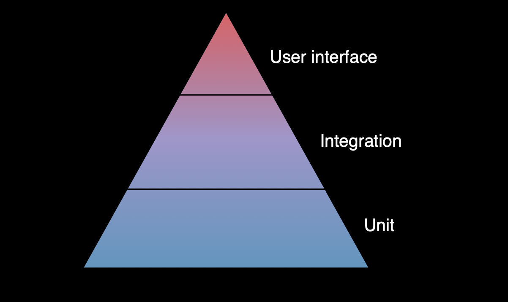
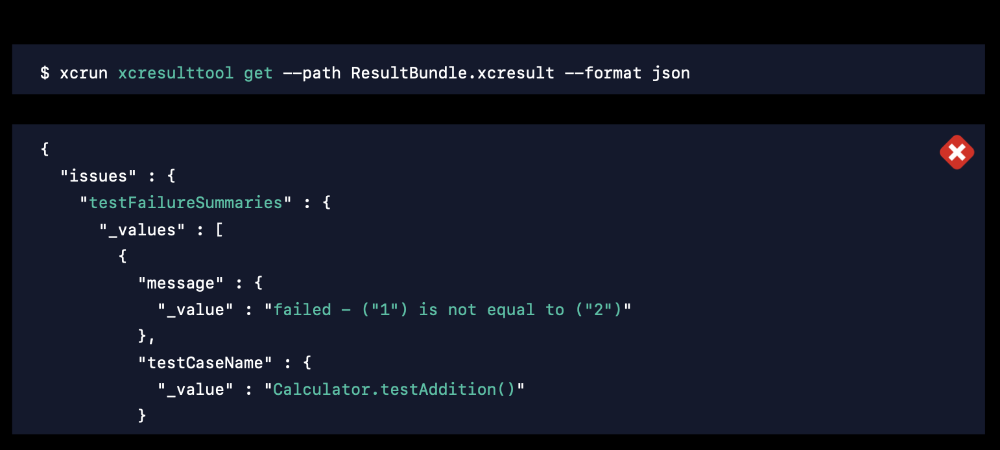

[toc]

##### Testing Pyramid

The typical testing pyramid. Unit tests would be most numerous in an app, and UI tests the least. Integration tests are tests that test the integration between various sub-systems. So may be things like whether module A works well with module B.

> Integration tests is just a term, you'd know what to test anyway and it does not matter whether you call them unit tests or integration tests.



##### Performance tests

These are tests that run a given test multiple times to look at the average timing. Need to try and document, shouldn't be anything difficult.

##### Test without rebuilding

There is now a menu option to be able to test without building again. 'Product > Perform Action > Test Without Building'.

##### Test results bundle, xcresulttool

 A result bundle (`xcresult`) is a file produced by Xcode containing structured data describing the outcome of building and running your tests. Can also be located by using the context menu on a test run in the Test Navigator. 

When running using command line, a custom test result path can also be specified.

```
 xcodebuild test
-project MyProject.xcodeproj
-scheme MyScheme
-resultBundlePath /path/to/ResultBundle.xcresult
```

In fact, Xcode 11 (2019) onwards to access the result bundle's contents programmatically, you can use a new command line tool called `xcresulttool`. Explained in the same 'WWDC 2019: Testing using Xcode' talk.

