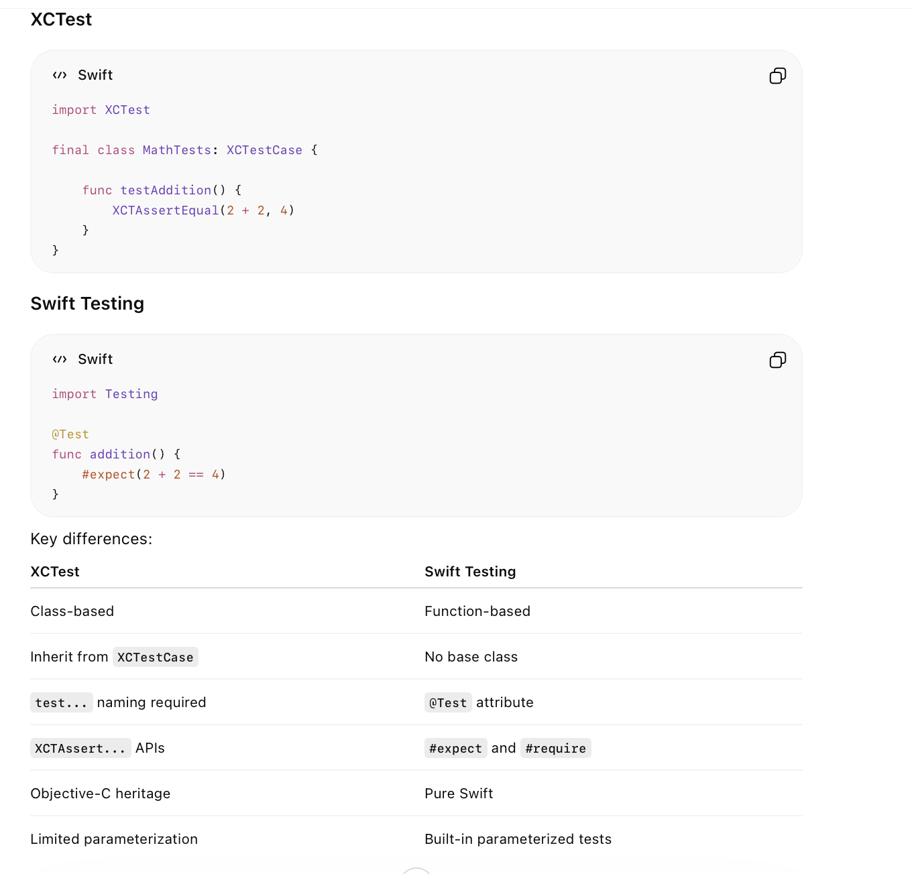
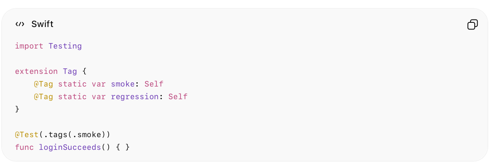
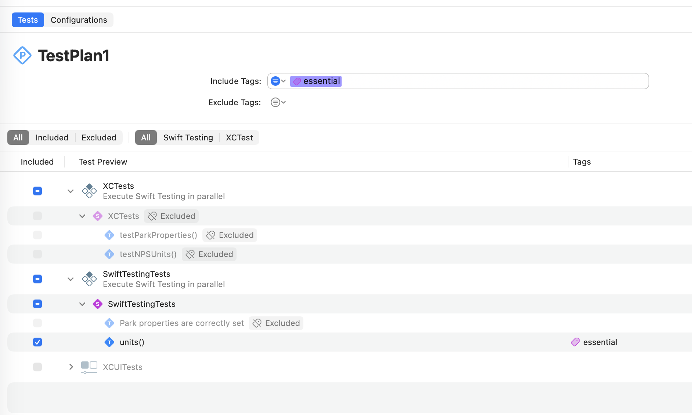

[toc]

##### Basics

**SwiftTesting** framework was introduced with Xcode 16 (i.e. 2024).

Unlike **XCTest**, its function based and does not necessitate test functions beginning with `test` prefix.

##### Tags

Swift Testing allows tags to be defined and then attached to tests. Test Plans can later filter based on these tags and just run the ones that qualify per the filter.

Define and attach Tags to tests

And then latest filter in test plans.

##### Resources

ChatGPT ([link](https://chatgpt.com/g/g-p-6828f041eef0819194fc9a04429044f8-ios-dev/c/6a25acf6-9980-83ea-9a21-c14fe1edbf20))