[toc]

#### The Very Basics

##### A target of its own

UI Tests have a target of their own, just like unit tests. Thereafter its a lot like unit tests, the same `XCTest` APIs are available for assertions, and similar test method name and test reports are used. It can later be run just how normal unit tests are run.

| Target of its own            | Test method names still start with `test` verbiage |
| ---------------------------- | -------------------------------------------------- |
| 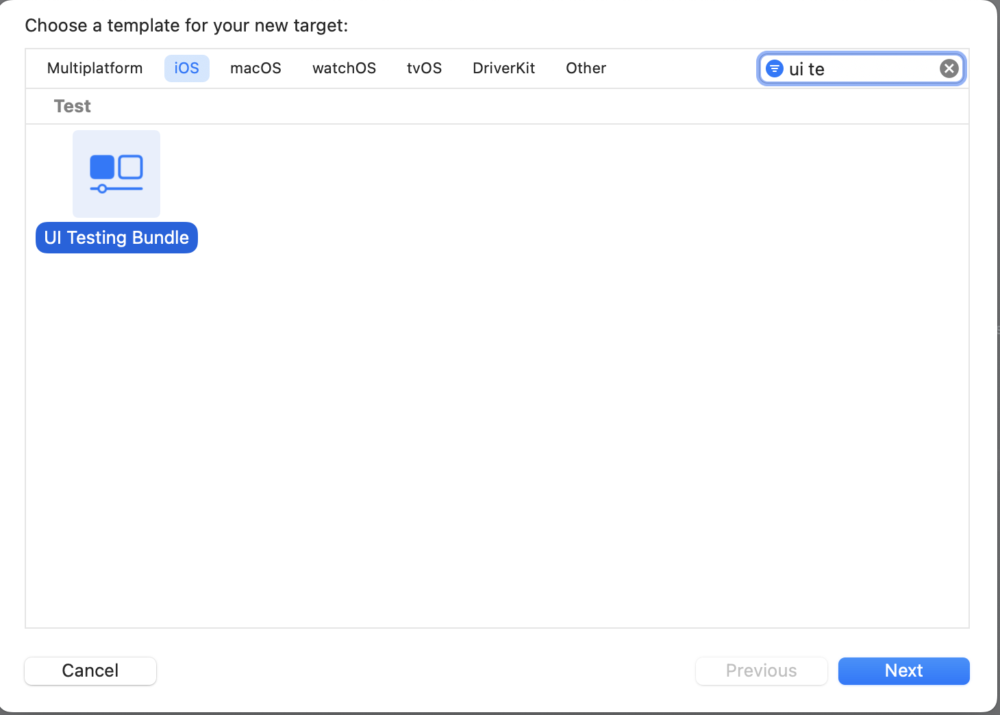 | 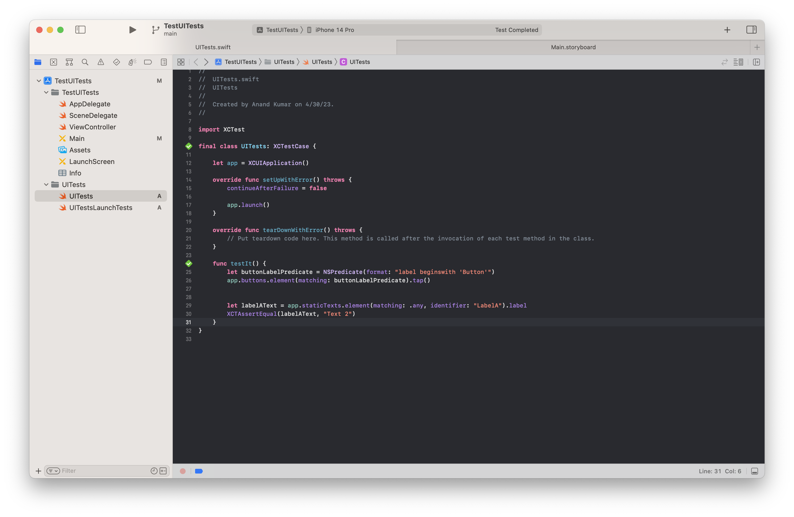                       |

##### How to record

Typically, a UI test is recorded by placing the cursor in a test method (of the UI test target) and then hitting the record button in the Xcode toolbar. It then launches a fresh simulator, runs a clone of the app in a new process (different from one that may already be running from the existing run) and lets you record the UI actions.

UI Test targets automatically configure for themselves the permission to use Accessibility in the privacy protection (on the device/simulator they are being run on). This is because UI tests use Accessibility for the required automation.

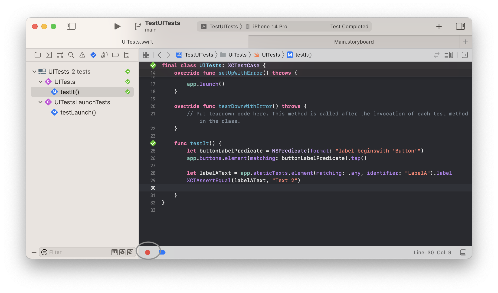

#### Basic API

##### XCUIApplication

`XCUIApplication` - A proxy to launch, monitor, and terminate a test application. If it's already running, calling launch will terminate the previous existing instance.<br>

```
let app = XCUIApplication()
app.launch()

app.buttons["Add"]
```

##### XCUIElement

`XCUIElement` -  A proxy for user interface elements. Elements have types ([`ElementType`](https://developer.apple.com/documentation/xctest/xcuielement/elementtype)) such as button, cell, datePicker, collectionView, etc. They have identifiers, i.e. accessibility identifier. As expected, elements form a hierarchy in the application (likely just like view hierarchy?).<br>

Elements need to be uniquely identified before they can be worked with during a running test. Elements are usually found using a combination of the type and the label. 

The only API that allows elements to not be unique is `exists` property on XCUIElement.

##### XCUIElementQuery

`XCUIElementQuery` - Queries resolve to a collection of elements. Specific elements can then be accessed using subscripts (`["identifierXYZ"]`) as well as `elementAtIndex()`. There are 3 kinds of relationships that can be used in queries - `descendants`, `children`, `containment`. 

Queries can only find elements that are visible to Accessibility. Not too sure though, as in a test app even when I made elements 'Accessibility off' in Interface Builder they were still getting found (but these things are strange at times, might have been a cached version of the build).

Queries are evaluated on-demand or as they are needed. They are not evaluated when they are created.

###### Creating queries using *matchingType

```
descendants(matching: XCUIElement.ElementType)  /// .descendants(matching:.button) ~ .buttons <-- SAME THING, and so on

children(matching: XCUIElement.ElementType) /// SIMILAR TO ABOVE

containing(elementType:, identifier:) /// Finds all the descendants of specified type and having passed identifier. Used with tableView cells, what else?

element(matching:)
```

###### Creating queries using predicates

```
let buttonLabelPredicate = NSPredicate(format: "label beginswith 'Button'")
app.buttons.element(matching: buttonLabelPredicate)
```

###### Getting elements from queries

If you are certain that a query will resolve only to one element, simly `element` property can be used.

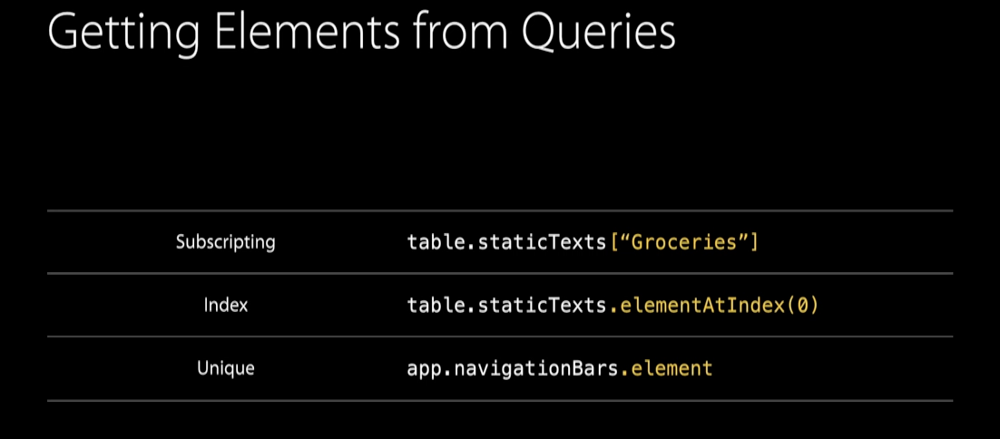

#### Handling interruptions and alerts

> Introduced in 'WWDC 2020: Handling interruptions and alerts in UI Tests'. (Need to try it.)

A UI interruption is any element which unexpectedly blocks access to another element with which a UI test is trying to interact. Such as a notification banner, or a camera access system confirmation alert. They are usually unexpected, or at least not deterministic.

They are typically handled using `Interruption Handlers`, i.e. closures that are invoked by XCTest when an interruption occurs. There can be multiple interruption handlers registered at any time, and they are invoked in reverse order (of the order in which they were added) until one of them signals that it handled the interruption.

If an interruption handler successfully handled an interruption, it returns true and the UI test continues. If it was not able to handle the interruption it returns false and the next handler on the stack gets invoked. At the lowest level in the stack of UI interruption handlers.

XCTest provides its own implicit interruption. handler that takes care of the most common interruptions for you. On iOS XCTest handles interrupting elements if they have a cancel button or a default button. And new in Xcode 12 XCTest also implicitly handles Banner notifications.

UI interruption handlers are automatically removed at the end of the test or can be removed manually at any time. 

##### API

The common function probably is `addUIInterruptionMonitor(withDescription: , handler: (XCUIElement) -> Bool))`, and its usually added in a `setUp()` method.

If an alert is deterministic regarding when it will appear (say a regular programmatic alert), it should not be handled like an interruption. Instead the traditional UI element query can be used and wait for with existence APIs. 

| Handling interruption (Interruption handler) | Handling expected alert      |
| -------------------------------------------- | ---------------------------- |
| 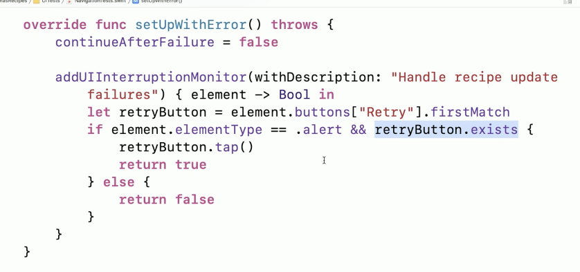                 | 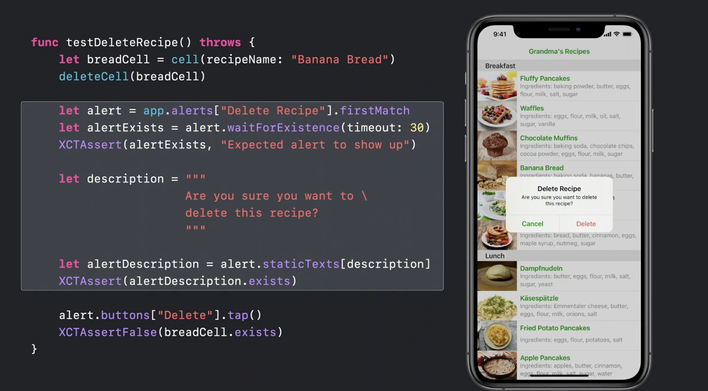 |

When it comes to handling system alerts related to access of protected resources like location, bluetooth, etc. it can probably be handled the usual way as an interruption handler. Also, the permission can be reset with an API.  `XCUIApplication` has a method called `resetAuthorizationStatus(:)` that can be used for programmatically resetting the authorization status of these protected resources.

#### Runner app

When a UI test target is run, another 'Runner' app is actually installed in the simulator which actually runs the tests (by itself you cannot run it).

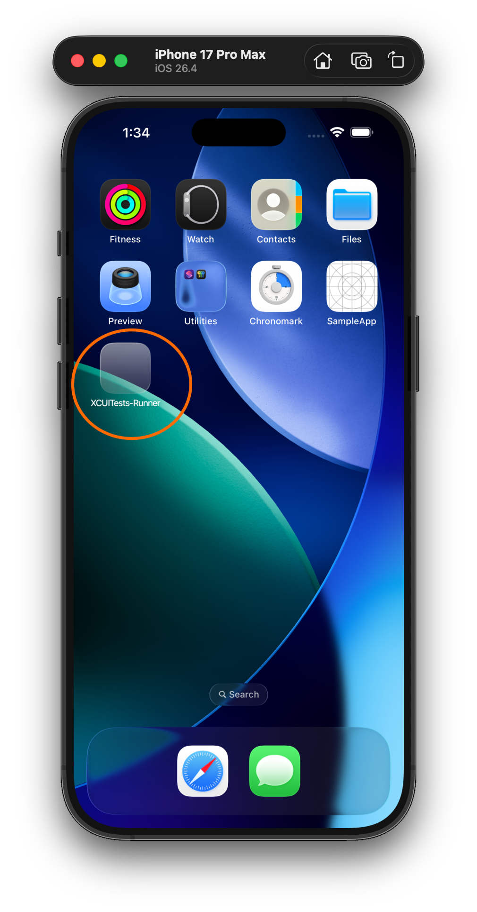

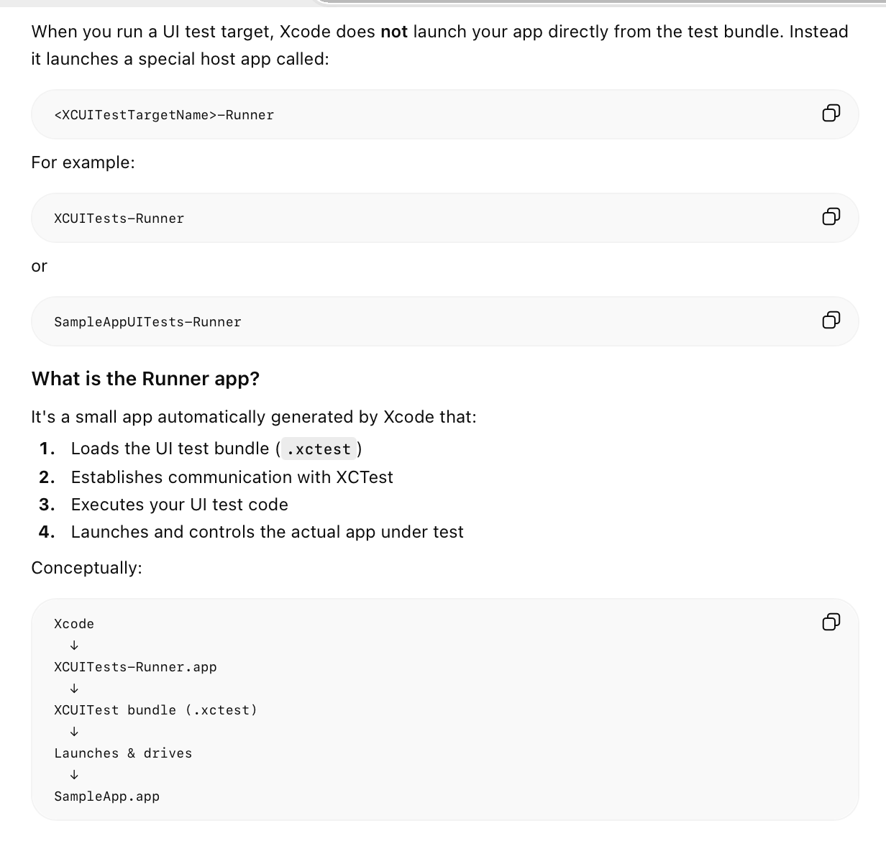

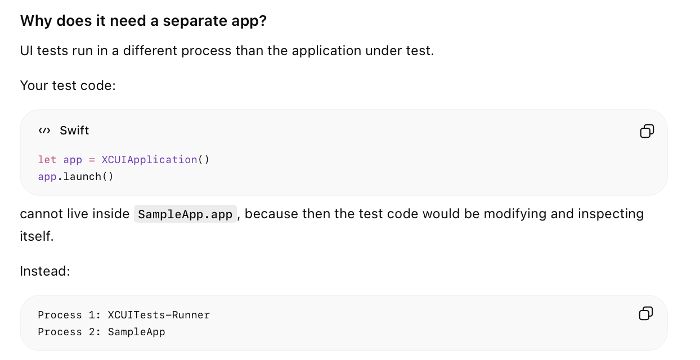

#### Misc.

If the 'Delete when tests succeed' option in 'scheme settings' is unchecked, screenshots of the application too will be visible in the test report.  The screenshots can then be viewed using the Quick Look button (or space bar) in Report Navigator.

| Retain screenshots if tests succeed | Screenshots in Report Navigator |
| ----------------------------------- | ------------------------------- |
| 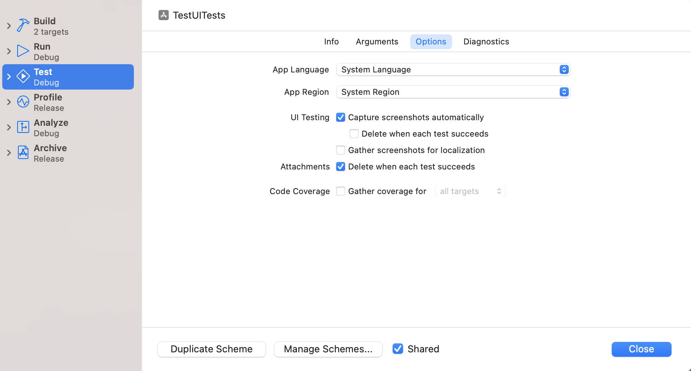        | 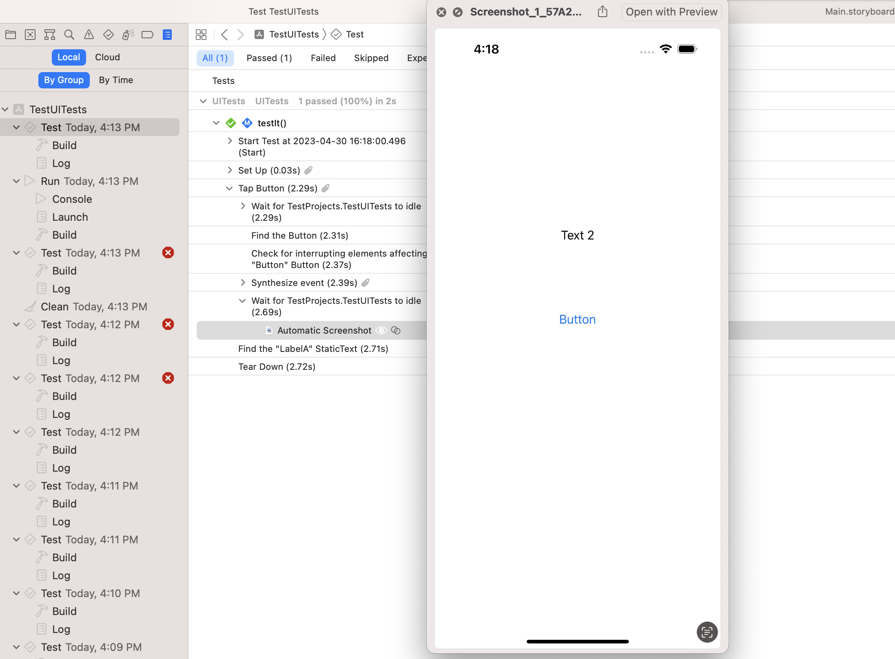    |

Localization screenshots is a feature since Xcode 11 (2019), which will cause your UI tests to preserve all of their screenshots even for test that succeed. Same thing as above?

The term `Event Synthesis` is used to refer to user action simulation. There are several methods for it. For example, `button.tap()`.

`element.isHittable` ensures both that the element exists in the view hierarchy and also that its currently on the screen so that it can be interacted with (what if its a scroll view and outside the currently visible portion).

