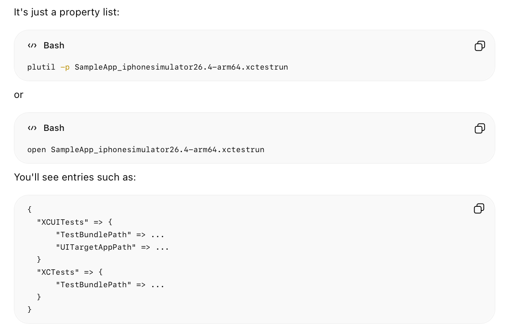
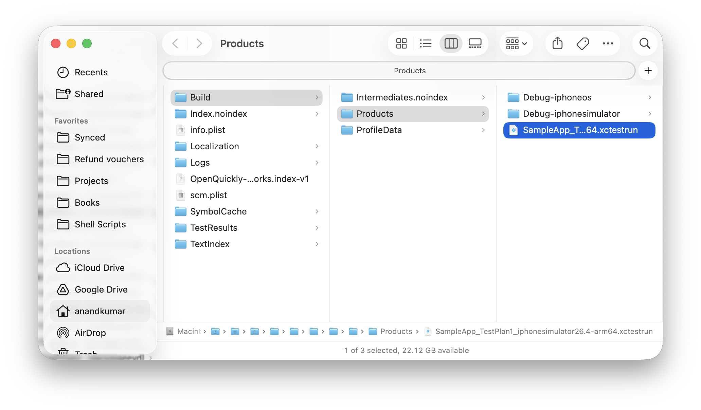
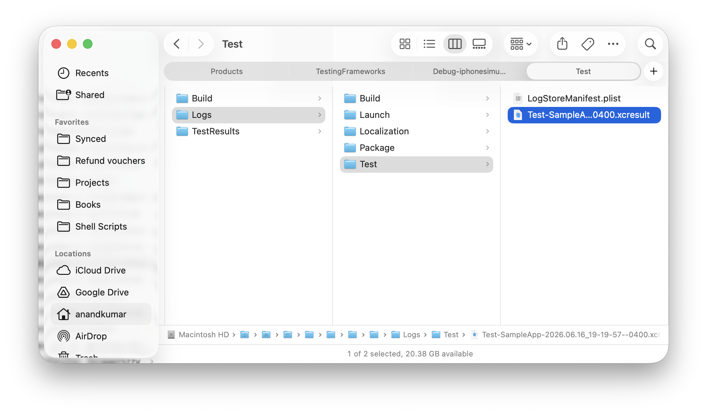
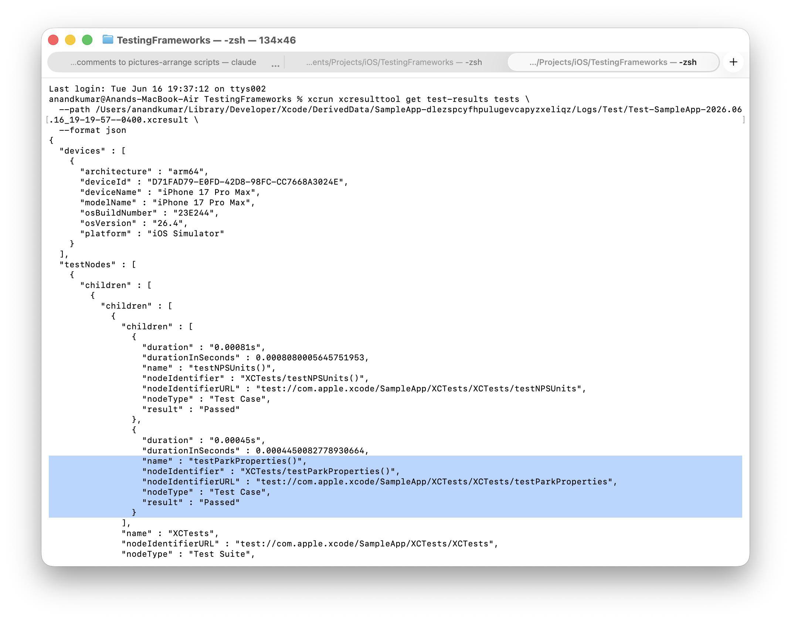
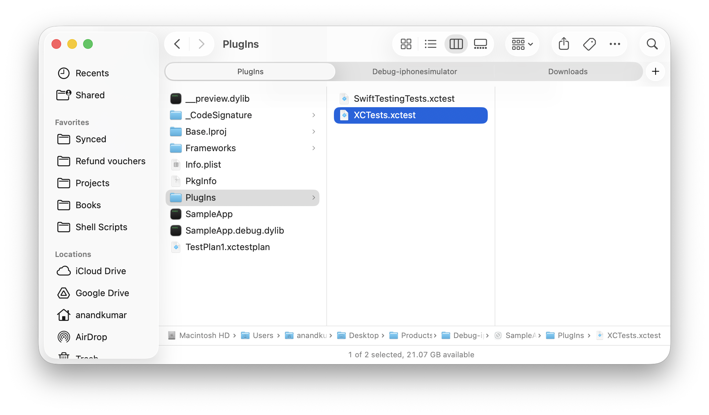
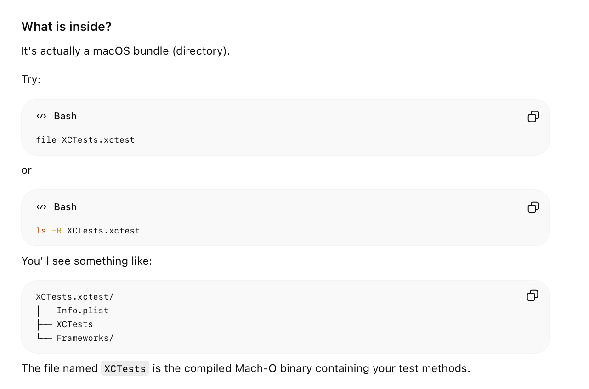
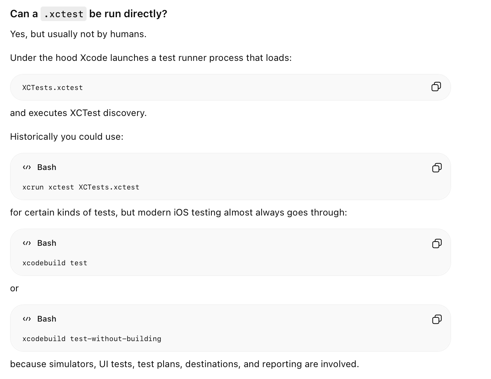
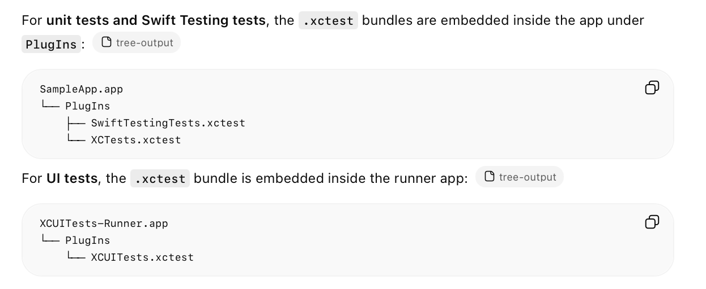

[toc]

##### .xctestrun

**.xctestrun** - It is generated when a 'build for testing' is done, and the generated file is placed in Derived Data. Technically, its a plist that has all the information for what tests to run etc., and the .app etc. are in sibling folders. By themselves, these are enough to run tests.





The `xctestrun` can then be run using `test-without-building`, so the idea is -

1. Use **build-for-testing** to generate a **.xctestrun**.
2. Have some scripts etc. to locate the xctestrun from derived data (or who knows even from the output of prev step).
3. Use that **.xctestrun** to test using **test-wthout-building**. This generates a **.xctestresult**.

```
xcodebuild build-for-testing \    
  -scheme SampleApp \
  -destination 'platform=iOS Simulator,name=iPhone 17 Pro Max'

xcodebuild test-without-building \
  -xctestrun <XCTESTRUN_PATH>
  -destination 'platform=iOS Simulator,name=iPhone 17 Pro Max'
```



> [WWDC 2019: Testing in Xcode](https://developer.apple.com/videos/play/wwdc2019/413/) has a section on setting up custom CICD (i.e. not using Xcode Server) at around 40:30 mark. Also says what is a `xctestrun` file (the xctestrun file is a manifest that describes the build products and instructs xcodebuild what to do at test time.)

##### .xctestresult

The below works

```
xcrun xcresulttool get test-results tests \
  --path /Users/anandkumar/Library/Developer/Xcode/DerivedData/SampleApp-dlezspcyfhpulugevcapyzxeliqz/Logs/Test/Test-SampleApp-2026.06.16_19-19-57--0400.xcresult \
  --format json
```



##### .xctest

**.xctest** - This is the actual test bundle (compiled test code), its nestled deep inside .app when a `build-for-testing` is done. You do not use it directly. There is one binary for every test target.







