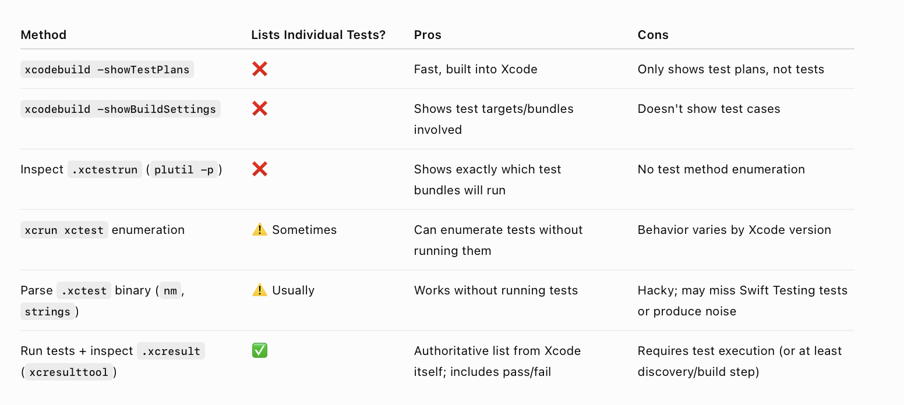

Enumerating all tests in a scheme, etc. (need to try this) - [ChatGPT link](https://chatgpt.com/c/6a3611a9-b814-83ea-b34b-ddf9ddb0a4e3)

##### Resources

ChatGPT Testing project ([link](https://chatgpt.com/g/g-p-6a3aad28a3f48191a8d794943d837761-testing-pipeline/project))

Sample Code - TestingFrameworks/SampleApp1
