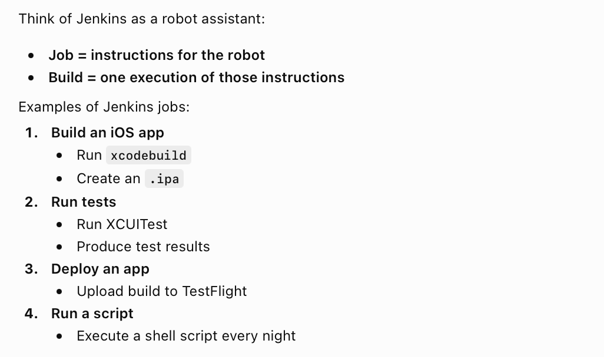
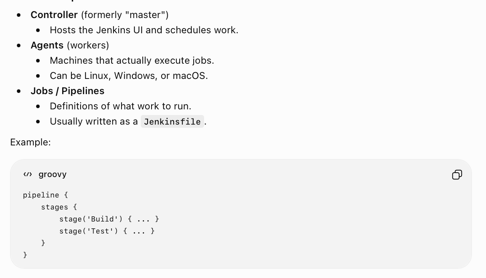
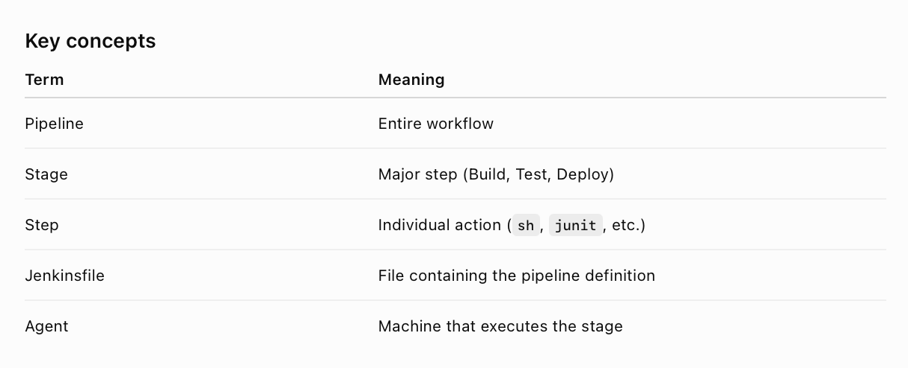

##### What is Jenkins

**Jenkins** is an open-source automation server used for **CI/CD**. Simply put it is something that can run scripts, and orchestrate things on many different remote servers. It knows how to manage those servers, set them up and queue them appropriately, etc. You provide scripts for things you want to do yourself.

A task in Jenkins is called a **Jenkins Job** (its an automation workflow), every run instance of it is called a **Jenkins Build**.

##### Core Concepts

**Controller** is the main orchestrator, and the remote servers are called **agents or workers**.

**Build Artefacts** - Thethings you want a build to generate and then save. They become downloadable from the build page (and are also accessible using an API).

There are also some terms/concepts such as **pipeline**, **stage**, **step**.

##### Resources

[Basics - ChatGPT link](https://chatgpt.com/c/6a360c1b-cb28-83ea-aa8c-7bbdd56367bf)