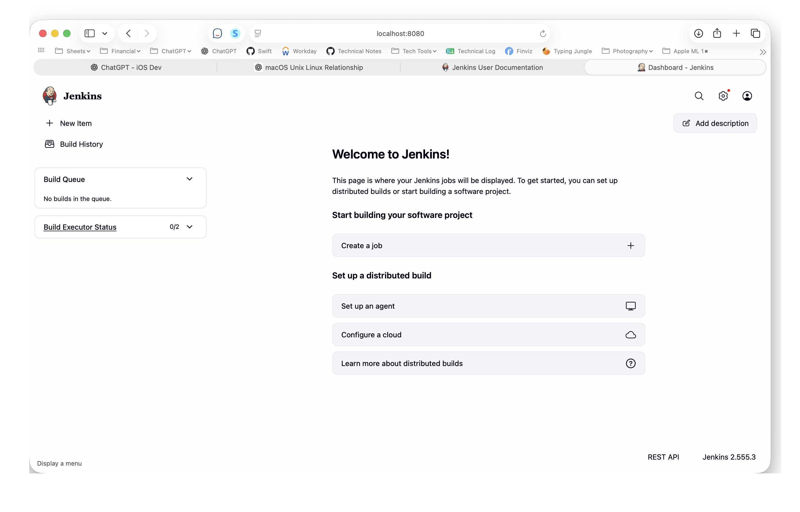
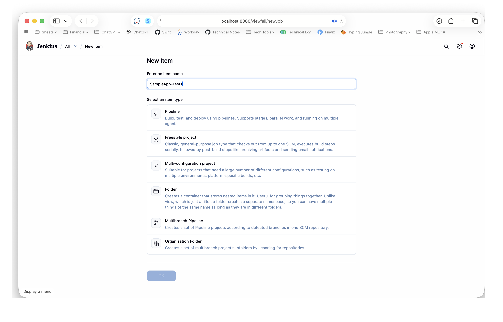
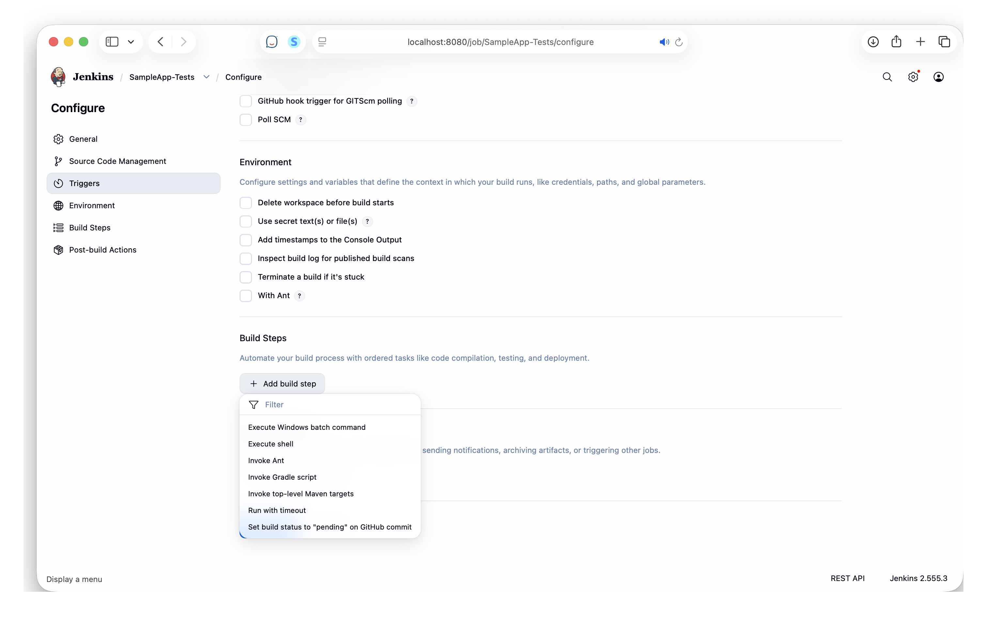
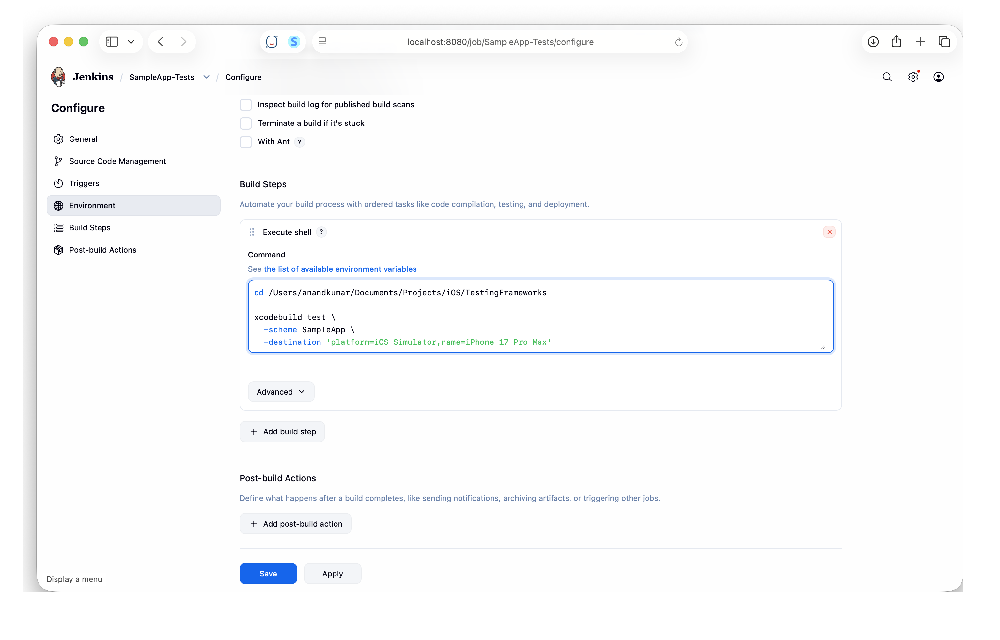
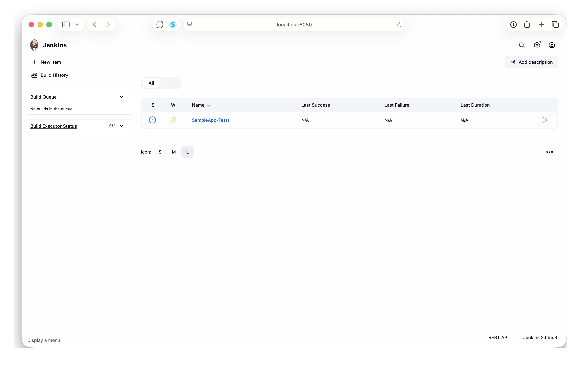
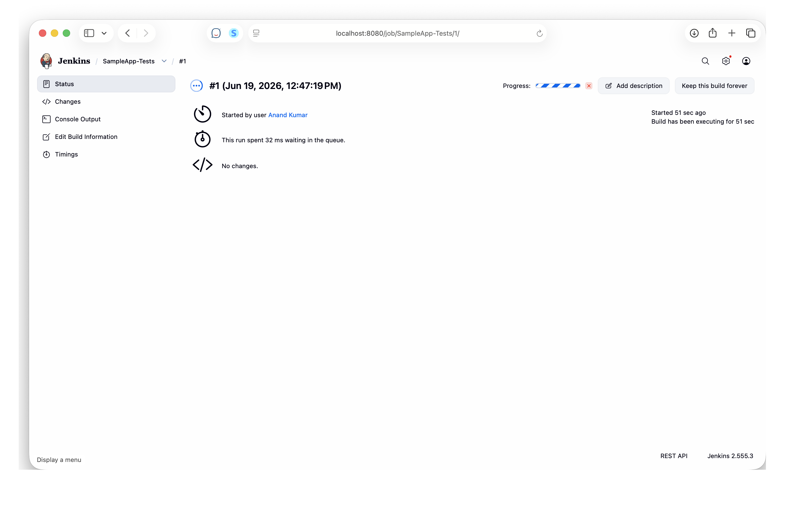
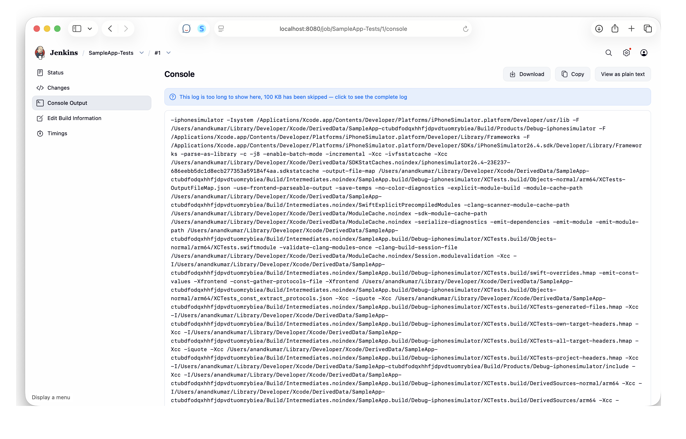
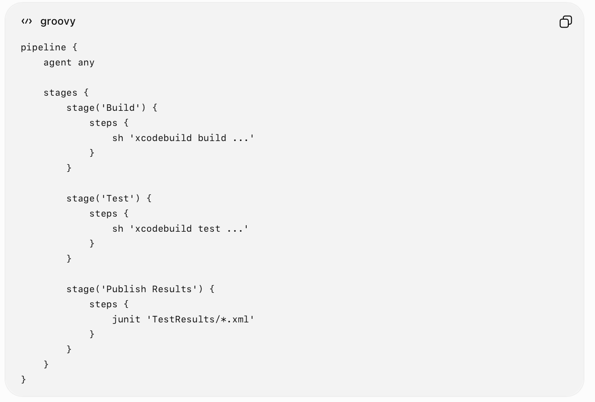

[toc]

##### How to create a Jenkins job

| 1. Jenkins Home Page > New Item | 2. Freestyle project |
|----|----|
|  |  |

| 3. Build Steps > Add > Execute Shell | 4. Paste a shell script, Save |
|----|----|
|  |  |

| 5. The job is created |
|----|
|  |

##### Checking a build's (i.e. job run instance) details

| 1. Job status | 2. Console Output |
|----|----|
|  |  |

##### Various kinds of jobs

**Freestyle job** - The simplest type of Jenkins job. You configure it through the Jenkins web UI

**Pipeline job** -  The entire build/test/deploy process is given as code, instead of clicking around in the Jenkins UI. Typically put in something known as a Jenkinsfile and is written in **Groovy**.

