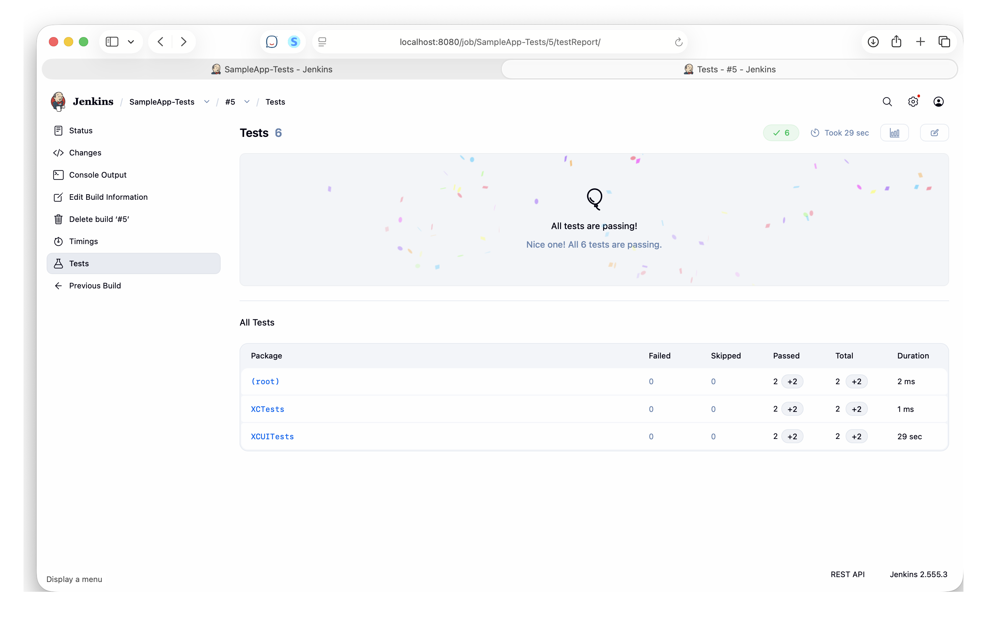
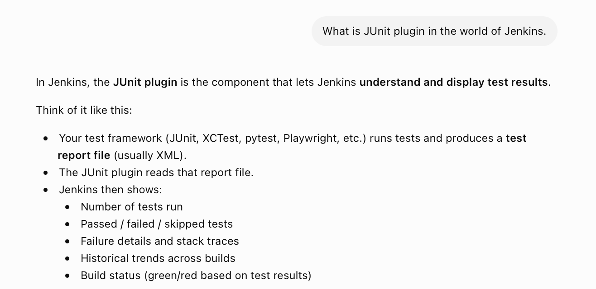
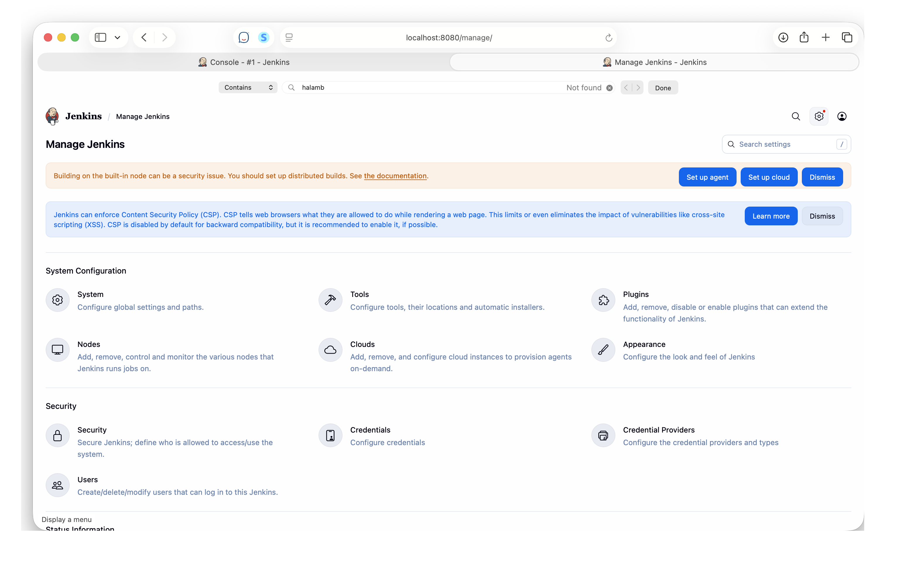
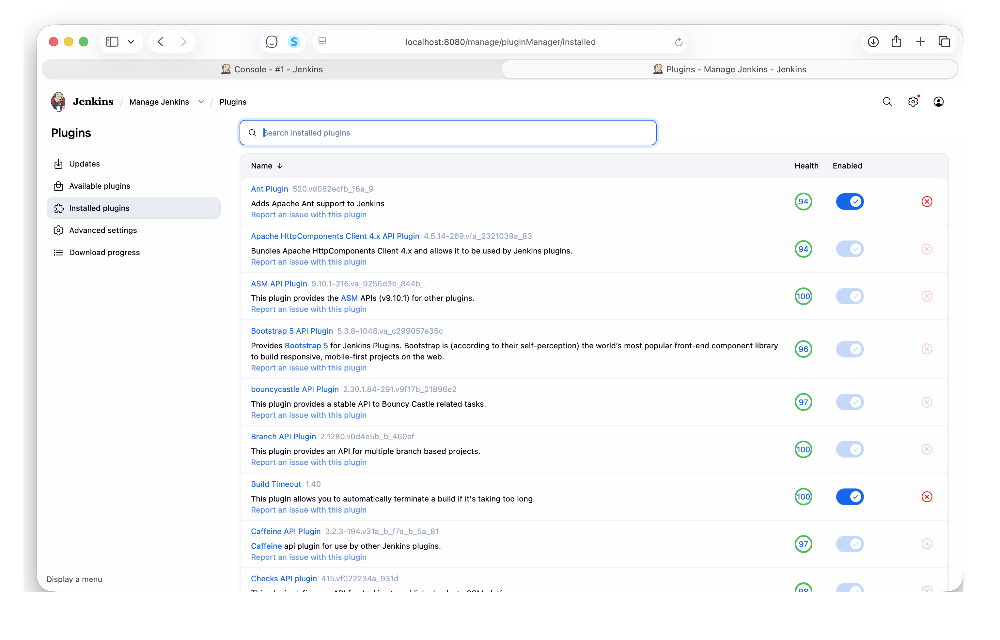
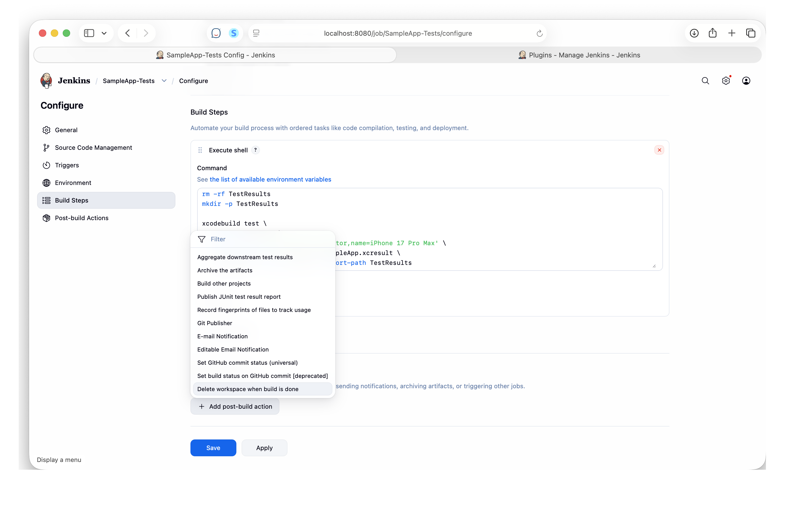
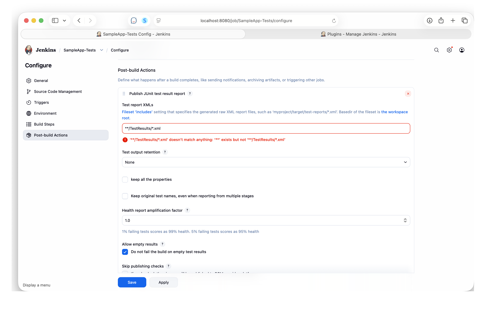

[toc]

##### Test Results UI

If a Jenkins jobs is runing some tests, those tests can be converted to an xml using JUnit, and then Jenkins automatically displays the test results in a nice UI.

This is how the UI looks

##### What is JUnit

Simply put its a plugin made available by Jenkins that can take a test result (in some supported formats, `xctestresult` being one of them) and convert it to a JUnit test report file (which is usually an **xml**). 

> **JUnit**, FWIW is a very old Java testing framework. So may be this plugin was actually developed for it.

##### How to configure a job to publish JUnit results

| 1. Go to Jenkins Settings > Plugins | 2. Ensure JUnit Plugin is installed |
|----|----|
|  |  |

| 3. Job Configuration > Add Post-Build action > Publish JUnit test result report | 4. Give a path where the test result xml will be saved |
|----|----|
|  |  |

##### Resources

[ChatGPT link](https://chatgpt.com/c/6a356d36-73a0-83ea-915b-7535c10ace0f)
