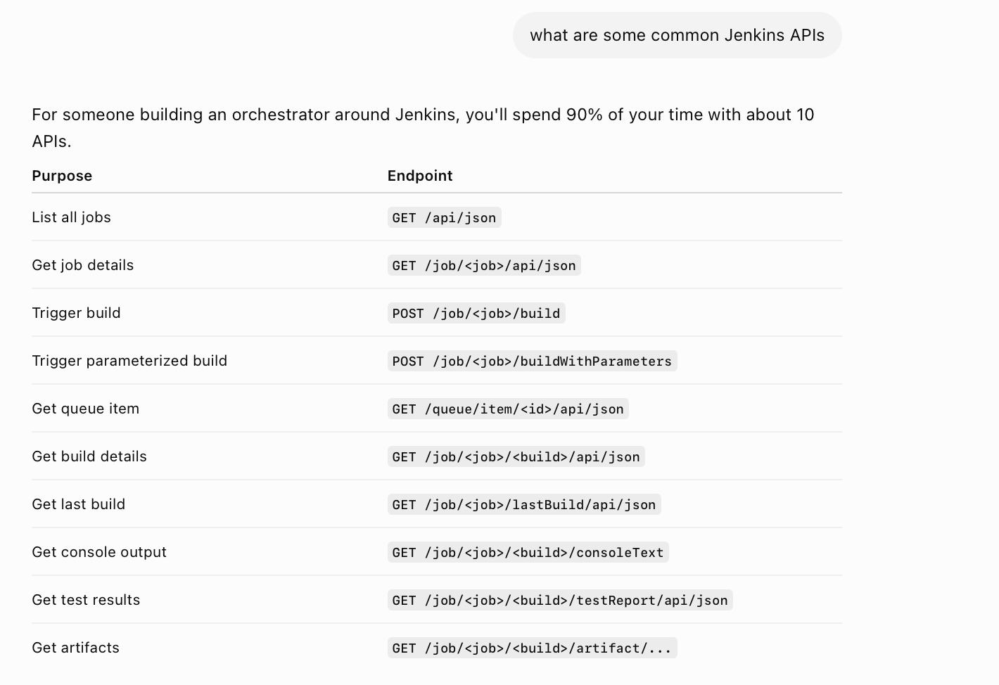
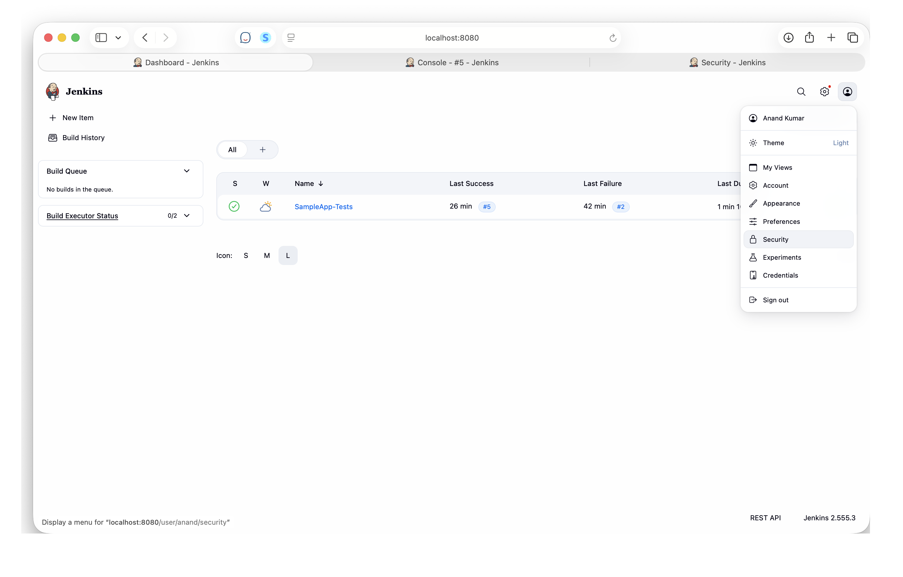
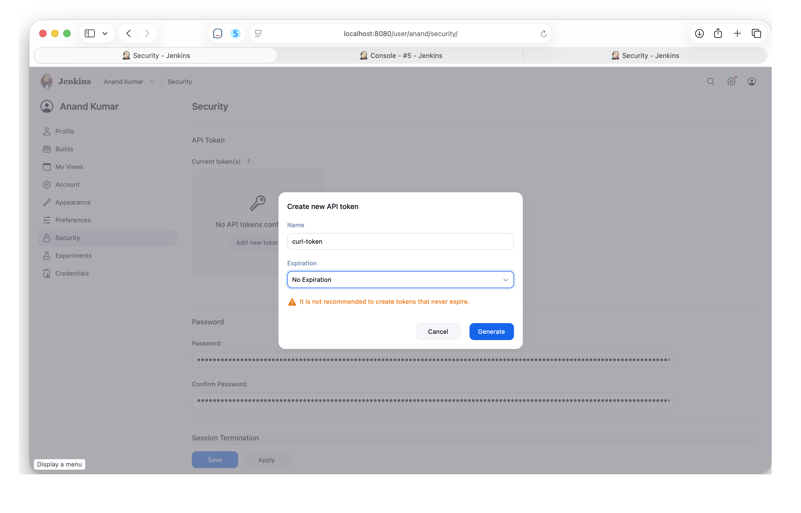

[toc]

##### What are Jenkins Remote Access APIs

Jenkins has Remote Access APIs ([link](https://www.jenkins.io/doc/book/using/remote-access-api/?utm_source=chatgpt.com)) that let you start Jenkins jobs, etc.



##### User Token and Crumb

Two things are needed to call the API - **token** and something called **crumb** (a measure against CSRF, i.e. Cross-Site request Forgery). You first generate a token, then use that to get a crumb, and then call the precise APIs using the crumb.


```
curl -u <USER-NAME>:<TOKEN> \
  http://localhost:8080/crumbIssuer/api/json   <--- THIS GIVES A CRUMB IN RESPONSE

curl -X POST \                          
  -u <USER-NAME>:<TOKEN> \
  -H "Jenkins-Crumb: <CRUMB>" \
  http://localhost:8080/job/<JOBNAME>/build  <--- THIS STARTS THE SPECIFIC JOB
```


```
curl -u anand:11c6dd8fe40c38caff1114f3abf003b5c1 \
  http://localhost:8080/crumbIssuer/api/json   

curl -X POST \                          
  -u anand:11c6dd8fe40c38caff1114f3abf003b5c1 \
  -H "Jenkins-Crumb: b860760b736effadada6d7b0338064ce960039858d95b0cda8722c5a90a226c9" \
  http://localhost:8080/job/SampleApp-Tests/build
```


##### Generating new API token

| 1. Jenkins Settings > Security | 2. Create new API token |
|----|----|
|  |  |

##### Resources

[Reference](https://www.jenkins.io/doc/book/using/remote-access-api/?utm_source=chatgpt.com) <br>[ChatGPT link](https://chatgpt.com/c/6a3587ad-62cc-83ea-a37f-9b5636884d27)
