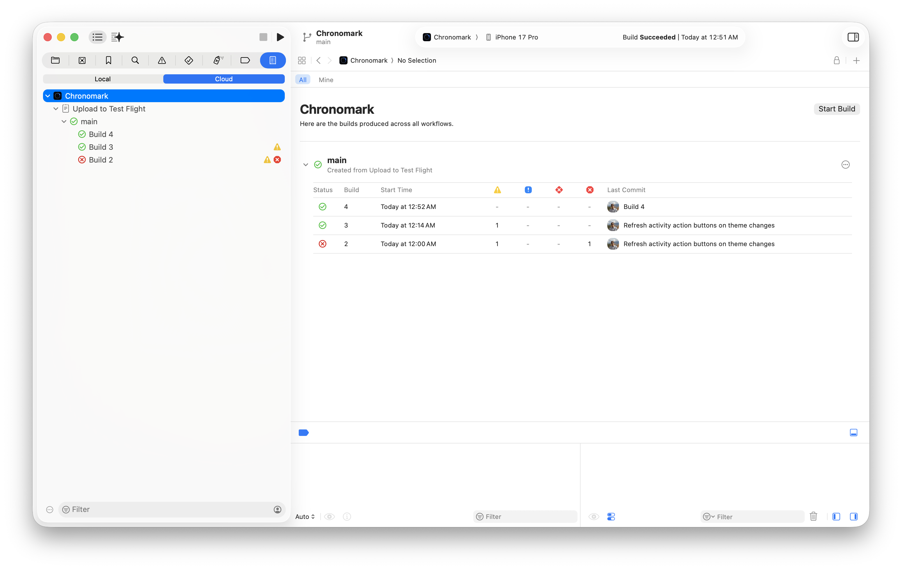
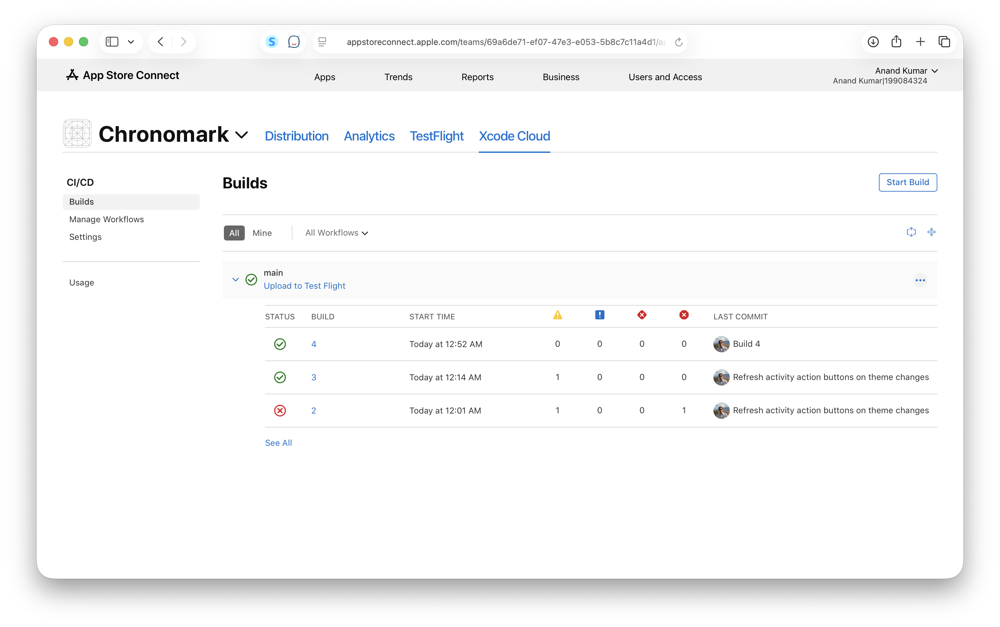
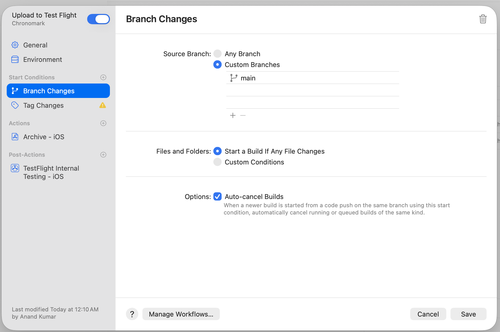
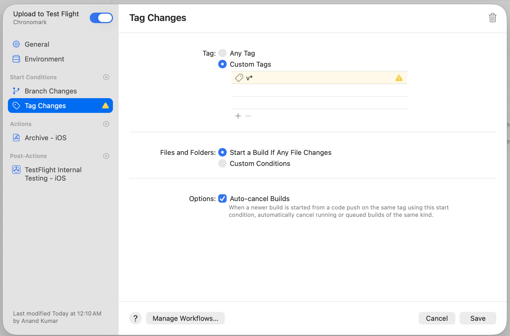
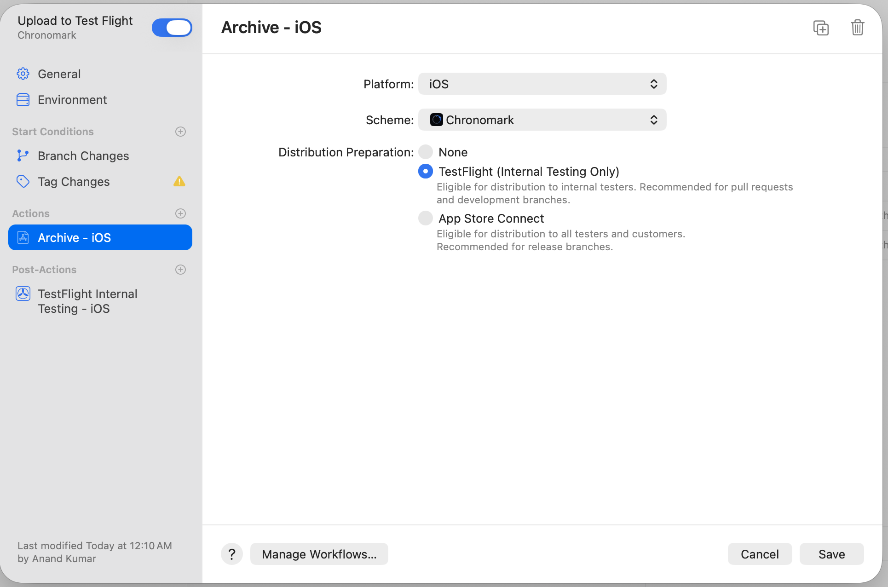
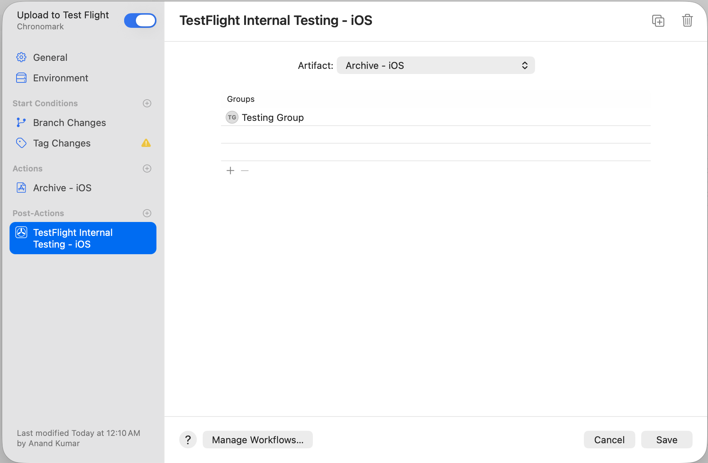

##### What is it

Simply put, Apple's CICD solution. You'd use it to automate things like creating and uploading an archive to App Store anytime a certain git tag is pushed to GitHub, etc.

Its accessible from Xcode's Report Navigator and then also from App Store Connect portal. You can create and manage workflows from either, as well as see the previous and current builds from either.

| Xcode UI                                                     | App Store Connect UI                                         |
| ------------------------------------------------------------ | ------------------------------------------------------------ |
|  |  |

##### Basics

You create workflows, and every workflow needs these things - Start Conditons, Actions, Post-Actions i.e. when to run these workflows, what happens in them, and what happens once those things are done.

Here is the workflow settings for a workflow that I created to automatically generate and upload an archive to App Store Connect anytime a certain tag is pushed.

| Start Conditions - Branch Changes                            | Start Conditions - Tag Changes                               |
| ------------------------------------------------------------ | ------------------------------------------------------------ |
|  |  |

| Actions - Archive                                            | Post-Actions - TestFlight Internal Testing                   |
| ------------------------------------------------------------ | ------------------------------------------------------------ |
|  |  |

##### Resources

[ChatGPT link](https://chatgpt.com/c/69fffca8-5934-83ea-ad5b-4a290228928a)