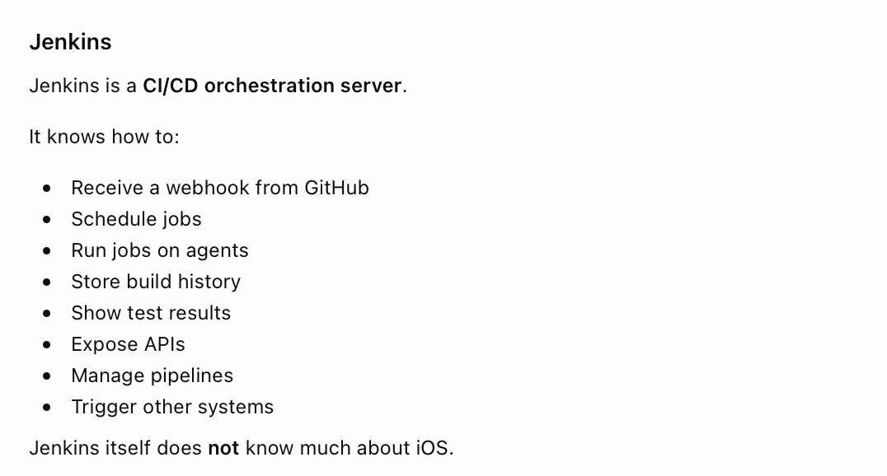
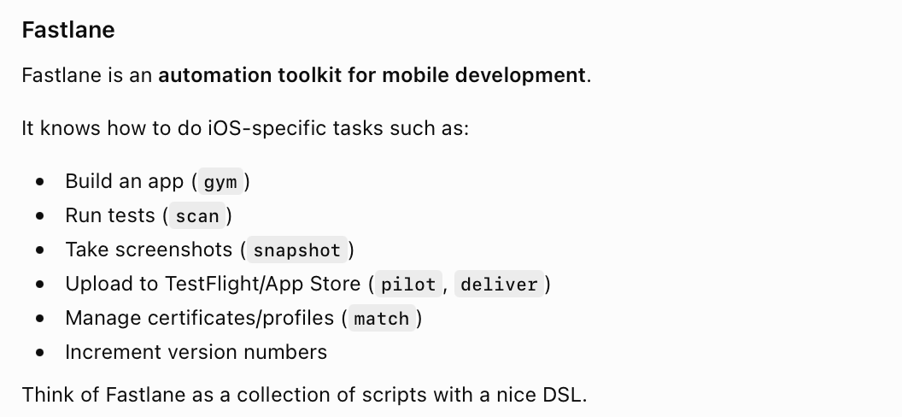
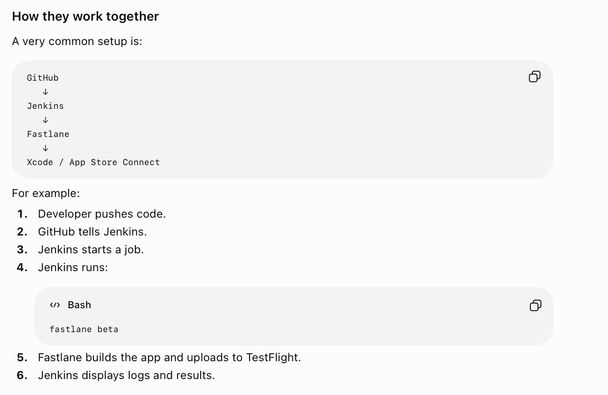

##### Jenkins and Fastlane
**Jenkins** is the automation system, i.e. the system where you create workflows and which then takes care of spinning up agents and running those.
**Fastlane** is basically a collection of Ruby scripts that automate various iOS activities such as build generation, App Store, upload, etc. using **xcodebuild**, **xcrun**, and App Store Connect APIs, etc. It might now look like why did this become such a huge thing, but yes back in 2014 doing all this was not straight forward or common for mobile developers and Apple's utilities too were not as good.
[ChatGPT link](https://chatgpt.com/c/6a3590f6-6504-83ea-a106-460e935fb436)

| Jenkins | Fastlane |
|----|----|
|  |  |

