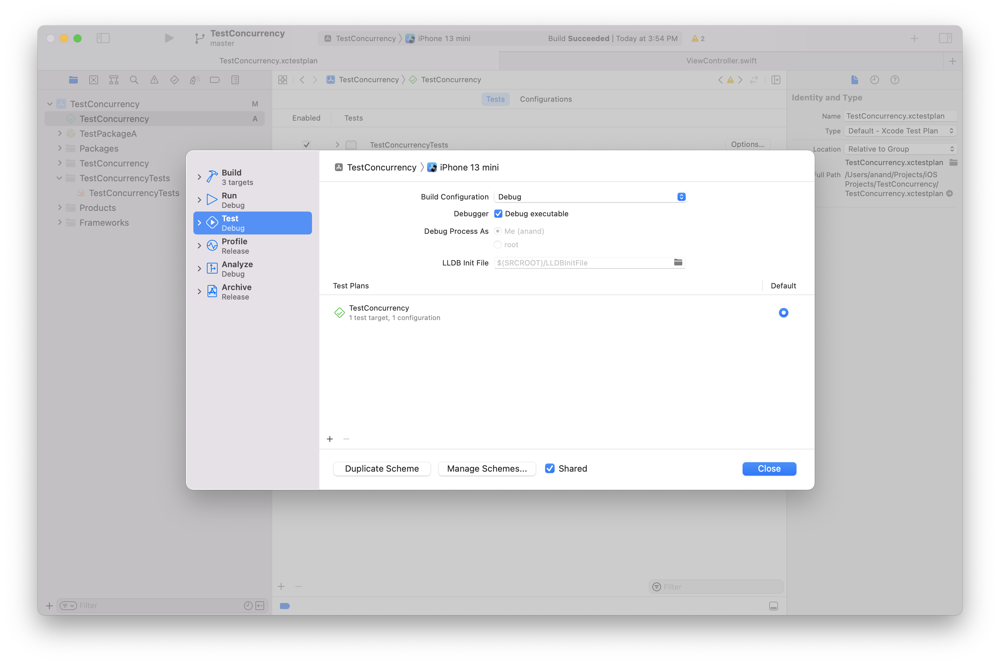
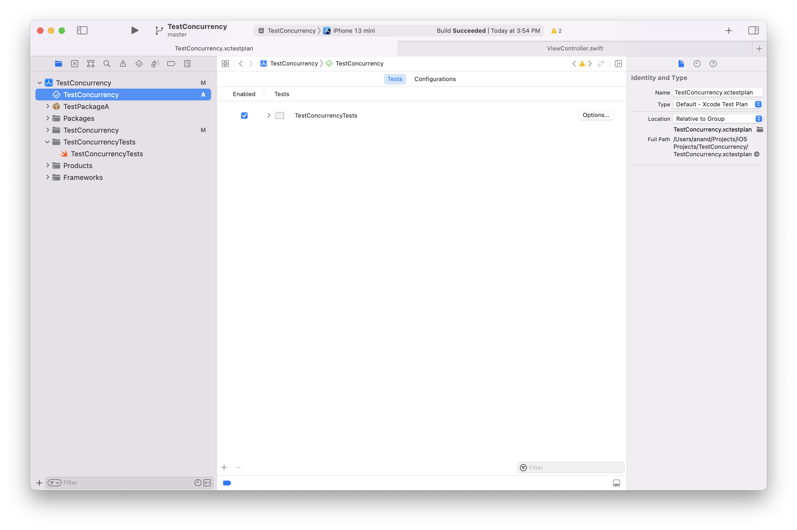

##### Test Plans

Test Plans are a newer thing (introduced sometime around 2018?). They are an alternate to old fashion test targets, and allow to have multiple test targets in a single testplan file that can be easily edited and attached to a scheme's test action settings.

Scheme settings | testplan document
--- | ---
 | 

There is also a menu option `Product > Scheme > Convert Scheme to use Test Plans` to move existing test targets to testplan.

[UseYourLoaf article (link)](https://useyourloaf.com/blog/xcode-test-plans/)
