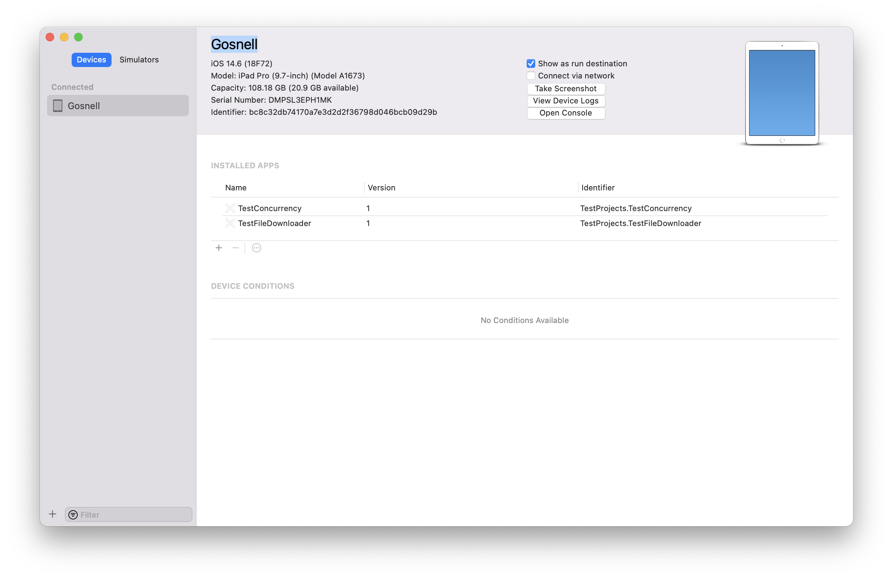
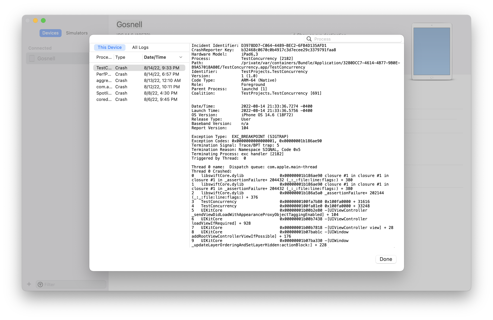
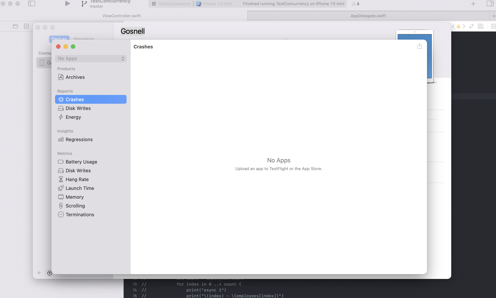
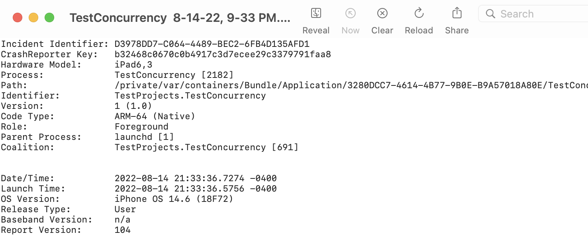
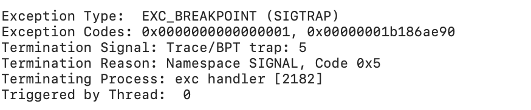
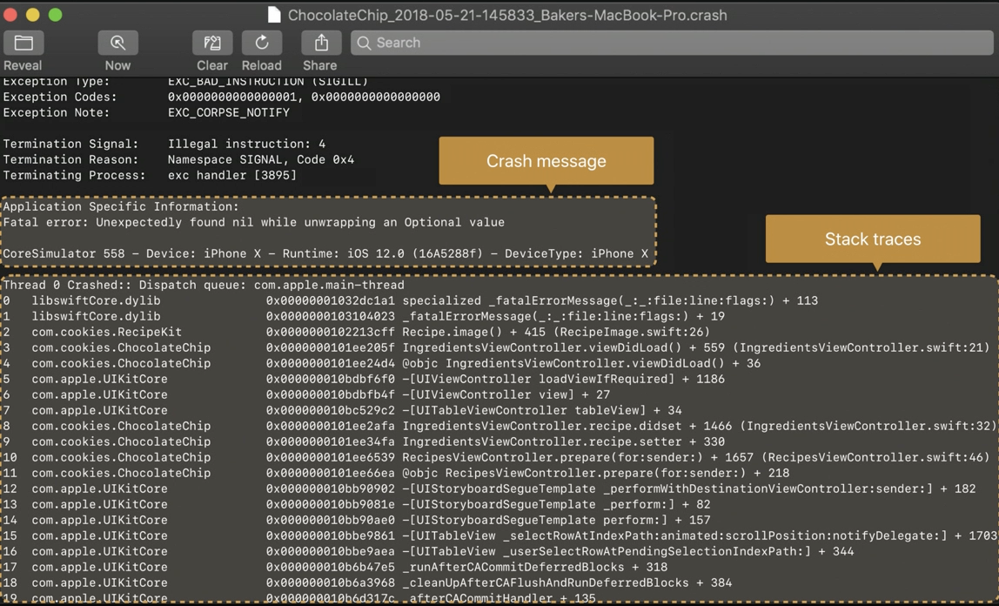
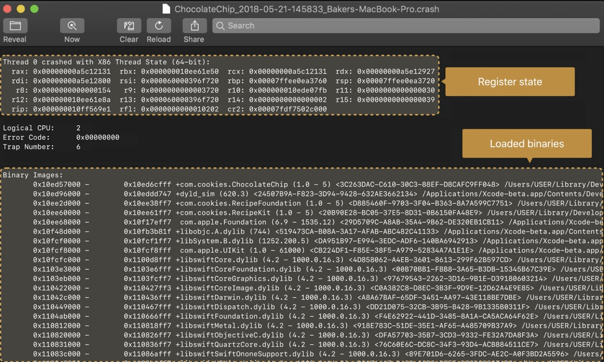
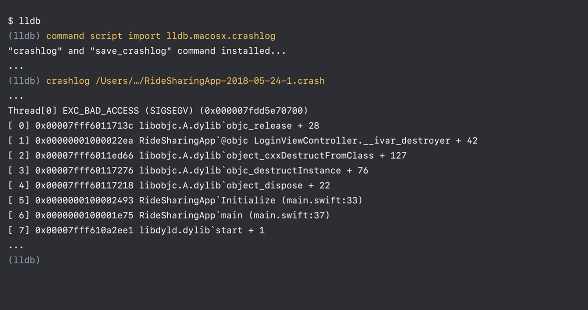

> This is largely from 'WWDC 2018: Understanding Crashes and Crash Logs 

#### What really is crash

Basically, its a sudden termination of your app when it attempts to do something that is not allowed.

This can be many different kinds of things. For example, if a division by zero is attempted the CPU does not allow it and causes a crash. Sometimes the OS can terminate an app if its taking too long to launch or is using too much of memory.

At times the programming language itself causes a crash to prevent a more serious issue (for example accessing an array element that's outside the array's bound). And yes, its possible to crash using assert from normal code too.

#### Crash logs - Symbolicated, and Unsymbolicated

When a crash is about to happen, if the debugger is attched (Which usually is, when the app is being run from Xcode) the debugger receives a signal that the app is about to crash and pauses the app.

In such a situation where debugger is attached a very clear stack trace for all the active threads at that point gets captured.


However when the debugger is not attached, the operating system captures  and saves (in plaintext) the backtrace to disk. This is what is known as 'crash log'. When the release build of an app crashes the log doesn't actually look this pretty and is `unsymbolicated`. What's actually written out is a list of binary names and addresses. As is clear below, (while the module name is visible) the file name, function name, line number, etc. are not visible. They then need to be symbolicated using some manual steps to make sense.


#### How to capture Crash logs

##### Xcode > Devices and Simulator

All the crashes saved in a device can be accessed using Xcode > Devices and Simulators (Cmd Shift 2) > `View Device Logs`.

Devices and Simulators window | Logs
--- | ---
 | 

> The logs shown here are automatically symbolicated using the local symbols on the Mac. Also, this is a more reliable list of logs than the one in 'Crashes Organizer' below.

##### Xcode > Crashes Organizer

For all the crashes generated on TestFlight builds crash logs can be accessed using Xcode > Organizer > `Crashes Organizer`.

Navigating from Xcode | An example when there are apps pushed to App Store/Test Flight
--- | ---
 | 

> When uploading the app to App Store or TestFlight, symbols should be included for server-side symbolication of crash logs.

##### Device > Settings > Privacy > Analytics Data

Crash logs (in fact all logs) are also available in device's Settings app under Privacy > Analytics. If the app was installed by running from Xcode, the logs are symbolicated. (If the app was installed in some other means, may be it will not be?)

#### Recommended practices for automatic symbolication of crash logs

When uploading the app to App Store or TestFlight, symbols should be included.

All app archives (`xcarchive`) must be saved locally. The app archives () contains a copy of debug symbols. Xcode uses Spotlight to find these dSYMs and to perform local symbolication when necessary.

And if the uploaded app contains bitcode, the 'Archives Organizer > Download Debug Symbols button' should be used to download any dSYMs that come from a store-side bitcode compilation. (Is it that if uploaded app has bitcode, usual symbols are not enough and store-side bitcode symbols must be downloaded locally for symbolication?)

##### Contents of Crash Log

Top of the file has basic things like process name, device types, date, OS version, etc.



Then there is the reason for the crash. The specific error, the specific signal that the OS sent to stop the process, etc. In some cases, it also includes the console logs.



Thereafter there are the stack traces for all the threads that were active at that time. One of them is marked as the 'crash thread', with full debug information regarding file and line number in the code of what the crash happened.

Example 1 | Example 2
--- | ---
 | 

 Below that there is some low-level information, the 'register state' of the thread that crashed and the 'binary images' that were loaded into the process, i.e. the application executable and all the other libraries. And Xcode uses this for symbolication in order to look up the symbols, the files and line number information for the stack traces.

Snippet 1 | Snippet 2
--- | ---
 | 

##### Exception type

Crash logs usually have `Exception Type` listed, and various codes there mean various things.

`EXC_BAD_INSTRUCTION (SIGILL)` - This means the CPU tried to execute an instruction that does not exist or is invalid for some reason. For example, implicity unwrapping a nil Optional in Swift will lead to this. In fact, that is an example of a precondition or an assertion in the code. Preconditions and assertions are error checks that deliberately stop the process when an error occurs. Out-of-bounds Swift.Array access is another example.

`EXC_CRASH (SIGKILL)` - Commonly used when the operating system wants to stop the process.

Some more example of crash log contents (of this type?) are OS stopping the process of debvice has overheated, watchdog events stopping the process if app takes too long to launch, device running out of memory, invalid code signature, etc. (Is division by 0 too an example of this?)

The termination reason `0x8badf00d` (termed as `ate badfood`) indicates something in particular (there is a documentation in some tech note for it, can locate). In the below example, it is for app taking more than 20 sec to launch (mentioned in 'Technical Description').


> The launch timeout watchdog is disabled in the Simulator, so launch times and any possible logs must be checked without debugger attached (for example through TestFlight). Possibly running on real device (from Xcode) too works?

`EXC_BAD_ACESS (SIGSEGV)` - This typically means bad memory error. Either a write is being attempted to a read-only memory or a read is being attempted from memory that does not exist at all. Its actually a wide variety of crashes.


In the above example, stack trace is showing an `objc_release` which is a part of the implementation of reference counting. The stack tracfe later also has an `object_dispose` which is a function used by Objective-C runtime to deallocate objects. So this example eventually indicates that an object of LoginViewControlle class is being deallocated (when its already deallocated).

Another common memory error symptom is an unrecognized selector exception. These are often caused when there is an object of some type, a code that is using that object, and then the object gets deallocated and used again.

you can use tools like the Address Sanitizer and the Zombies instrument to try and reproduce the crash.

Address Sanitizer and the Zombies instrument too are handy tools to catch memory errors.

##### Trying to guess things from memory address

> Sometimes even the address in crash log can give an idea. There are certain addresses that belong to address range of malloc memory allocator. <br> (Explained in 'WWDC 2018: Understanding Crashes and Crash Logs 26:50 - 29:20').


In the above example, `ivar_destroyer` function is a compiler generated function. There's no filename or line number associated with this point in the crash.  But there is a '+42' where the file and line number would've been. And that is the clue because the '+42' happens to be an offset in the assembly code of the function. The ivar_destroyer function can be disassembled, the code revealed and which property was being accessed at offset 42 can be worked out.

`lldb` is a command line tool too. It has commands to import a crash log a little bit as if it crashed inside the debugger.



Thre things are needed to make this work. A copy of the crash log on the Mac, a copy of our app (archive?), and a copy of the dSYM file that went with the app.


Here are some of the commands.
```
command script import lldb.macosx.crashlog
disassemble -a <address>
atospot
```
In a stack trace the assembly level offset of most stack frames is the return address, it is the instruction after the function call. What does this mean?

> Try using lldb command disassembling a real production crash log.
