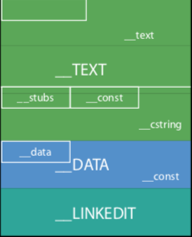
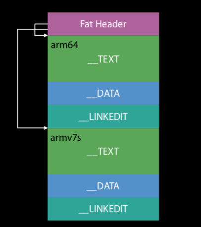

> These notes are mainly from 'WWDC 2016: Optimizing App Startup Time' ([YouTube link](https://www.youtube.com/watch?v=PxV34oZxGLM)).

##### Common Terms

`Mach-O` - It is the file type for different runtime executables. Usually corresponds to main binary of an app or extension.

`Dylib` - Dynamic library (`DSO`/`DLL` in other platforms).

`Framework` - This is usually a very generic term but in the context of Apple platforms, it indicates a `dylib` with a special directory structure around it to also hold all the files needed by the `dylib`.

`Bundle`- Special kind of `dylib` that cannot be linked against. It can only be opened at runtime using `dlopen()`. Used in macOS for plugins.

`Image` - A generic term for any of the above.

`DYLD` - Dynamic link editor, a dynamic linker that is the part of OS.

##### Internals of `Mach-O`

`Mach-O` image is divided into segments. Each `segment` is a multiple of page size and the page size in turn is determined by hardware. For arm64 page size is 16K, everywhere else it is 4K. A segment has sections. A `section` does not have any constraints of having to be page sized etc. They are non-overlapping however.

The common segments are  `__TEXT`, `__DATA`, and `__LINKEDIT`. Almost any binary has exactly these 3 segments.

Mach-O file | Universal file
--- | ---
 | 

`__TEXT`- At the start of file, contains Mach header, machine instructions, some read only constants such as C strings.

`__DATA` - Rewrite-able. Contains global variables.

`__LINKEDIT` - Contains metadata about functions and variables, such as name and address.

`Universal file` - A single file that contains binary for multiple formats (`arm64`, `armv5s`, etc.). It has a single fat header at top, which also contains offsets for the mach-O for individual architectures. This fat header is 1 of page size.

##### Logical address space and Physical RAM

Every process is a logical address space which gets mapped to some physical page of RAM. This isn't one to one mapping.

If you have a logical address that does not map to any physical RAM, when you access that address in your process, a page fault happens. At that point the kernel stops that thread.

If you have two processes with different logical addresses  mapping to the same physical page, those two processes are now sharing the same bit of RAM. You now have sharing between processes.

`File backed mapping` is when rather than actually reading an entire file into RAM you can tell the VM system through the `mmap` call, that I want this slice of this file mapped to this address range in my process.

`Copy on write` is when the `DATA` page gets shared between all the processes. It causes the kernel to make a copy of that page into another physical RAM and redirect the mapping to go to that. Such a copy however is considered a `dirty page`.

To be precise, `Dirty page` is something that contains process specific information.  `Clean page` is something that the kernel could regenerate later if needed by re-reading from disc.

##### Security aspects

Permissions that can be marked on a page - readable, writable, or executable, or any combination of those.

There are 2 big security things that have impacted `dyld`.

`ASLR` - Address space layout randomization, where basically you randomize the load address.

`Code signing` - The common notion is that a cryptographic hash is run over the entire file, and then signed with your signature. In order to validate that run time, the entire file would have to be re-read.  
So instead what actually happens at build time, is that  every single page of your Mach-O file gets its own individual cryptographic hash. And all those hashes are stored in the `LINKEDIT`.
