#### Different Instruments and Standard profiling templates

##### Instrument

There are different kinds of `Instrument`. They can be viewed in the Library (`Cmd + L`).

Instruments menu 1 | Instruments menu 2 | Instruments menu 3
--- | --- | ---
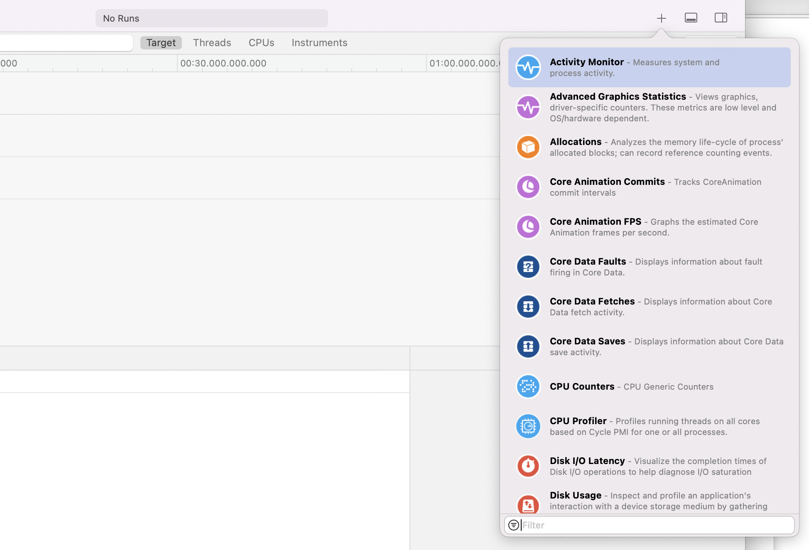 | 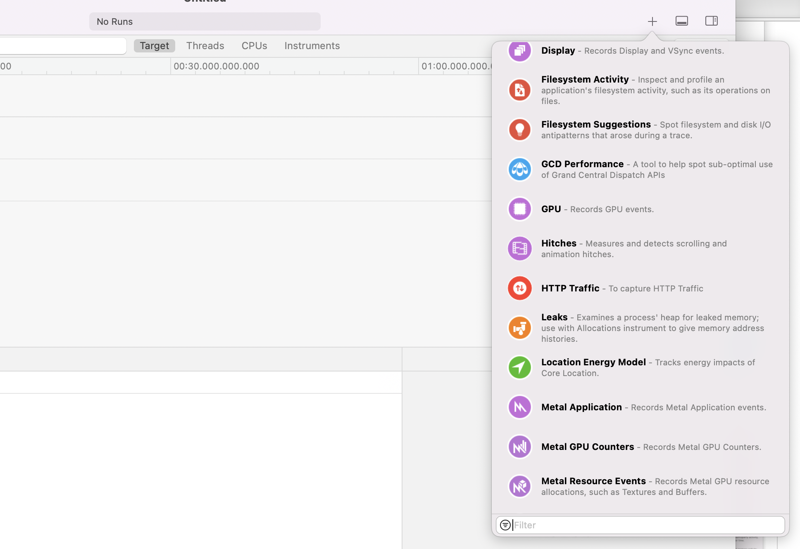 | 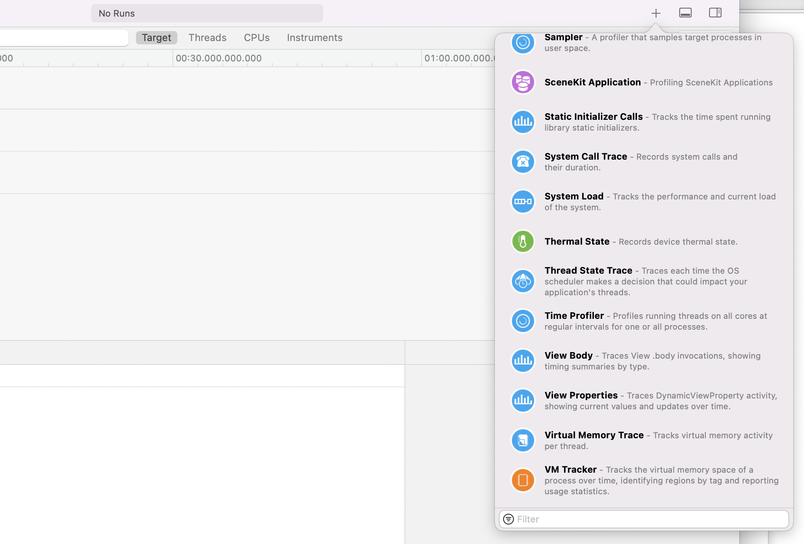

`Time Profiler` - This instrument uses infrastructure provided by the operating system to collect call stacks of relevant threads at a fixed interval. If the app's responsiveness needs to be looked into, check the main thread there.

`Points of interest` - It collects data from important areas of the app that have been highlighted in code using APIs such as `Signpost`.

##### Trace Document/Profiling Template

Multiple instruments are combined together to create a `trace document`. There exist some `Profiling Templates` for these trace documents.

Standard Profiling Templates | Time Profiler profiling template
--- | ---
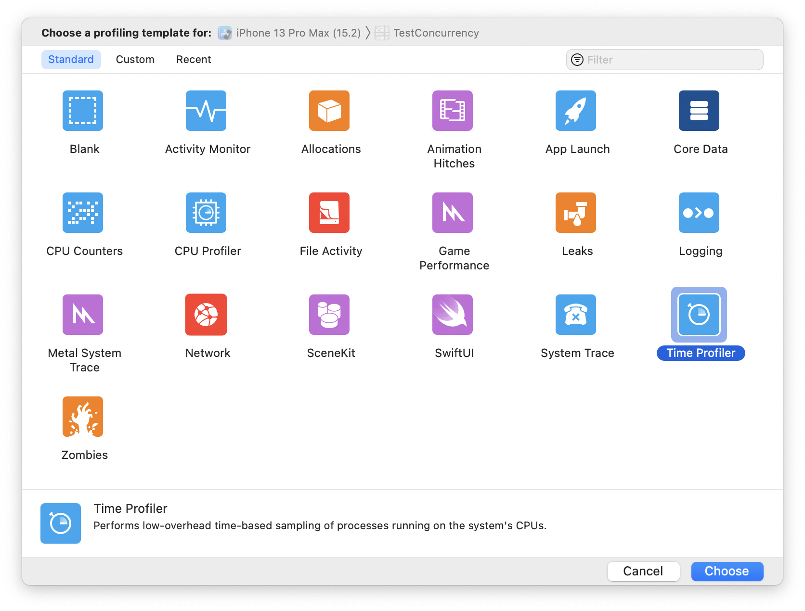 | 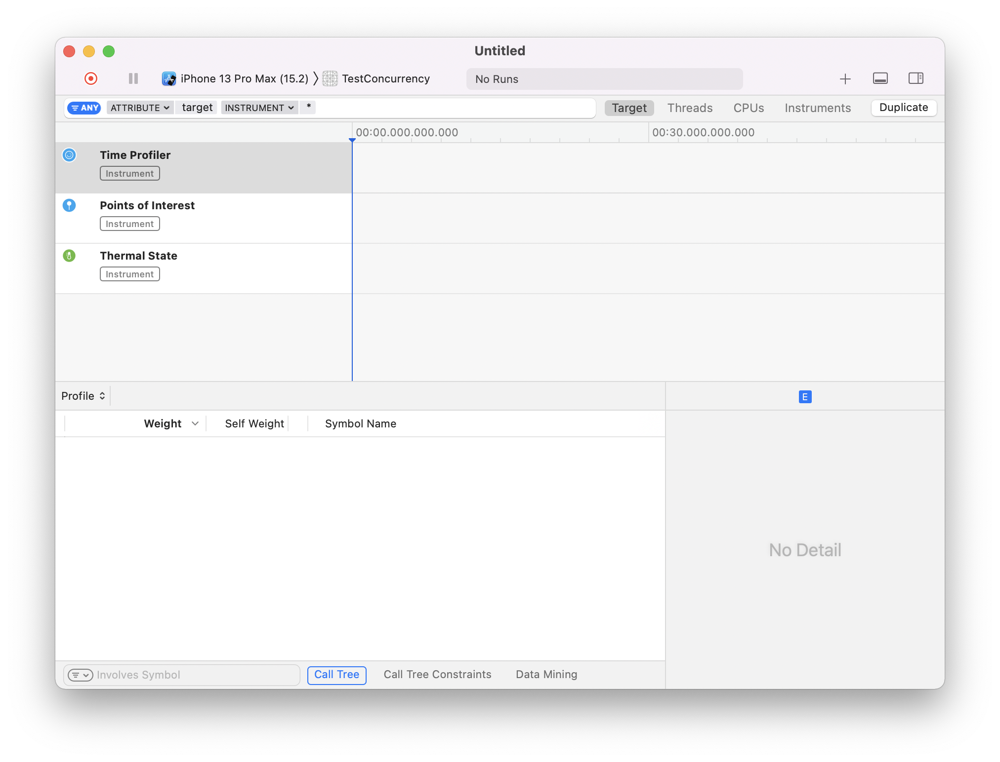

Here are some of the common profiling templates.

`Time Profiler` - Performs low-overhead time based sampling of processes running on system's CPUs. It contains three Instruments - Time Profiler, Points of Interest, Thermal State. Its a great tool for understanding how an app is spending time.

`App Launch` - A 5 second app launch time profile and system trace.

`File Activity` - Records and analyszes file system and disk I/O activity.

`Logging` - Visualization of logs and signposts. This has both `os_log` and `os_signpost` instruments.

`Network` - Shows how application makes HTTP requests and uses TCP/IP and UDP/IP connections using Connections Instrument.

`System Trace` - A comprehensive view of what's happening on the system. Shows how threads are scheduled across CPUs. Shows system calls and virtual memory faults too.

A single Instrument can contribute trace data to multiple tacks (i.e. 'instruments', loosely speaking).

#### Instruments UI

More instruments can be added to a document/profiling template from the top right button (i.e. the `library`). `Profiling controls` such as record, pause, etc. are provided on top left. The profiling target device (i.e. `Target area`) are also on top left right next to the profiling controls. And right next to the target area is the selector for the `process (i.e. app)` to be profiled.

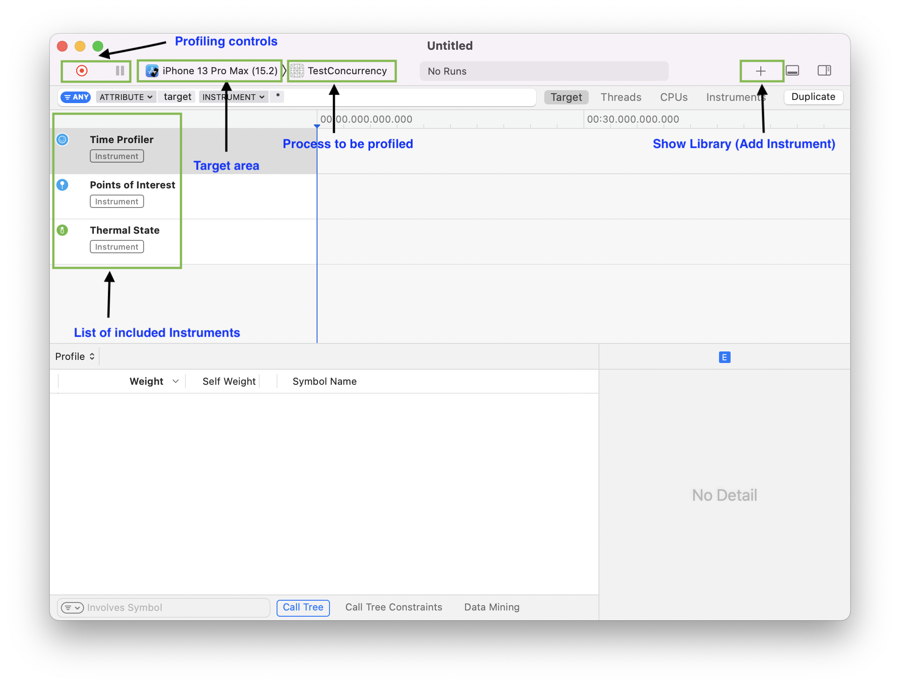

Every row in the main pane is probably what is termed as `Track`.

In the top filter bar, there are some standard filters. These probably change for different profiling templates, but in case of a `Time Profiler` profiling template, there are 4 standard filters -

`Target` (has all instruments + Threads), `Threads` (shows the threads used by the process being profiled), `CPU` (shows what's happening across various CPUs on the target device), `Instruments` (shows just the included Instruments alone). Also, the 'filter textfield' always shows the currently selected filters.

Target filter | Threads filter
---| ---
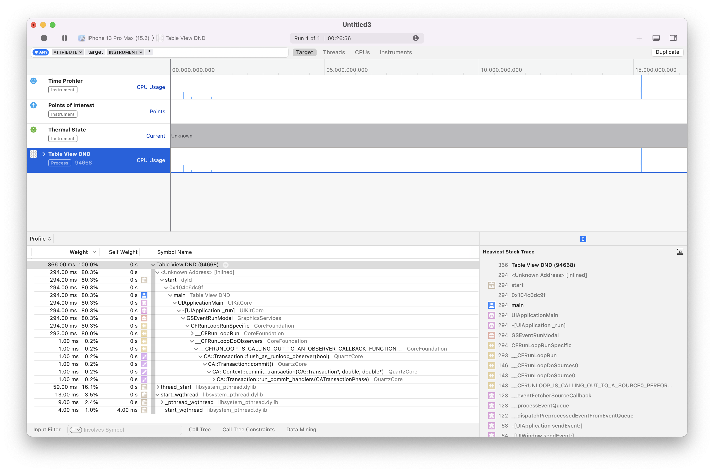 | 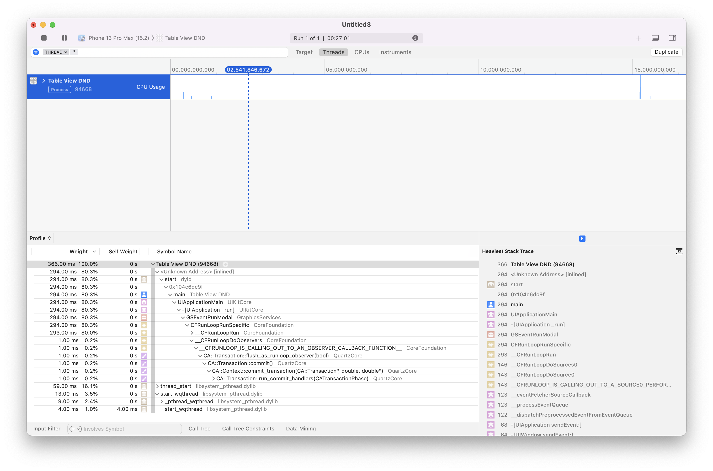

CPUs filter | Instruments filter
---| ---
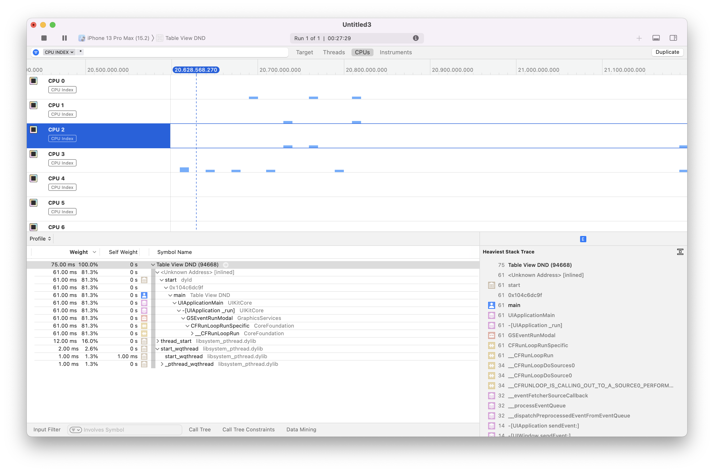 | 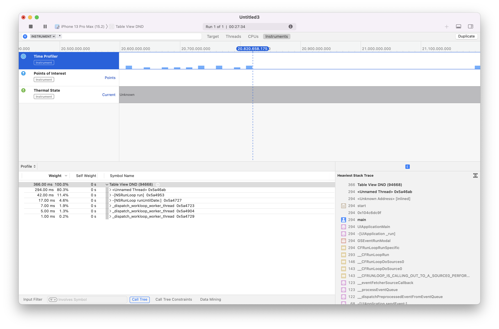

The process being profiled is shown in the `Threads` filter.

#### Tricks

While looking into any thread's stack (sequence of functions called), if `Option Click` is done on the disclosure triangle for any symbol all the symbols are automatically expanded (until Instruments feels there is something of interest).

For any thread, the `Heaviest Stack Trace` is shown on the right bottom pane. This is the stack for the set of functions that were called most often during the Profile.

The main thread is usually identifiable by looking for the thread which has `UIApplicationMain` called (in older versions of Instruments app, probably that thread used to have an explicit 'Main Thread' label).

While looking at the symbols/frames list for a stack, frames that come from System Frameworks or Libraries are shown in grey (custom code whereas is not). If a custom module symbol is tapped in the detail view, the symbol gets highlighted in the main menu and it can then be double clicked to go the corresponding code. Thereafter its also possible to the Xcode icon there to open that file in Xcode (this Xcode icon is greyed out if the symbol is from a system module).

Custom code symbols not greyed out | Xcode icon enabled for custom code
--- | ---
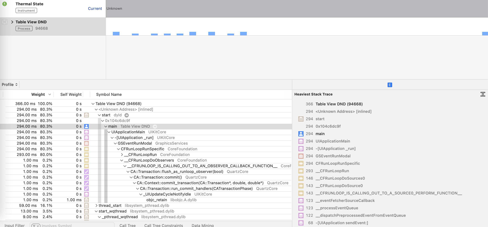 | 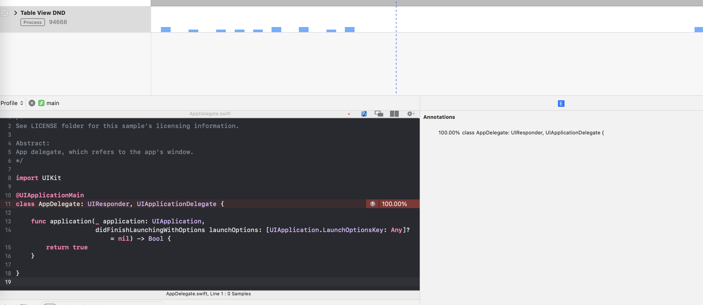

If the '+' icon next to any track is tapped, it gets pinned at the bottom and is always shown (i.e. `Track pinning`). This is handy when there are plenty of tracks or instruments in the document.

There is a debug `console` (menu option as well 'Command Shift Y') 'here too that can be used to look at the app's console log as it it was being run from Xcode.

Any of the tracks' graphs can also be tapped at any point, using what is known as `Inspection Head`. On doing so, some details are showed in a hover and the Expanded Details View also gives more information regarding the stack trace there.

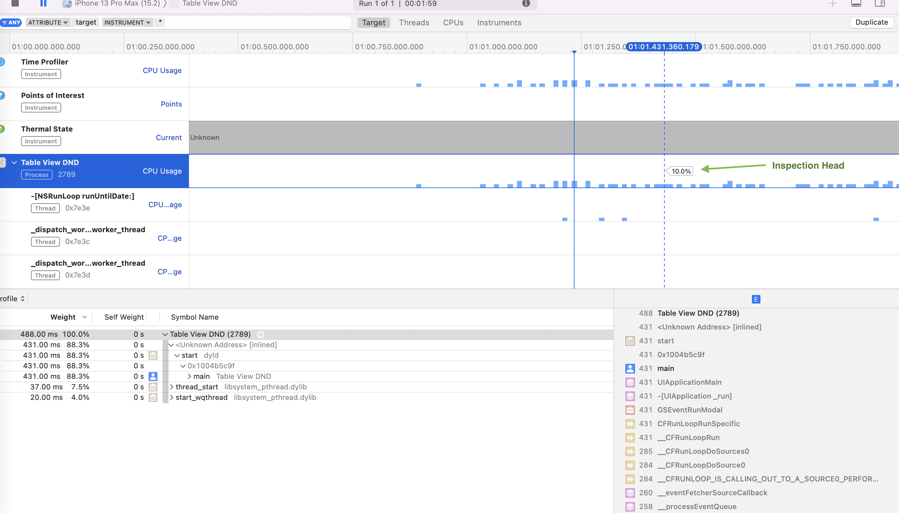

> Its supposedly possible to zoom in on any region in the graph by triple clicking there (instead of clicking and dragging). But doing this just seems to select that point in detail view, and does not do anything more.

#### Best practices while profiling with Instruments

> These are not recommended but mandatory (👇). Even if they are not done, Instruments can still give valuable insight depending on what the goal is.

To get really accurate date, profiling should be done with a real device being the target. When pofiled on simulator, the process is using Mac's hardware.

Also, profiling should ideally be done in the app's release configuration and not debug. This can be done by editing app's Profile scheme. The Compiler supports a number of different optimization levels and when a Build-Run cycle is done from Xcode, a low-level of optimization is done which probably really optimizes things for debug configurations that could hide some issues that would be more obvious when running with release configuration. By default, Profile scheme for any app has Release configuration set.

#### Misc.

Spinning is how Instruments refers to the main thread being blocked. And on the Mac, that's what causes the Spinning Wait Cursor.

Very often stack trace has instance of something termed as `thunk`. Its a piece of helper code generated by the compiler and doesn't correspond directly to any source code in the application.

There is an `Immediate mode` and a `Last x seconds mode` while profiling. The former is the defaul mode and the latter can be activated by doing an option click on the Record button. The latter is easier on the system and is recommended.
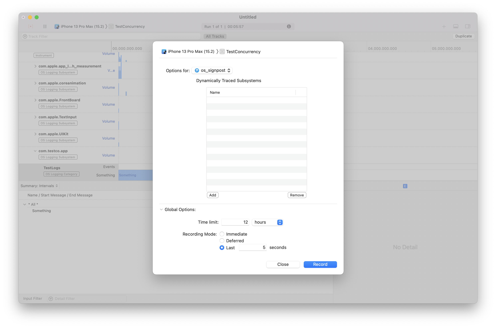
