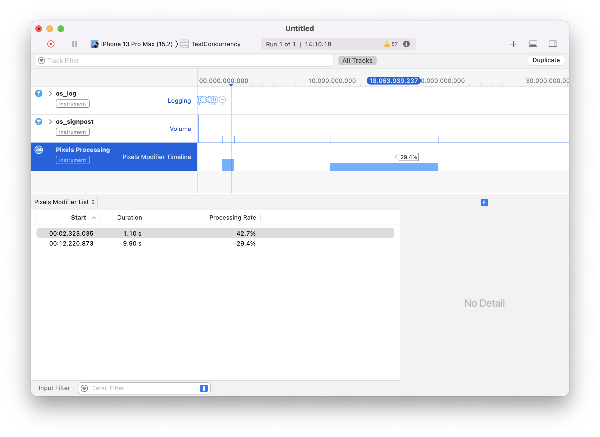
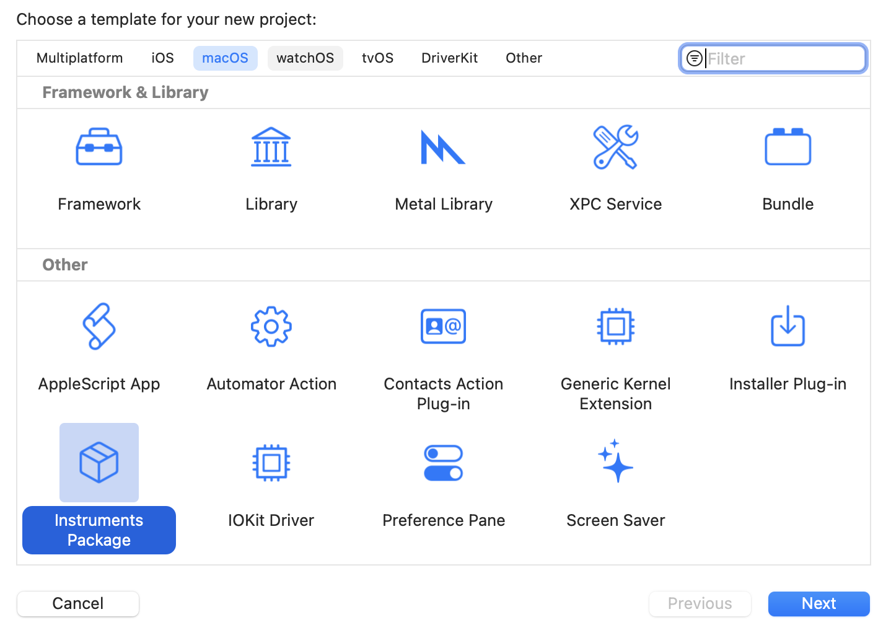
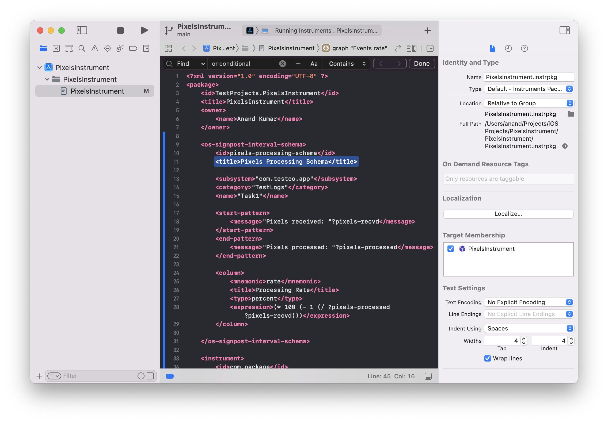
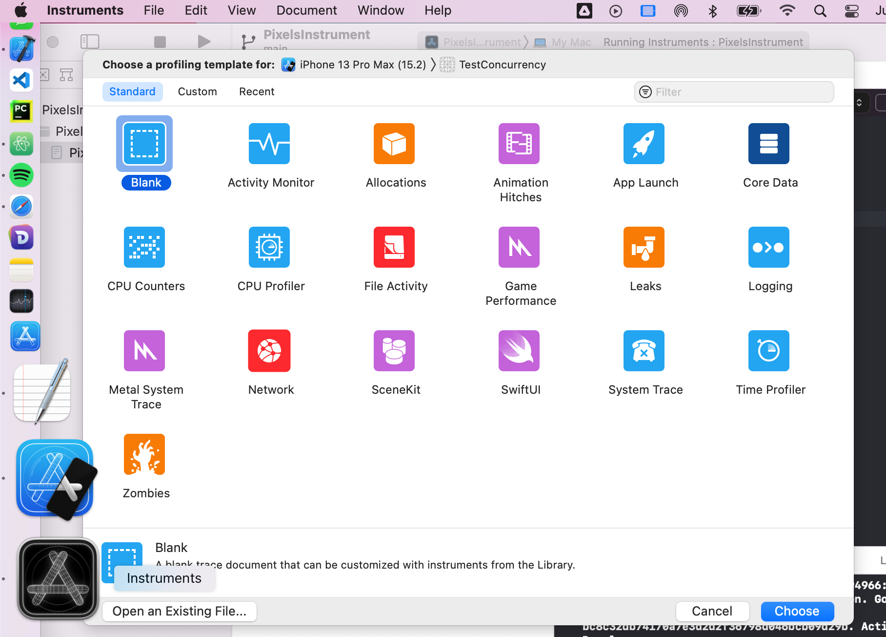
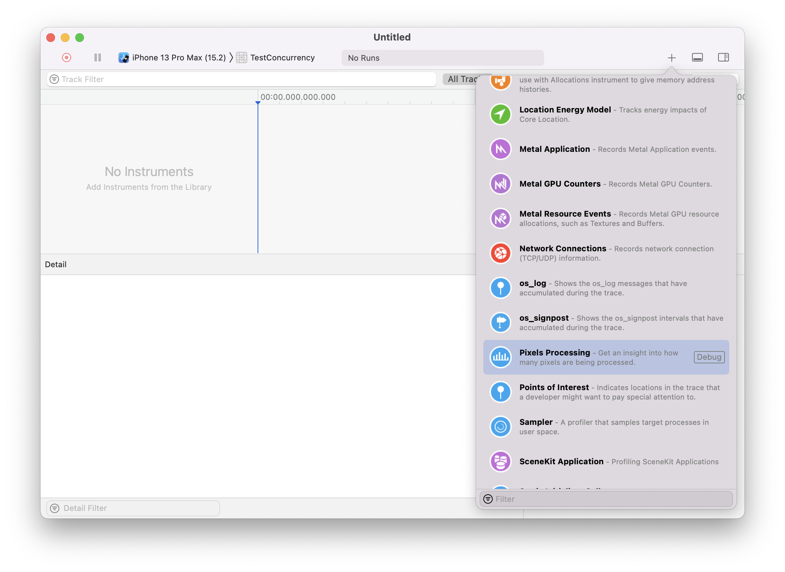
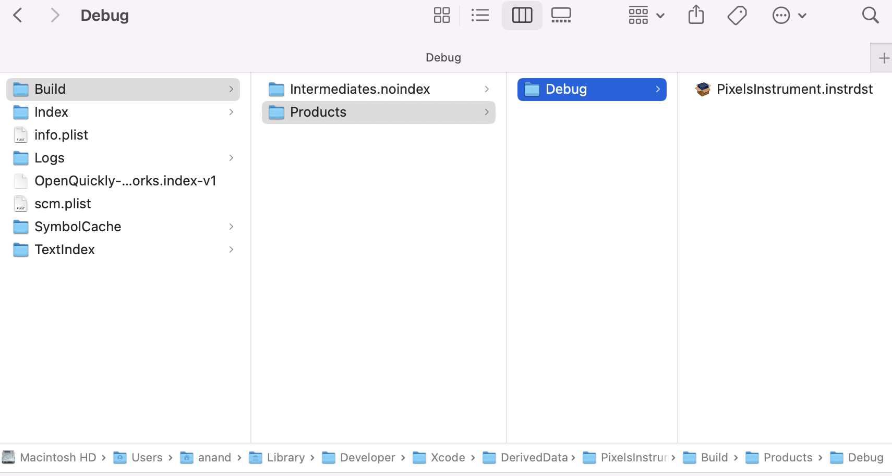

#### What does it eventually look like

Simply put, this allows to create a custom instrument. That is a new instrument in the library which shows customized graphs and details using custom data.

In the below screenshot, 'Pixels Processing' is a custom instrument. It has just 1 graph named 'Pixels Modifier Timeline' and 1 detail view named 'Pixels Modifier List'. The list has 2 entries, and there are 2 corresponding entries in the graph too.

#### Basic steps

Create a new macOS app of type `Instrument Package`. The resulting project is pretty simple, and has just 1 file (of type `instrpkg`). This instrpkg file is of xml format and this is where everything is specified. Its contents to needs to be as per certain allowed keywords (the build system does catch some of these). When run (i.e. simple Cmd + R), it launches a 'developer' Instruments app (which has a grayscale icon). Any template (it can also simply be the 'Blank template') needs to be selected there, and in the resulting tracedoc this new Instrument shows up in the library (with a `Debug` label next to it).

1. Create a new macOS Instruments Package project | 2. Specify configuration in the `instrpkg` xml
--- | ---
 | 

3. Run project, developer Instruments app launches | 4. Custom Instrument shows up in library
--- | ---
 | 

#### Distributing

Distributon of a custom instrument is done by sharing the `instrdst` file needs. Its located in the Build folder (`Product > Show Build folder in Finder`). Theretafter it can be installed by others by double clicking on it.

`instrdst` location | Installing the Instrument
--- | ---
 | 
