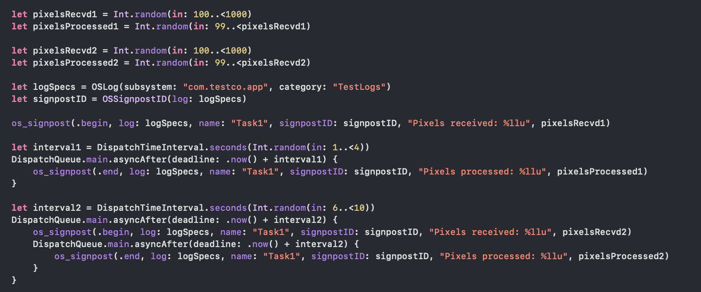
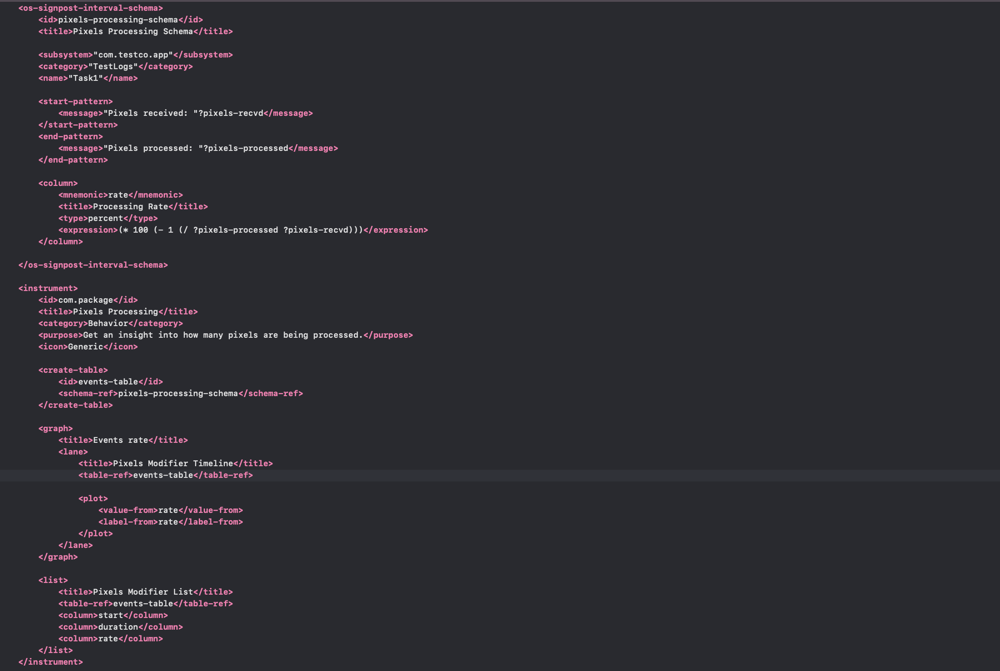
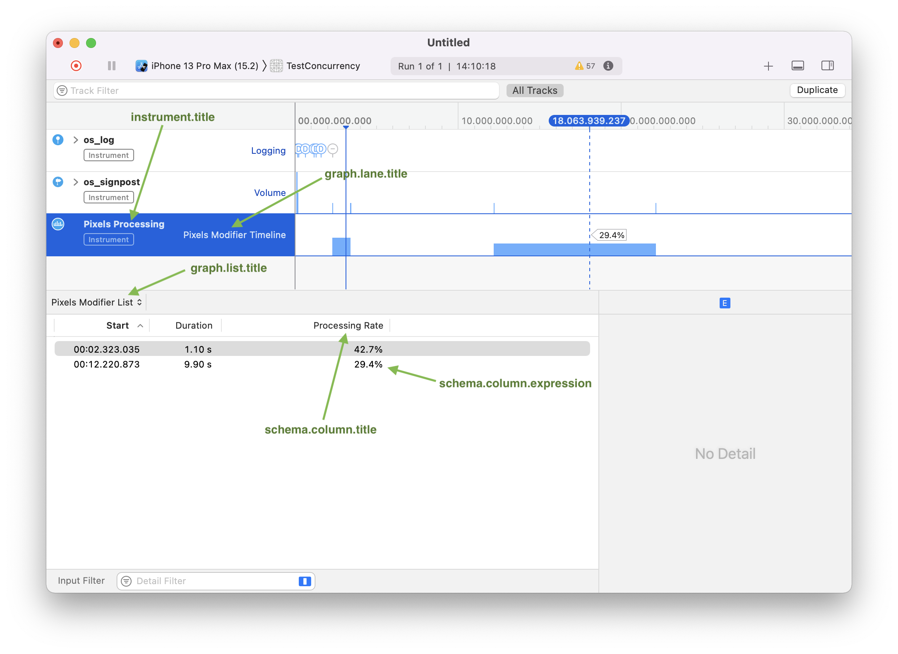

#### Understanding the package xml

Consider the below code that uses signposts to record interval based logs.



For the above code the xml needs to be something like this and then it will show up in Instrument as below. (Keep in mind that any interval shows up in Instrument only when an `end` event happens too, just `being` event alone is not enough.)

Package xml | Instrument UI
--- | ---
 | 

##### Schema

Any instrument package needs to have a schema defined. For creating signposts based instrument, a default schema named `os-signpost-interval-schema` exists which should be used (it can be inserted using a built-in code snippet). <br>

Specifying the signpost specs i.e. `subsystem`, `category`, `name` is pretty simple.

```
<subsystem>"com.testco.app"</subsystem>
<category>"TestLogs"</category>
<name>"Task1"</name>
```

The patterns for recognizing the interval-start as well as interval-end messages is more intricate though. If the messages need to be parsed such that its substrings are treated as variable in the remaining xml, `CLIPS` language needs to be used. In the below example, parts of start message and end message are stored in variabled named `pixels-recvd` and `pixels-processed`.

```
<start-pattern>
    <message>"Pixels received: "?pixels-recvd</message>
</start-pattern>
<end-pattern>
    <message>"Pixels processed: "?pixels-processed</message>
</end-pattern>
```

`column` tags are probably what are used to insert entries into underlying analysis core (i.e. database). In the below example, for every signpost interval an entry is made for a column named 'Preprocessing Rate' which has the specified `mnemonic` (i.e. idenitfier). The value is as specified in `expression` (which again used `CLIPS`) and has the specified `type`.

```
<column>
    <mnemonic>rate</mnemonic>
    <title>Processing Rate</title>
    <type>percent</type>
    <expression>(* 100 (- 1 (/ ?pixels-processed ?pixels-recvd)))</expression>
</column>
```

In `(* 100 (- 1 (/ ?pixels-processed ?pixels-recvd)))` is basically this - `((1 - (pixels-processed/pixels-recvd))*100)` (i.e. a 'remaining' percentage calculation).

The types here need to be of some specific Instrument types that are known as `Engineering Type`. There are numerous possible values such as `percent`.

###### Some more examples of expressions

Being an xml, to specify `>` and `<`, encoded symbols like `&gt;` should be used.
```
(if (&gt; (- 1 (/ ?size-after ?size-before)) 0.85) then "High" else "Low")
```

The color strings `Red` and `Green` here are being spcified as they are the allowed values for the associated mnemonic `event-concept` ([link](https://help.apple.com/instruments/developer/mac/10.0/#/dev66257045)).
```
(if (&gt; (- 1 (/ ?size-after ?size-before)) 0.85) then "Red" else "Green")
```

##### Instrument tag

The basic details are specified using tags such as `title`, `category` (needs to be an allowed value , build system will verify), `purpose`, etc.

```
<id>com.package</id>
<title>Pixels Processing</title>
<category>Behavior</category>
<purpose>Get an insight into how many pixels are being processed.</purpose>
<icon>Generic</icon>
```

`create-table` tag is needed too and need to have a `schema-ref` with its value being what was specified earlier in the xml for the schema.
> What really is a table though, and why is it needed when a schema was already specified.

```
<create-table>
    <id>events-table</id>
    <schema-ref>pixels-processing-schema</schema-ref>
</create-table>
```

The graph view for the instrument is specified using `graph` tag. There can be more than one graph and every graph can have more than one lane.

```
<graph>
    <title>Events rate</title>
    <lane>
        <title>Pixels Modifier Timeline</title>
        <table-ref>events-table</table-ref>

        <plot>
            <value-from>rate</value-from>
            <label-from>rate</label-from>
        </plot>
    </lane>
</graph>
```

The detail view can have multiple lists and they are specified using `list` tag. The `table-ref` here needs to be the table ID that was given earlier for the table. `column` values should either be a column mnemonic that was specified earlier in the schema (like `rate` here) or a built-in Instrument value (like `start`, `duration`, here).

```
<list>
    <title>Pixels Modifier List</title>
    <table-ref>events-table</table-ref>
    <column>start</column>
    <column>duration</column>
    <column>rate</column>
</list>
```


##### Engineering types

All the engineering types correspond to a certain CLIPS data type, has a fixed display width in Instrument UI, etc. For example, [this](https://help.apple.com/instruments/developer/mac/10.0/#/dev14811197) is the reference for `percent` type.


Apple's Instruments documentation has the [full documentation](https://help.apple.com/instruments/developer/mac/10.0/#/dev44171418).


##### CLIPS basics

Variables should always be prefixed with a `?`, as in `?pixels-recvd` above.

Aritmetic calculations are done using the syntax - `operator first_operand second_operand`.
```
CLIPS> (/ 4 2)  // Division
2.0

CLIPS> (* 2 3 4)  // Multiplication
24

CLIPS> (- 4.7 3.1)  // Subtraction
1.6
```

Comparisons too follow the same format.
```
= ?v 6   // Checking if the variable v is equal to 6
TRUE
```

If conditions are specified this way (newlines are not necessary in the xml).
```
if <expression>
   then
      <action>*
   [else
      <action>*]
```

Official CLIPS language reference ([link](https://clipsrules.sourceforge.io/documentation/v630/bpg.pdf)) <br>
Another CLIPS documentation that I referred to ([link](https://clipsrules.net/Documentation.html)) <br>

##### Misc.

[AppSector article](https://medium.com/appspector/building-custom-instruments-package-9d84fd9339b6) (this is what I pretty much followed) <br>
[Another AppSector article about the process](https://appspector.com/blog/instruments-part-2) (a minor introspection about the lack of documentation and utility) <br>
[Cocoafrog article](https://blog.cocoafrog.de/how-to/2020/06/20/You-should-all-build-this-custom-instrument.html) (didn't quite read, but looks fine) <br>
[Apple's official guide for creating a signpost based Instrument](https://help.apple.com/instruments/developer/mac/current/#/devbe5c72066) <br>
