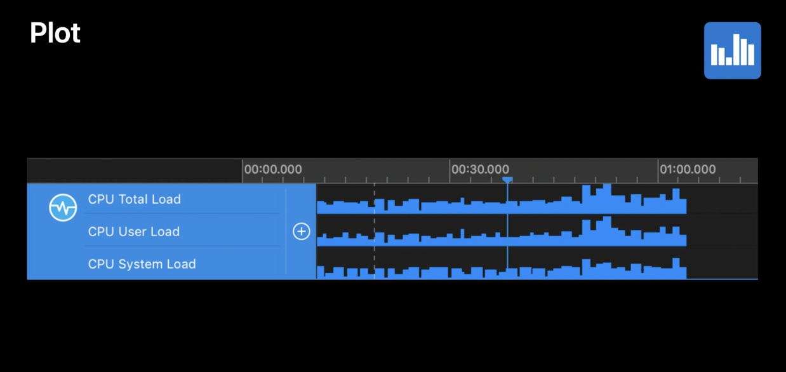
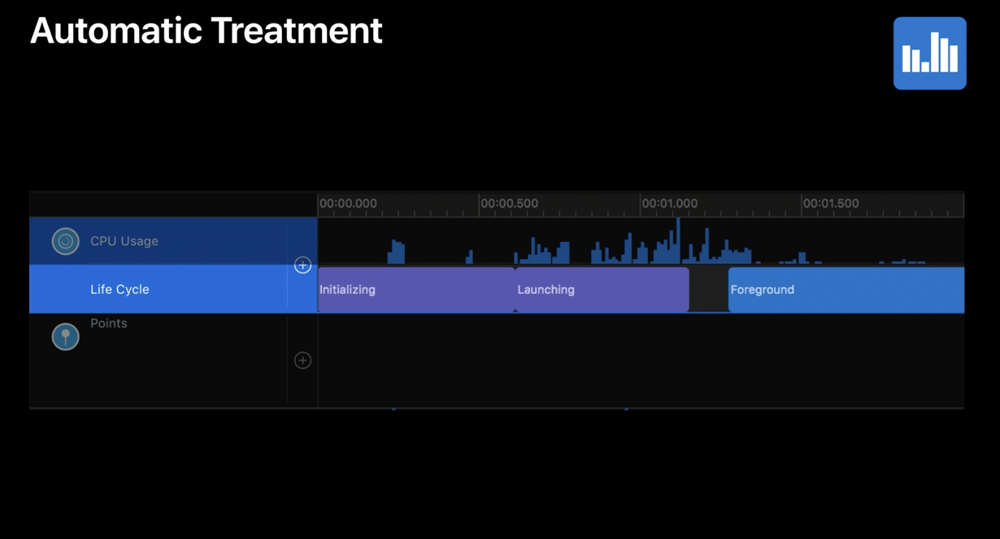
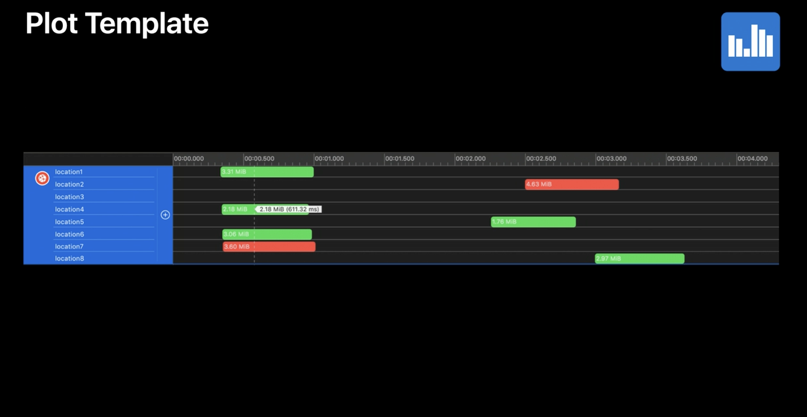
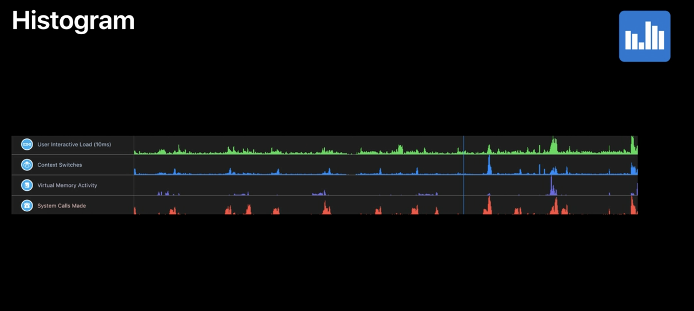
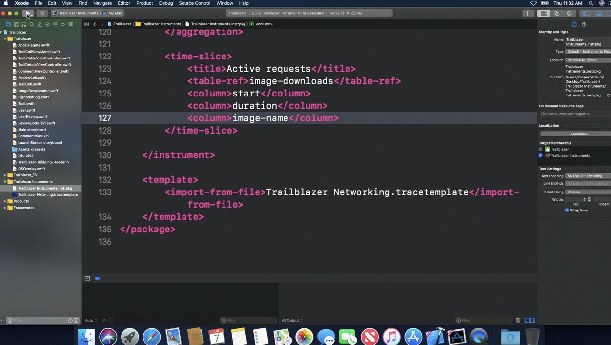
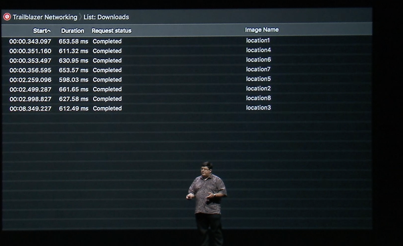
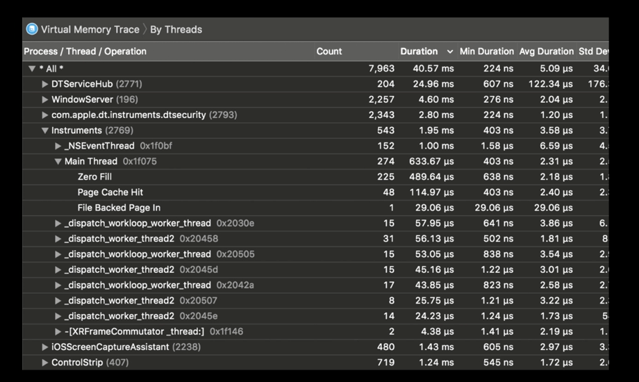
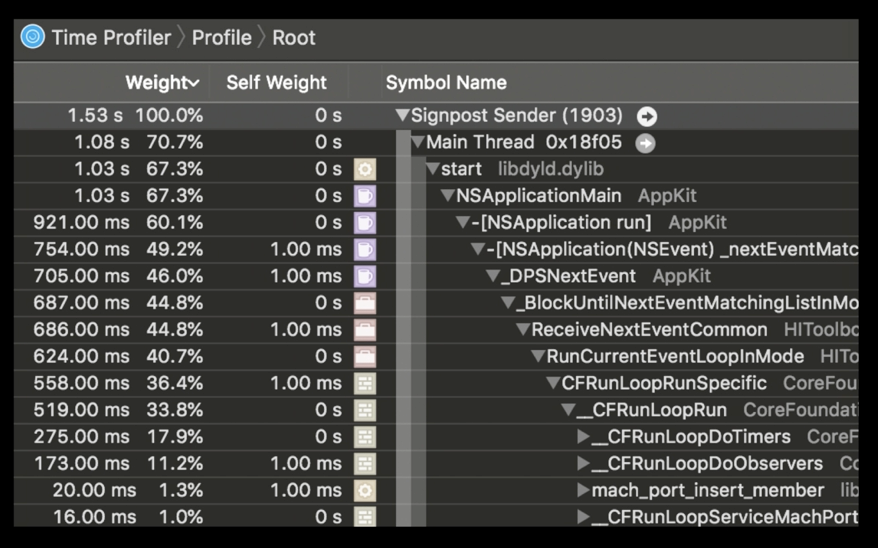
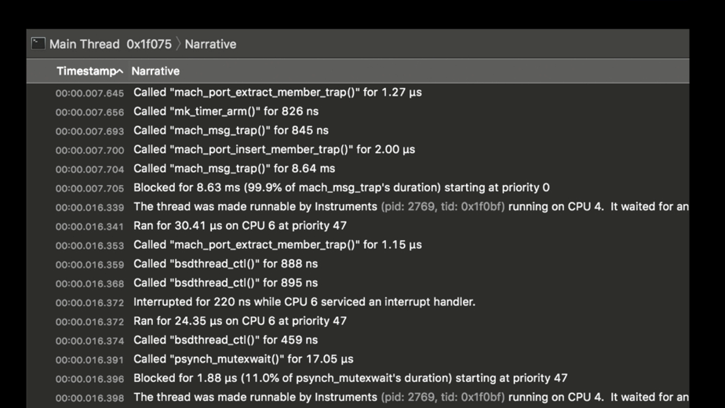
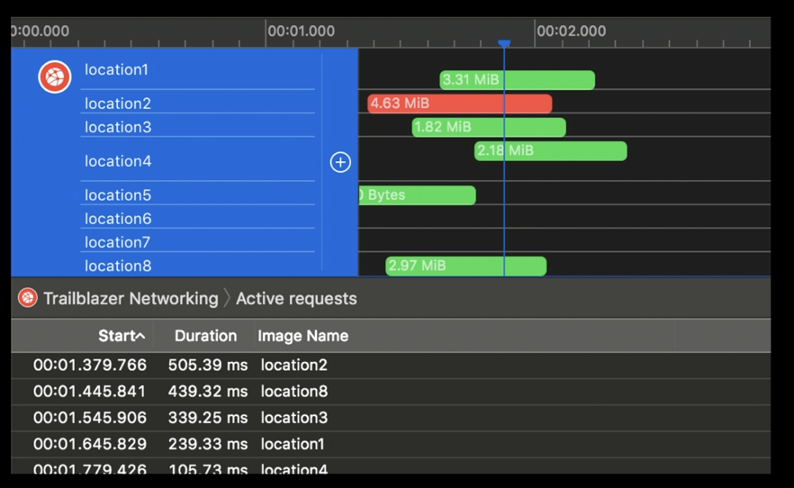

##### Different kinds of Graph Views

The kind of graph is depends on both the schema type as well as the column from which data is being sourced.

There are different kinds of schemas. An `interval schema` works with a time and a duration. A `point schema` just works with a timestamps.

If the column being targeted has a 'magnitude', then a bar graoh such as this is drawn. If however the column being targeted has a state and the state does not inherently have a magnitude, a different representation (with rounded rectangles) gets used.

magnitude represented using bar graph | state represented using state graph
--- | ---
 | 

If number of graphs or the number of lanes are to be created dynamically, based on the contents of the data, a `plot template` needs to be used. It allows to choose a column in the table and a separate row is created for each unique value in that column.

If just spikes or periods of activity needs to be looked at, `histogram` can be used.

Plot template | spikes represented using histogram
--- | ---
 | 

> An example of a instrpkg xml for a plot template based on signpost schema (from 'WWDC 2018: Creating custom instruments 30:00')

> These are also explained in possibly greater depth in 'WWDC 2019: Developing a Great Profiling Experience 26:00' onwards.

##### Different kinds of Detail Views

`Lists` are a simple tabular representation of data from the analysis core. `Aggregations` are a more aggregated representation of data (which even allow hierarchy to be depicted). There is yet another kind of aggregated view known as `Call Tree` that is possible. For example, it is useful when there is a backtrace and there is another column that's a weight. Time Profiler has a Call Tree detail view.

List | Aggregation | Call Tree
--- | --- | ---
 |  | 

`Narrative` is yet another representation, it is used when some information has to be conveyed that is best left to plain technical words.

`Time Slice` detail view looks a lot like lists, except the contents are filtered to include only the intervals that intersect with the currently selected time on the graph view (usually a blue vertical line).

Narrative |Time Slice
--- | ---
 | 
