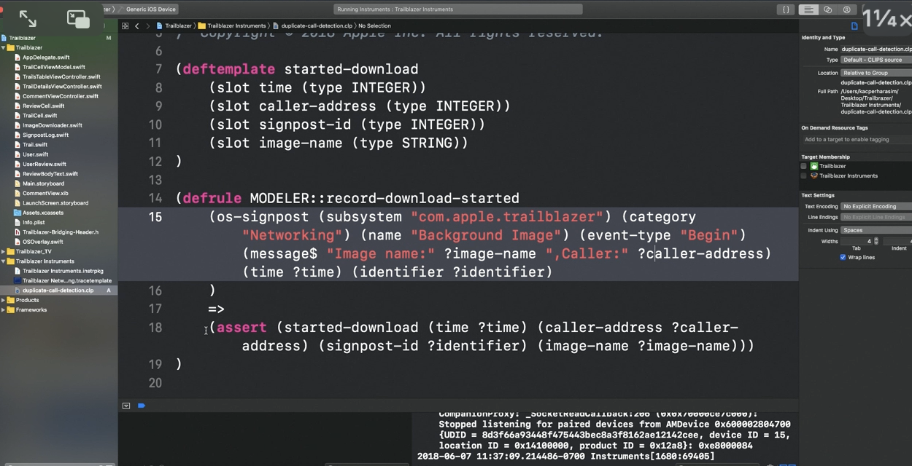

> Explained in 'WWDC 2018: Creating Custom Instruments' from around 37:31. This is just some theory from that video. Need to watch it again after actually trying a custom modeler.     Modelers are also covered in some details in 'WWDC 2019: Developing a Great Profiling Experience 30:56' onwards.

Roughly speaking, `Modelers` are what work on incoming data stream and modify it before saving them in the tables in `Analysis Core`.

##### Custom modelers

Its possible to write custom modelers. They are written in `CLIPS` language and defined in the instrument package using `<modeler>` tag. `<point-schema>`, `<interval-schema>` can be used to create a custom ouput schema for the modeler. A new clips file can be created using `File > New > Other > Clips file (.clp)`.

Here is a sample custom modeler.

[Official documentation](https://developer.apple.com/documentation/metrickit/improving_your_app_s_performance/creating_custom_modelers_for_intelligent_instruments)

##### Time ordered

Modelers can require their own inputs and those inputs can be the outputs of other modelers or they can be recorded directly from the data stream.

The inputs of the modelers are always perfectly time ordered and so if several different `Input Tables` are requested, those tables are first time ordered and then merged into a time-ordered queue (whatever it may mean), which feeds the `Working Memory`. As the modeler sees a pattern that it wants to produce an output for, it simply writes it to its outbound `Output Tables`.

The `Modeler clock` is always set to the current input timestamp. And for an input to remain in the working memory, it must intersect with the current clock in the modeler.

##### Production system

The way that a modeler reasons about its working memory is defined by the developer through what's called a `Production system`.

Production systems work on facts in the working memory and they're defined by rules that have a left-hand side, a production operator, and the right-hand side. The left-hand side is a pattern in working memory that has to occur to activate the rule and the right-hand side are the actions that will happen when that rule fires. Now the actions could include adding a row to an output table or include asserting a new fact into the working memory as the modeling process progresses.

Rules are prepended by either modeler or recorder. Those are what are called modules in Clips and they allow to both group rules and also control the execution order of the rules.

##### Logical support

`Logical support` is usually tied to what are called `Peer Inference rules` and those are rules that  say, well, if A and B, then C.
