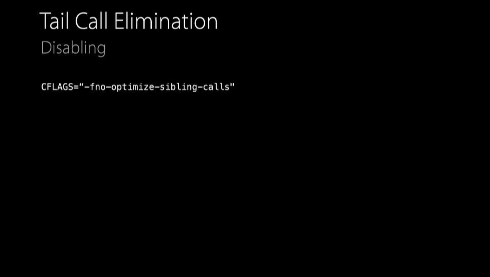
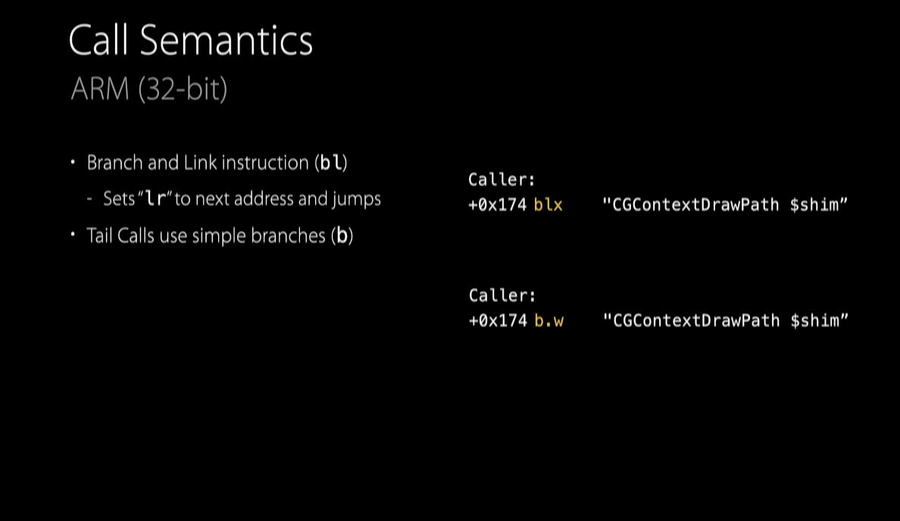
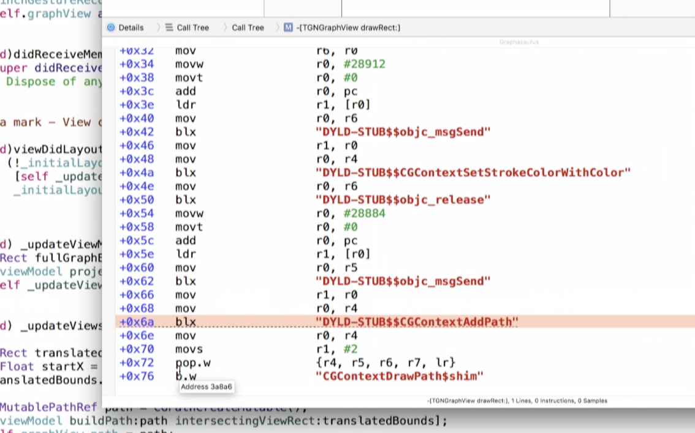
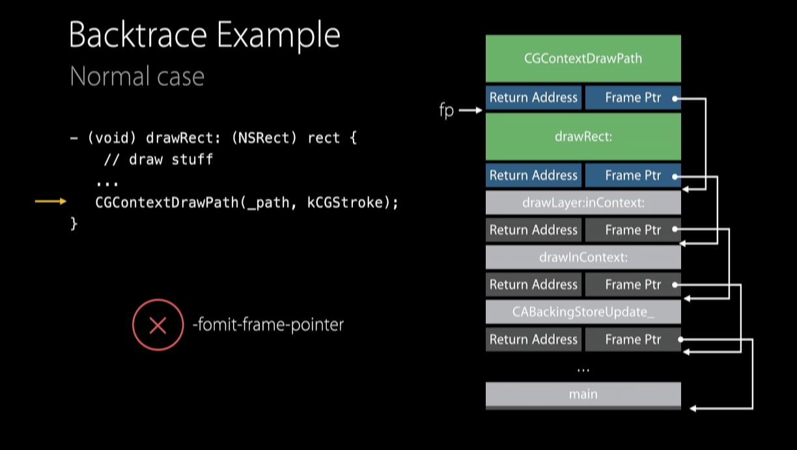

##### WWDC videos

WWDC 2021: Analyze HTTP traffic in Instruments  
WWDC 2019: Getting Started with Instruments k  
WWDC 2019: Developing a Great Profiling Experience k  
WWDC 2019: Modeling in Custom Instruments  

WWDC 2018: Creating Custom Instruments k  
WWDC 2018: Measuring Performance Using Logging k  

WWDC 2015: Profiling in Depth k  
WWDC 2015: Debugging Energy Issues  

WWDC 2020: Diagnose performance issues with Xcode organizer  
WWDC 2018: iOS Memory Deep Dive  
WWDC 2015: Performance on iOS and watchOS  

--------

#### Tail Call Elimination

> Explained in 'WWDC 2015: Profiling in Depth' 10:30 - 15:47. Also, in [a Medium article](https://medium.com/the-traveled-ios-developers-guide/tail-call-elimination-in-ios-7a5f491e4273), and [another GH page](https://suelan.github.io/2020/08/05/20200805-tail-call-elimination/).

The compiler does plenty of optimizations while converting source code into lower level assembly code. One of these is `Tail Call Optimization`. When it  comes to assembly, even function invocation gets something called a `stack frame` where a certain part of the memory gets pushed on to the stack for itself. It uses that to store things like the address of the function that called it, captured variables, etc. Loosely speaking what happens in case of `Tail call optimization` is that if the compiler sees that functionA's implementation's last line is functionB and functionB does not need anything from functionA otherwise, when the execution reaches functionB call it just already pops out the functionA stack frame from the stack and transfers the return address to functionB's stack frame. Something like that.

The catch with this optimization though is that it causes a misrepresention of the backtrace shown in Instruments' Time Profiler, as the time shown as spent in functionA may not be accurate (when in reality functionA has not yet expired in terms of chain of functions called).

So if needed for the purpose of instrumenting, tail call optimization can be turned off using a compiler flag and the app rebuilt.

Tail call optimization is also identifable by looking at assembly code, by tracing the sequence of things like `blx` and `b.w`.

`bl` and `b` codes | Disassembly in Instruments
--- | ---
 | 

[Stack frames and Frame pointers (Rutgers link)](https://people.cs.rutgers.edu/~pxk/419/notes/frames.html)

#### Do not turn on `fomit-frame-pointer`

Frame pointers are absolutely necessary for Instruments to capture backtraces. Its technically possible to not use them with some compiler build settings, so that setting (`fomit-frame-pointer`) should not be used.

--------

Lib vs framework
Concurrency notes
SPM notes

SPM EASE implementation
Xcodegen

Instrumentation
JavaScript

Building EASE web
Splunk
Safari and Web technologies
Server side code
Server side Swift/Xcode cloud
ML basics, CoreML, UI frameworks

--------
