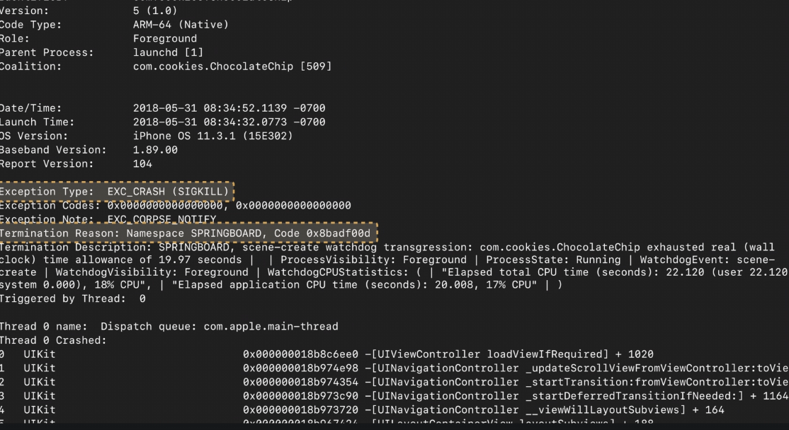
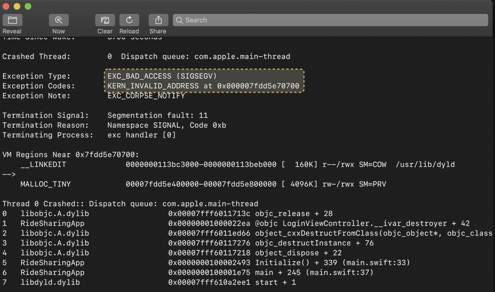

##### Exception type

Crash logs usually have `Exception Type` listed, and various codes there mean various things.

`EXC_BAD_INSTRUCTION (SIGILL)` - This means the CPU tried to execute an instruction that does not exist or is invalid for some reason. For example, implicity unwrapping a nil Optional in Swift will lead to this. In fact, that is an example of a precondition or an assertion in the code. Preconditions and assertions are error checks that deliberately stop the process when an error occurs. Out-of-bounds Swift.Array access is another example.

`EXC_CRASH (SIGKILL)` - Commonly used when the operating system wants to stop the process.

Some more example of crash log contents (of this type?) are OS stopping the process of debvice has overheated, watchdog events stopping the process if app takes too long to launch, device running out of memory, invalid code signature, etc. (Is division by 0 too an example of this?)

The termination reason `0x8badf00d` (termed as `ate badfood`) indicates something in particular (there is a documentation in some tech note for it, can locate). In the below example, it is for app taking more than 20 sec to launch (mentioned in 'Technical Description').

> The launch timeout watchdog is disabled in the Simulator, so launch times and any possible logs must be checked without debugger attached (for example through TestFlight). Possibly running on real device (from Xcode) too works?

`EXC_BAD_ACESS (SIGSEGV)` - This typically means bad memory error. Either a write is being attempted to a read-only memory or a read is being attempted from memory that does not exist at all. Its actually a wide variety of crashes.

In the above example, stack trace is showing an `objc_release` which is a part of the implementation of reference counting. The stack tracfe later also has an `object_dispose` which is a function used by Objective-C runtime to deallocate objects. So this example eventually indicates that an object of LoginViewControlle class is being deallocated (when its already deallocated).

Another common memory error symptom is an unrecognized selector exception. These are often caused when there is an object of some type, a code that is using that object, and then the object gets deallocated and used again.

you can use tools like the Address Sanitizer and the Zombies instrument to try and reproduce the crash.

Address Sanitizer and the Zombies instrument too are handy tools to catch memory errors.
