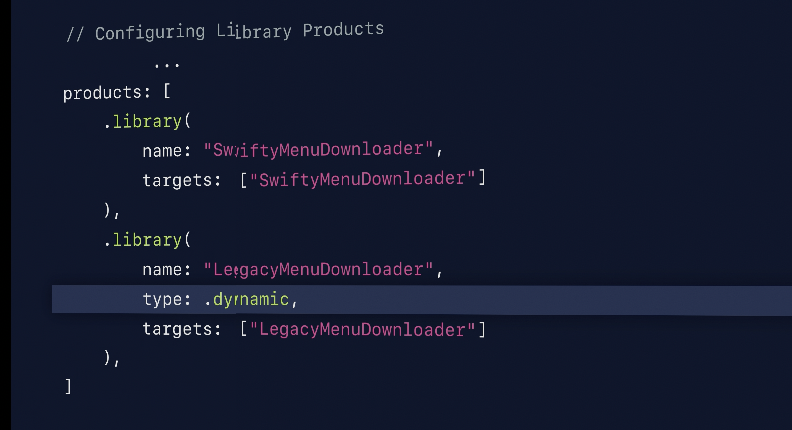
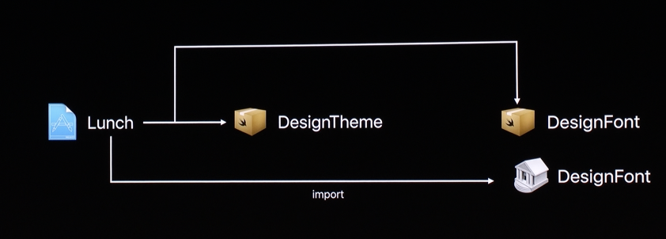

##### Manifest syntax

There needs to be a class instance of name `package` and type `Package` in a file named `Manifest.swift` which specifies everything about the package, i.e. its name, dependencies, etc. This class is a system defined module named `PackageDescription`.

```
// swift-tools-version:5.5

import PackageDescription

let package = Package(
    name: "FisherYates",
    products: [
        .library(name: "FisherYates", targets: ["FisherYates"]),
    ],
    targets: [
        .target(
            name: "FisherYates",
            dependencies: []),
        .testTarget(
            name: "FisherYatesTests",
            dependencies: ["FisherYates"]),
    ]
)
```

```
init(
  name: String,
  pkgConfig: String? = nil,
  providers: [PackageDescription.SystemPackageProvider]? = nil,
  products: [PackageDescription.Product] = [],
  dependencies: [PackageDescription.Package.Dependency] = [],
  targets: [PackageDescription.Target] = [],
  swiftLanguageVersions: [Int]? = nil,
  cLanguageStandard: PackageDescription.CLanguageStandard? = nil,
  cxxLanguageStandard: PackageDescription.CXXLanguageStandard? = nil
)
```

`PackageDescription.Target` <br>
`PackageDescription.Product` <br>
`PackageDescription.Package.Dependency` <br>

`PackageDescription.SystemPackageProvider` <br>
`PackageDescription.CLanguageStandard` <br>
`PackageDescription.CXXLanguageStandard` <br>

##### Minor things in syntax

Every manifest file must have a comment such as this in its first line.
```
// swift-tools-version:5.5
```

##### Dependency

A package dependency consists of a Git URL to the source of the package, and a requirement for the version of the package.

```
dependencies: [
    .package(url: "https://github.com/apple/example-package-deckofplayingcards.git",
             from: "3.0.0"),
    .package(url: "https://github.com/apple/swift-argument-parser.git",
             from: "0.4.4"),
],
```

Its also possible to specify a certain branch (and not version) for a dependency using `package(url:branch:)`.

The `Package.resolved` file records the results of the `dependency resolution`. If a Swift package is added as a package dependency to an app for an Apple platform, the Package.resolved file is inside .xcodeproj/ .xcworkspace itself.

##### Target

The basic building block of a Swift package. Every listed target indicates an individually buildable parts of the package.

`executableTarget()` creates an excutable target. It can can contain either Swift or C-family source files, but not both. It contains code that is built as an executable module that can be used as the main target of an executable product.

`testTarget()` creates a test target.

```
targets: [
    .executableTarget(
        name: "dealer",
        dependencies: [
            .product(name: "DeckOfPlayingCards",
                     package: "example-package-deckofplayingcards"),
            .product(name: "ArgumentParser",
                     package: "swift-argument-parser")
        ]),
    .testTarget(
        name: "DealerTests",
        dependencies: [
            .byName(name: "dealer")
        ]),
]
```

##### CSetting

If any C language specific macro, build setting, etc. are needed they can be specified here using `CSetting`. ([link](https://developer.apple.com/documentation/swift_packages/csetting))

> SwiftPM probably does not allow having both Swift and C-language based code in the same target.

##### Specifying a library as dynamic

Package libraries are static by default. if they have to be made dynamic instead is this how it is done, i.e. by using `type`?



##### Product

An externally visible build artifact that’s available to clients of a package. It is assembled from the build artifacts of one or more of the package’s targets.

`library` - Generates library targets and makes it available to clients that integrate the Swift package. (What if the library is intended for apps that do not otherwise use SPM?)

`executable` - Generates an executable target (i.e. an application).

`plugin` - > (What is a plugin?)

```
products: [
    .executable(name: "tool", targets: ["tool"]),
    .library(name: "Paper", targets: ["Paper"]),
    .library(name: "PaperStatic", type: .static, targets: ["Paper"]),
    .library(name: "PaperDynamic", type: .dynamic, targets: ["Paper"]),
],
```

##### Specifying dependencies

If a project/package needs PackageA, and PackageA needs PackageB, and the project/package needs some symbol in PackageB too then its better that the project/package specifies PackageB dependency as well in addition to PackageA. This way if PackageA later stops using PackageB, things will not break in the consumer project.



##### Misc.

Each package can also declare which versions of the Swift language it uses for compiling its source code through `swiftLanguageVersions` argument.
