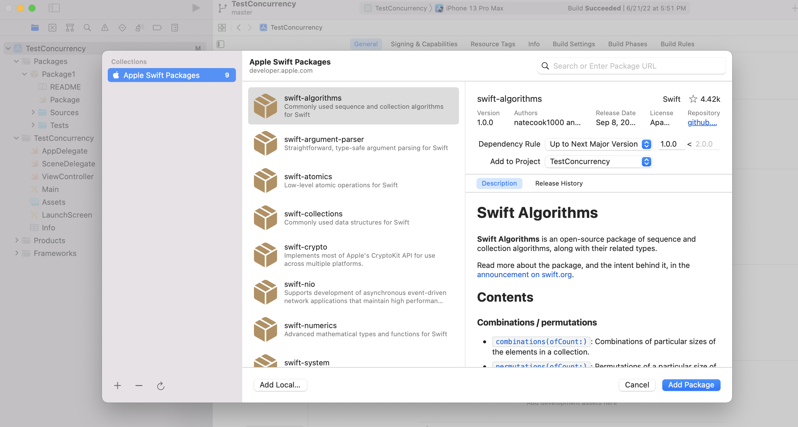
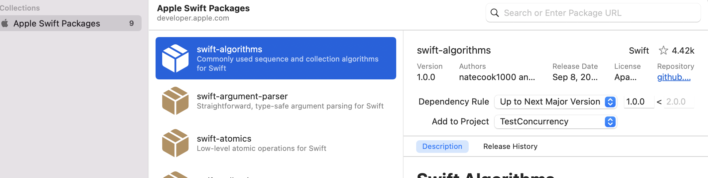
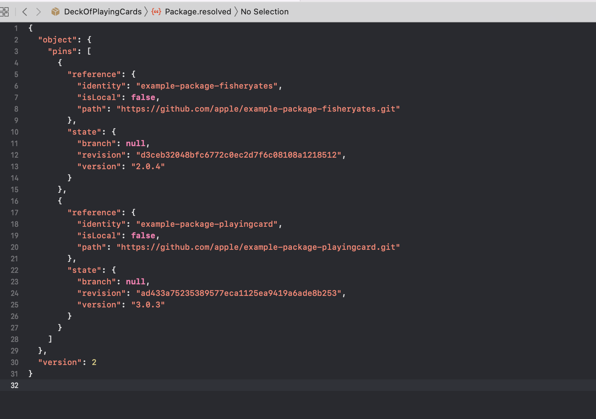
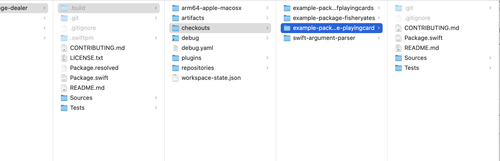

##### Adding a Swift package to an existing Xcode project

It can be done through the project's 'Frameworks, Libraries, and Embedded Content > Add Package Dependency' and then 'Add Local or Apple Swift Packages'.

Add Package Dependency | Select Package
--- | ---
 | 

When the package is added through a Github URL or using Apple's standard packages menu, the versioning rule can also be specified.

All remote packages added to a repository probably get shown in project navigator pane under a 'Swift Package Dependencies' section and if there is a `.xcodeproj` file also in  'Project settings > Package Dependencies'.

Thereafter the package becomes available to in Xcode as a library, but still does need to be added afresh to the workspace.

> As a convenince, if a remote package being used in a project needs to be edited and tried with the consumer project its possible to simply download the remote package and add it to the consumer project and then simply edit them. Doing this does not mess up the consumer app's package dependencies, Xcode knows this dependency is now available locally and simply uses that.

When using version control for a consumer project that uses packages, the `.xcshareddata > swiftpm` folder should be checked-in as well into commits as that is where resolved package dependencies are stored (in `Package.resolved` file) and this needs to be same across the entire team.

##### When are dependencies downloaded

When the `swift build` command is run, Swift Package Manager downloads all of the dependencies, compiles them, and links them to the package module.

All the dependencies are in fact also automatically downloaded once the package is opened with Xcode.

The downloaded sources are typically present in the `.build/checkouts` directory at the root of the project, and intermediate build products in the `.build` directory at the root of the project packages. Once built they are typically present in `DerivedData/<PackageOrProjectName>/SourcePackages/checkouts`.

In root `.build` | In Derived Data `SourcePackages`
--- | ---
 | 

The packages can probably also be updated using `swift package update` command.
