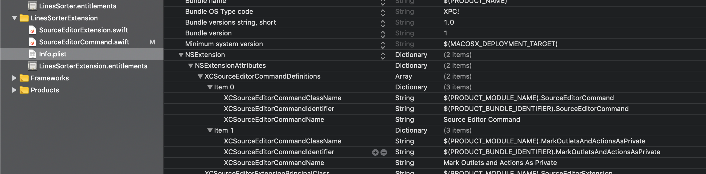

#### What is it

Xcode source editor extensions were introduced in Xcode 8 (2016) and give a way to add custom menu options to Xcode (in `Editor` section), to add features to Xcode.

> While previously similar things were done using Xcode plugins, they have since been decommissioned (although they were quite powerful). <br>
As of early Xcode 10 (early 2019) Xcode source editor extensions are somewhat limited (when compared to Xcode plugins) and can only work on one file at a time.

Scope wise, Xcode source editor extensions can change code in the current file, perform selections, and also do certain kind of navigations (like what?).

A single extension app can have multiple extensions in it. They would all show up as different menu items under the same heading.

#### How to make a source editor extension

It is just like any other extension and does need an accompanying macOS app. This macOS app can in turn be used for certain configuration (say downloading some `js` files the extension would need).

The extension can be added as a new target of the type `Xcode source editor extension`.

For every extension command (i.e. Xcode Editor menu option), an entry is added to the extension's `Info.plist` file's `XCSourceEditorCommandDefinitions` key.


Every command gets following keys.
```
XCSourceEditorCommandName - The display name for command's menu item
XCSourceEditorCommandClassName - The class that corresponds to the extension
XCSourceEditorCommandIdentifier - A unique identifier for the command
```

###### A bit of underlying architectural theory

Since Xcode extensions are application extensions, each one runs in its own process and can do pretty much whatever it wants within its process without interfering with Xcode or with other extensions. Additionally, as application extensions are built on top of Mach messaging and XPC, they are fully asynchronous and are hence fast.

Also, Source editor extensions aren't like some other kinds of application extensions in the sense the other extensions are only used once, and then shutdown. (So once started, a source editor extension is always active?)
