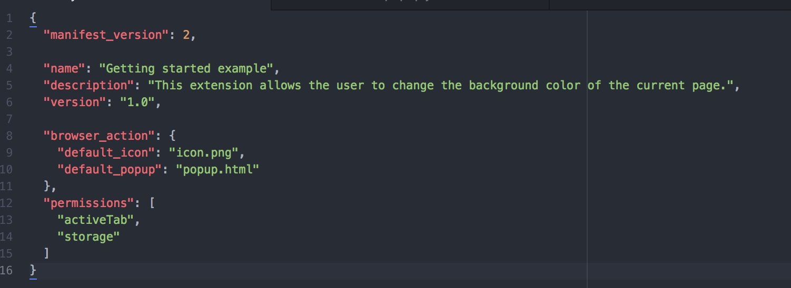
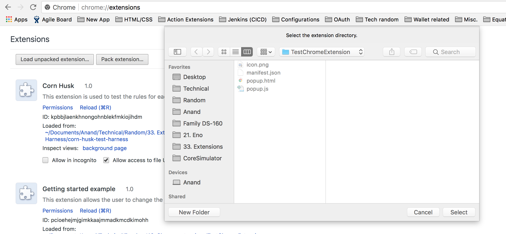

###### Creating a simple extension -

Its very easy. Create a folder and add at least these files to it -

	1. A json file named as manifest.json
	2. A html file that will serve as the extension's UI
	3. A JS file if the extension needs any JS (it usually will)

There can be more files added here as needed. Like various resources (i.e. images, etc.), more html pages, etc.

`manifest.json` is the file that serves as the extension's specs. This is the file that Chrome looks into to find out different things about the extension. So there are some special keys that need to go into it.

Here is a very simple manifest file. name specifies the extension's name (also shows up as a tooltip in browser). `default_icon` specifies the image it uses as its icon. `default_popup` specifies the html file to be used for the extension.

The html file is just a regular html file. If the extension needs a js, it must be specified in the html though (usually in a script tag in the head).

###### Loading extensions -

Extensions are packaged as `.crx` file and this format is automatically created when uploading to Chrome Web Store. During dev though, either the entire folder itself can be added to Chrome using Load Unpacked Extensions option in extensions page (the developer mode checkbox must be checked though before it).

Or the folder can just be dragged and dropped into the extensions home page.

And that's it the extension shows up next to the omnibox after that.
