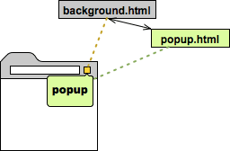
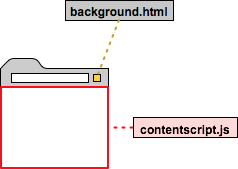
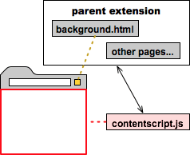

`Background pages` - UI-less pages that usually have the main logic of the extension. They are probably named as background.html. There are two kinds of background pages. Persistent background pages are always open, event pages are opened and closed as needed. It seems as if an extension can have only one background page.

`Content script` - The extension can interact with the parent webpage only through this. It runs within the context of the webpage and should be thought as belonging to the parent webpage rather than the parent extension. It communicates with the extension's files using something called messages.

`Actions` - Extensions also need to specify their action types. Any extension is allowed to have at most one `browser action` or `page action`. Browser action is used when the extension is relevant to most pages. Page action is used when the extension's icon should be active or inactive (and greyed out), depending on the page.
(Not very clear on this, need more examples.)

All of an extension's pages execute in same process on the same thread, and hence the pages can make direct function calls to each other. So what it means is that HTML pages inside an extension have complete access to each other's DOMs, and they can invoke functions on each other. (So they do not have access to DOM of other webpages that might be currently open?)
