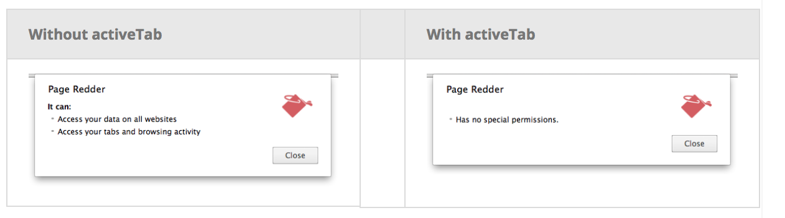

###### activeTab permission -

If the extension needs to access the tab, it has to specify so in manifest file. Without an activeTab specification the user gets all tabs access warning during extension installation. With this permission though, the user does not get any warning and the extension can still access the currently active tab if the user initiates the extension by tapping the icon (i.e. browser action) himself.

```
"permissions": [
    "activeTab"
],
```



Technically speaking, this permission is needed for

1. Calling `tabs.executeScript` or `tabs.insertCSS`, that is practically nothing but programmatic injection of content scripts.

2. Getting the URL, title and favIcon of the tab (done via tabs.Tab)

3. Intercept network requests in the tab to the tab's main frame origin (need to see this).
