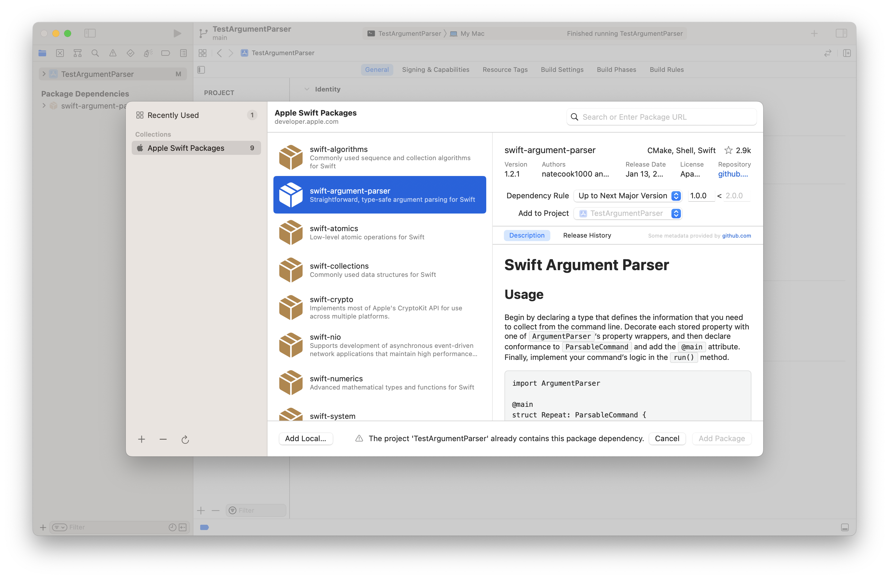
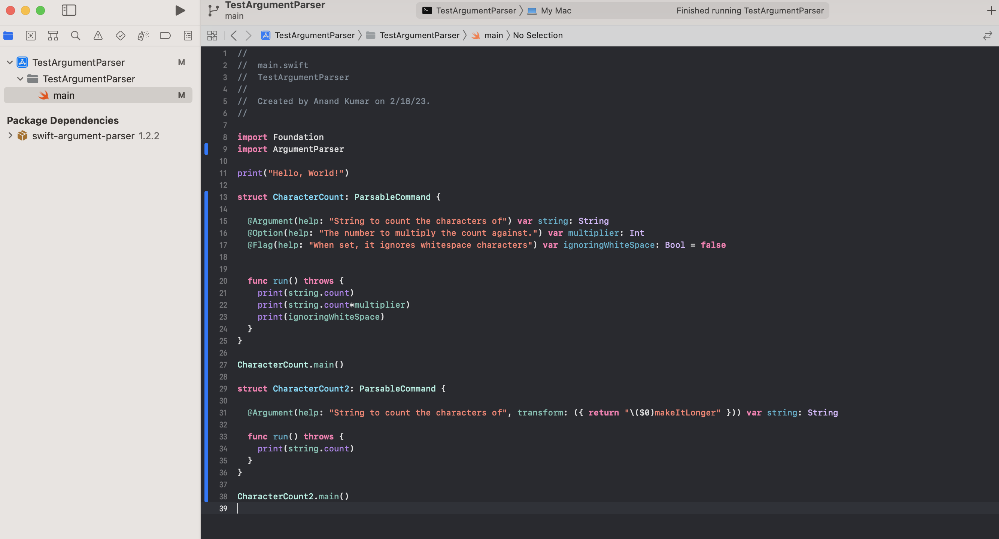
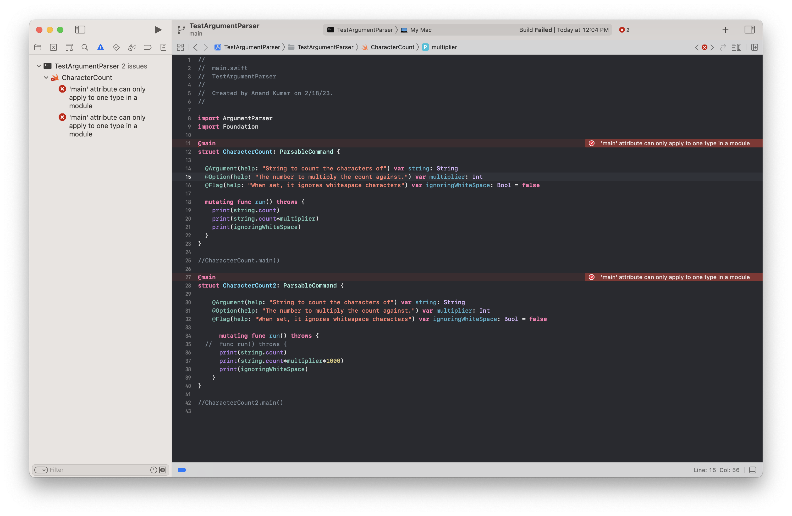
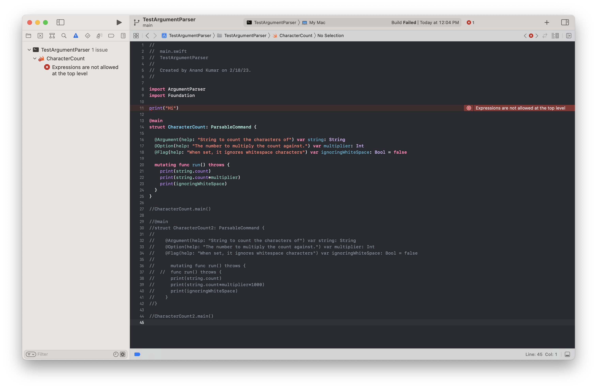

[toc]

#### What is it

Essentially an Apple package that makes it easier to work with arguments passed to command line applications/executables. The precise name of the package is `swift-argument-parser` and the framework that needs to be imported in code is `ArgumentParser`.



[(Reference)](https://apple.github.io/swift-argument-parser/documentation/argumentparser/gettingstarted/) 

#### Basic syntax

Any struct that conforms to `ParsableCommand` protocol, is capable of parsing command line arguments using `SwiftArgument`. The struct needs to have the `run()` function implemented as that is where the struct runs some code and produces some output. And the struct's static `main()` function needs to be manually invoked in the code for it to actually run.

There are 3 important property wrappers that any property in this struct can be qualified with - `@Argument`, `@Option`, `@Flag` and they all parse different types of command line arguments.

> Technically, there can be multiple ParsableCommand structs in the same executable package and if all them have their main() invoked, they all get to run when the executable is invoked.




Its also possible to use the `@main` attribute for a ParsableCommand struct, instead of actually invoking the `main()` function that is. However, with this just ParsableCommand struct can have the `@main` attribute in a given module. Additionally, any code is not allowed outside the struct. Otherwise, there will be an error that says "'main' attribute cannot be used in a module that contains top-level code".

| Just one struct with `@main` attribute in a module | No top-level-code if `@main` attribute is used |
| -------------------------------------------------- | ---------------------------------------------- |
|                       |                   |

> Note that even when there is just one `ParsableCommand` struct, and it has a `@main` attribute there is the same "'main' attribute cannot be used in a module that contains top-level code" error shown if the struct is in a file named `main.swift`. Its a bug, and the [workround](https://github.com/apple/swift/issues/55127#issuecomment-1108412939) is to name the file anything other than `main.swift`.
>
> In fact, this is now a documented behavior in Apple's documentation. The Swift compiler uses either the type marked with `@main` or a `main.swift` file as the entry point for an executable program. You can use either one, but not both. ([Link](https://apple.github.io/swift-argument-parser/documentation/argumentparser/gettingstarted/))


#### @Argument, @Option, @Flag - Basics

`@Argument` - A property wrapper for positional arguments. The 1st argument is parsed into the first property, the 2nd argument to the second property, and so on.

`@Option` - A property wrapper for named (i.e. labeled) options. Basically arguments that are specified using key-value pairs and are preceded with `--` or `-`. They are order-indepenedent. The key and value can be separated by `=` or whitespace.

```
% count --input-file readme.md --output-file readme.counts

struct Count: ParsableCommand {
    @Option var inputFile: String
    @Option var outputFile: String
    ...
}
```

`@Flag` - A property wrapper for 'optional/option' flag arguments, i.e. arguments that are preceded by `--` but are not key-value pairs. It denotes a command-line input that looks like `--name`, deriving its name from the name of your property. Flags are most frequently used for Boolean values, like the `verbose` property here. They are probably always supposed to have a default value.

```
% count --input-file readme.md --output-file readme.counts
(no output)

% count --verbose --input-file readme.md --output-file readme.counts
Counting words in 'readme.md' and writing the result into 'readme.counts'.

struct Count: ParsableCommand {
    @Option var inputFile: String
    @Option var outputFile: String
    @Flag var verbose = false
    ...
}
```

> Wherever applicable (in case of options and flags), property names are converted from camelCase to hyphenated-string in commands.

##### name attribute

The argument names expected in the command line for both `@Option` and `@Flag` properties can be customized to some extent using the `name` parameter in property wrapper.

```
% count -v -i readme.md -o readme.counts
Counting words in 'readme.md' and writing the result into 'readme.counts'.

% count --input readme.md --output readme.counts -v
Counting words in 'readme.md' and writing the result into 'readme.counts'.

% count -o readme.counts -i readme.md --verbose
Counting words in 'readme.md' and writing the result into 'readme.counts'.

@main
struct Count: ParsableCommand {
    @Option(name: [.short, .customLong("input")])
    var inputFile: String

    @Option(name: [.short, .customLong("output")])
    var outputFile: String

    @Flag(name: .shortAndLong)
    var verbose = false
    
    mutating func run() throws { ... }
}
```

The default name specification is `.long`, which uses a property’s name with a two-dash prefix. `.short` uses only the first letter of a property’s name with a single-dash prefix, and allows combining groups of short options. 

You can specify custom short and long names with the `.customShort(_:)` and `.customLong(_:)` methods, respectively.

Or use the combined `.shortAndLong` property to specify the common case of both the short and long derived names.

#### Providing Help

`ArgumentParser` automatically generates help for any command when a user provides the `-h` or `--help` flags.

Custom options and flag can have descriptive text specified by passing string literals as the `help` parameter in their property wrappers.

```
struct Count: ParsableCommand {
    @Option(name: [.short, .customLong("input")], help: "A file to read.") var inputFile: String
    @Flag(name: .shortAndLong, help: "Print status updates while counting.") var verbose = false
    ...
}

% count -h
USAGE: count --input <input> --output <output> [--verbose]

OPTIONS:
  -i, --input <input>     A file to read. 
  -o, --output <output>   A file to save word counts to. 
  -v, --verbose           Print status updates while counting. 
  -h, --help              Show help information.
```

For more control over the help text, `ArgumentHelp` instance can be used instead of a string literal. 

```
    @Argument(help: ArgumentHelp(
        "The input file.",
        discussion: "If no input file is provided, the tool reads from stdin.",
        valueName: "file"))
```

There are few more things like `ArgumentVisibility`, `NameSpecification`.

([Reference](https://apple.github.io/swift-argument-parser/documentation/argumentparser/customizinghelp/))

