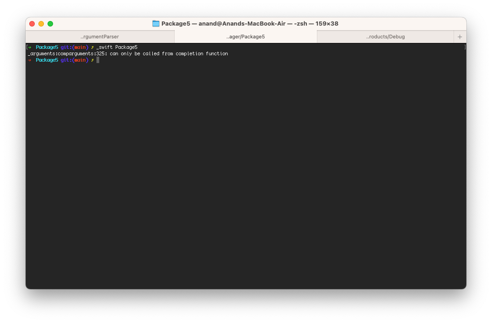
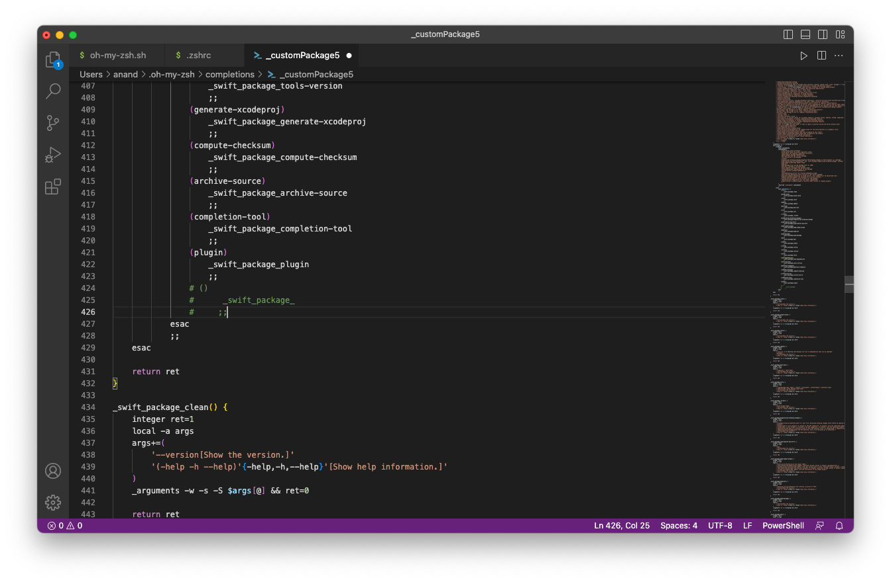

> Technically, its possible to generate completion scripts for command line tools that use ArgumentParser, but when I try following the steps and using, it just gives error. 

[Apple documentation](https://apple.github.io/swift-argument-parser/documentation/argumentparser/installingcompletionscripts/) <br>

[SPM PR which added this feature](https://github.com/apple/swift-argument-parser/pull/123)


So the recommended steps are this.

1. Run the command with the option `--generate-completion-script` followed by your specific shell's name.

   ​	```$ customCommand --generate-completion-script zsh```

   

2. Then copy the generated script and put it as required by your shell (make sure to have the filename of the format _xyz, it has to start with _).

   1. In case of zsh, it needs to be put somewhere and the location added in `$fpath` in `.zshrc` file. Also, this has to be added to `.zshrc`

      ```autoload -U compinit
      autoload -U compinit
      compinit
      ```

      

   2. If oh-my-zsh framework is being used, then I think just the script needs to be added. But is that if `[https://github.com/matchaxnb/oh-my-zsh/tree/master/plugins/swiftpm](https://github.com/matchaxnb/oh-my-zsh/tree/master/plugins/swiftpm)` plugin (a. built in Swift Package Manager plugin that comes with oh-my-zsh) has been activated. ([Article](https://blog.eidinger.info/autocompletion-for-swift-package-manager-commands))

      

But regardless, it just hasn't worked. It gives this error.

```
_arguments:comparguments:325: can only be called from completion function
```



Actually before that it gives another error which says something about a syntax error in the completion script around line 425, which are these. if I comment it, then it goes to the line 325 error. (Other folks seeing same error - [2020 post](https://forums.swift.org/t/zsh-completions-using-generate-zsh-script-output-not-working/32452))

