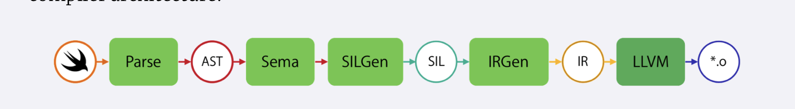
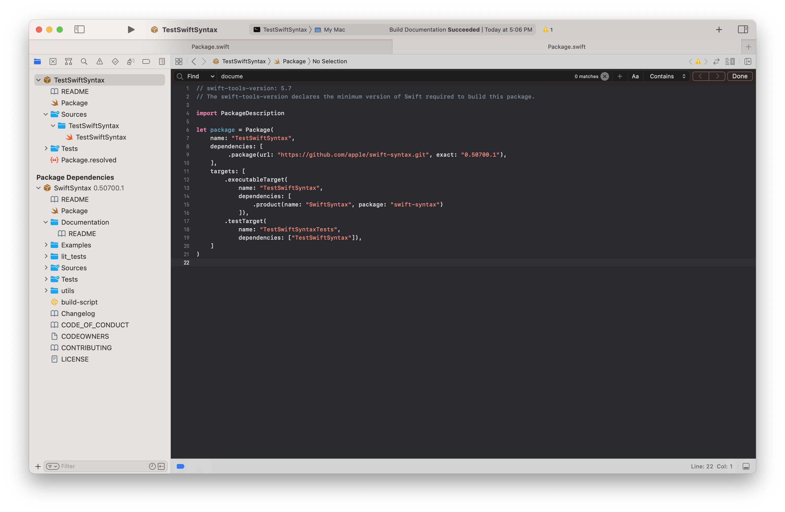
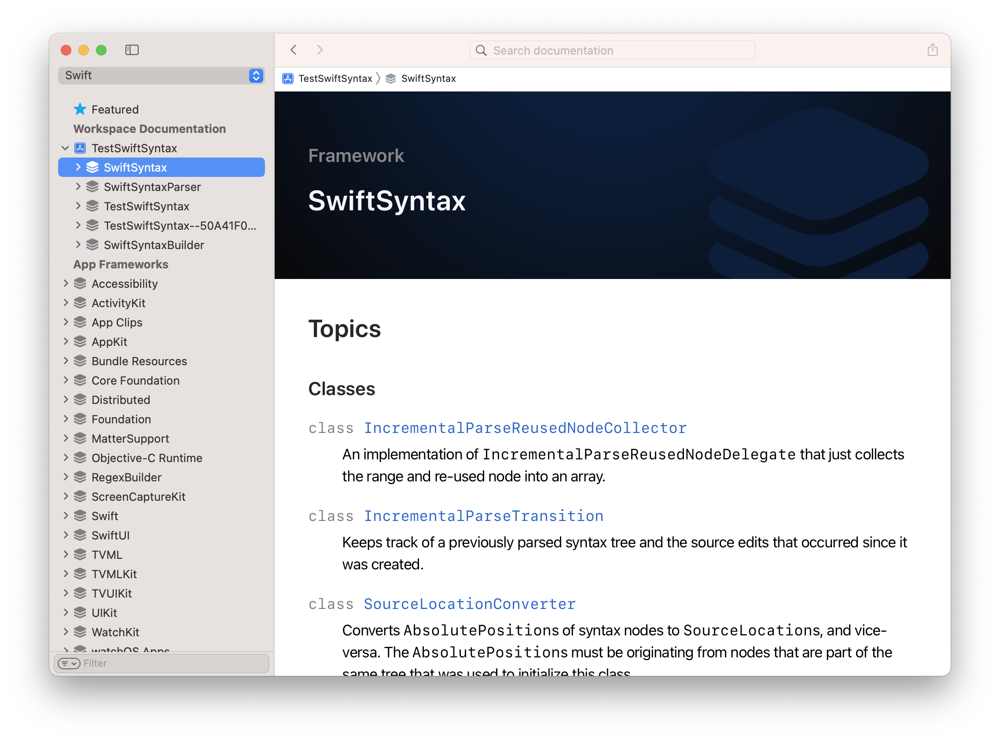

[toc]

Essentially, a [package](https://github.com/apple/swift-syntax). Its a set of Swift libraries for parsing, inspecting, generating, and transforming Swift source code. Officially, its still in development and its API is not guranteed to remain stable. Its not available in Apple's Swift Package Collection yet and needs to be added by manually specifying it as a dependency in Package.swift. 

###### What does SwiftSyntax operate upon

(From [NSHipster](https://nshipster.com/swiftsyntax/) SwiftSyntax article from ~2018)

In a typical process of compiling Swift code, this is what happens.

1. [Parser](https://github.com/apple/swift/tree/master/lib/Parse), which generates an `Abstract Syntax Tree, i.e. AST`. (Is Lexer the same thing as Parser?)

2. From there, semantic analysis is performed on the syntax to produce a type-checked AST, which is lowered into [Swift Intermediate Language](https://github.com/apple/swift/blob/master/docs/SIL.rst); i.e. the `SIL`.

3. The SIL is transformed and optimized and itself translated into [LLVM IR](http://llvm.org/docs/LangRef.html).

4. The LLVM IR is ultimately compiled into machine code.



`SwiftSyntax` operates on the AST generated at the first step of the compilation process. As such, it can’t tell you any semantic or type information about code.

>  [Apple's SourceKit](https://github.com/apple/swift/tree/master/tools/SourceKit) (a framework for supporting IDE features like indexing, syntax-coloring, code-completion, etc) operates with a much more complete understanding of Swift code. This additional information can be helpful for implementing editor features like code-completion or navigating across files. But there are plenty of important use cases that can be satisfied on a purely syntactic level, such as code formatting and syntax highlighting.

###### AST format

Consider the following single-line Swift file, for which AST (in JSON format) can be generated using the mentioned command.

```
func one() -> Int { return 1 }

$ xcrun swiftc -frontend -emit-syntax ./One.swift
```

The generated AST looks like this.

```
{
    "kind": "SourceFile",
    "layout": [{
        "kind": "CodeBlockItemList",
        "layout": [{
            "kind": "CodeBlockItem",
            "layout": [{
                "kind": "FunctionDecl",
                "layout": [null, null, {
                    "tokenKind": {
                        "kind": "kw_func"
                    },
                    "leadingTrivia": [],
                    "trailingTrivia": [{
                        "kind": "Space",
                        "value": 1
                    }],
                    "presence": "Present"
                }, {
                    "tokenKind": {
                        "kind": "identifier",
                        "text": "one"
                    },
                    "leadingTrivia": [],
                    "trailingTrivia": [],
                    "presence": "Present"
                }, ...
```

At the top-level, there is a `SourceFile` consisting of `CodeBlockItemList` elements and their constituent `CodeBlockItem` parts. This example has a single `CodeBlockItem` for the function declaration (`FunctionDecl`), which itself comprises subcomponents including a function signature, parameter clause, and return clause.

The term `trivia` is used to describe anything that isn’t syntactically meaningful, like whitespace. Each token can have one or more pieces of leading and trailing trivia. 

`SwiftSyntax` generates AST by delegating system calls to `swiftc` (i.e. Swift compiler), just as how the above command generated a sample AST.

###### How to add SwiftSyntax as a dependency

It needs to be manually specified in `Package.swift` (so can only be added in a SPM exe and not in a regular command line tool?). Both in package dependencies and in executableTarget's dependencies. 



And then an `import SwiftSyntax` can be done in the code.

###### Documentation

Being an in-development package still, its documentation is rather unusual. The only official [documentation](https://github.com/apple/swift-syntax#documentation) at this point is in GH. Another way to generate documentation is by importing all the concerned modules in a test project, and then generating its DocC documentation (Cmd Ctrl Shift D) and then navigate to the project's documentation in the documentation window, it will also have documentation/reference for all the imported modules of SwiftSyntax.



###### SyntaxTreeBuilder

`SyntaxTreeBuilder` module has the `SwiftParser` library and that is the library which has APIs for converting source code string to syntax trees.

```
let codeString  =
  """
  import Foundation

  func testA() {
    print("hello world")
  }
  testA()
  """

let rootNode: SourceFileSyntax = try! SyntaxParser.parse(source: codeString)
print(rootNode.description)
```

[Some documentation](https://github.com/apple/swift-syntax/blob/main/Sources/SwiftSyntax/Documentation.docc/Working%20with%20SwiftSyntax.md#building-syntax-trees)

`Syntax` represents a tree of nodes with tokens at the leaves. <br>`SourceFileSyntax` represents a syntax tree.

###### Things worth checking

- NSHipster article on SwiftSyntax also makes a reference to something called [Gyb](https://nshipster.com/swift-gyb/) (an acronym for Generate Your Boilerplate), a Python script to generate source code using a set of template tags.

- The same article also makes a reference to an interface (AppKit/CommandLine?) named [TemporaryFile](https://nshipster.com/temporary-files/) when a mock representation of a temporary file is needed.

- NSHipster article on [Mirror / CustomReflectable / CustomLeafReflectable](https://nshipster.com/mirror/).