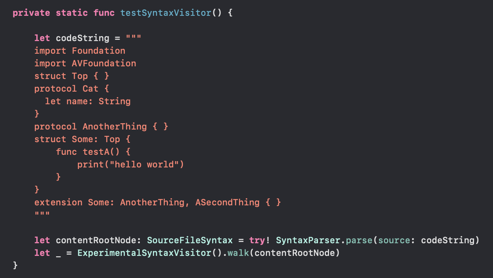
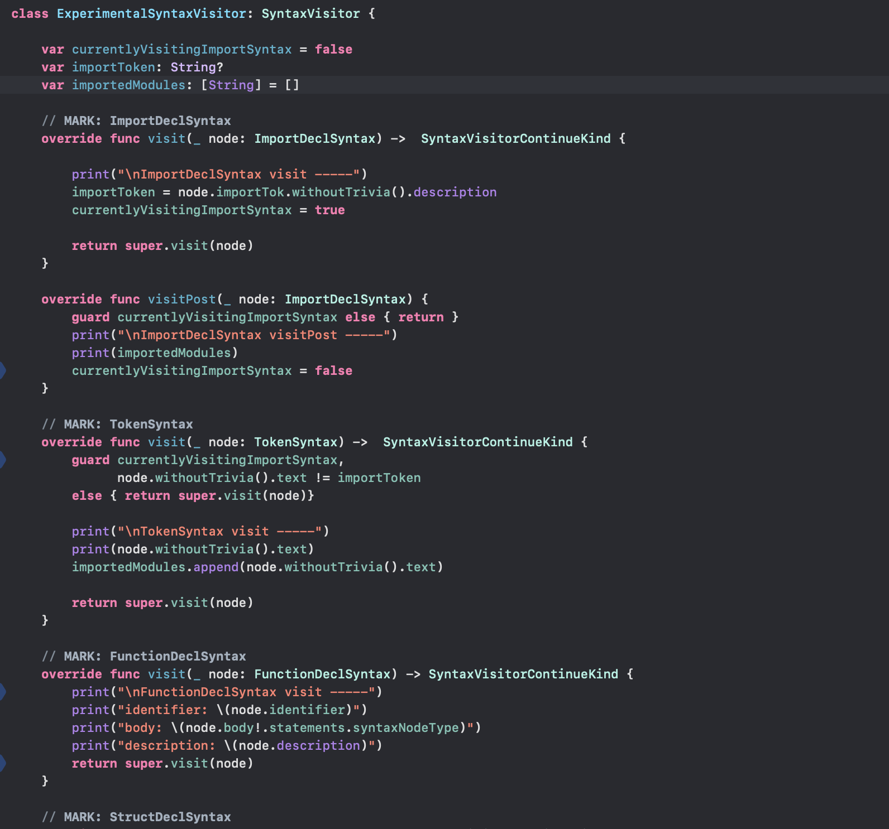
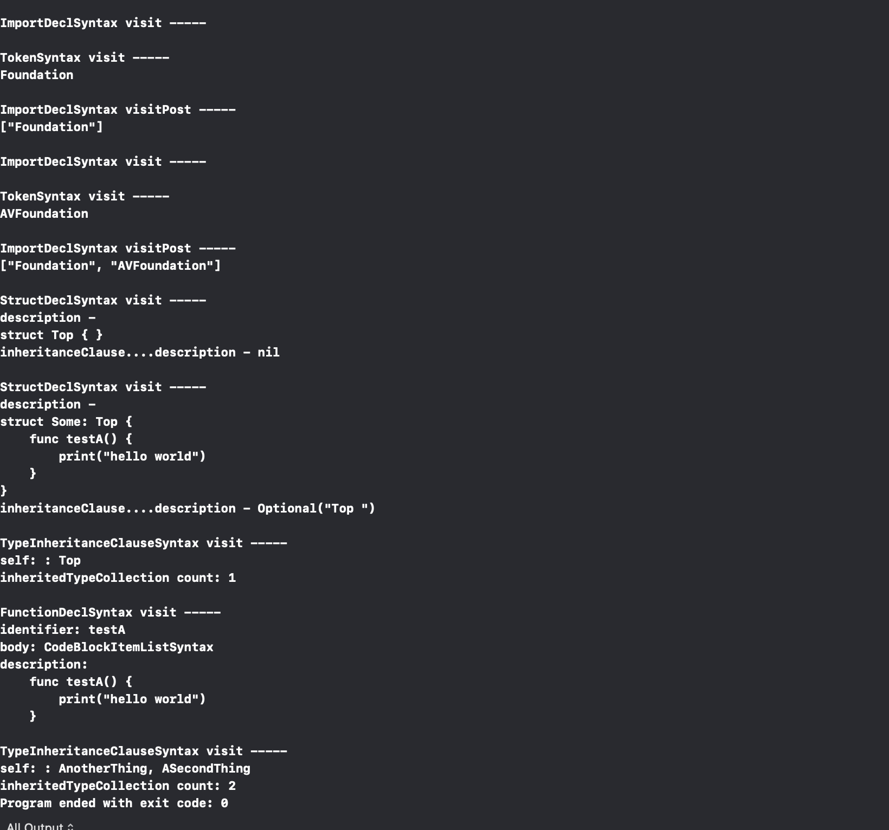

[toc]

##### Navigating a Syntax Tree

There are several ways of traversing the syntactic structure of a syntax tree.

 Every node includes a reference to its parent node via the `SyntaxProtocol/parent` accessor, and a reference to its child nodes via the `SyntaxProtocol/children(viewMode:)` method. The children of a syntax tree always appear in order and the associated `viewMode` allows the client to express their intent to process missing and unexpected syntax.

Some types of nodes also contain strongly-typed APIs to access those same child nodes individually. For example, `ClassDeclSyntax` provides an `ClassDeclSyntax/identifier` to get the name of the class, as well as `ClassDeclSyntax/members` to get the syntax node representing the braced block with its members.

The most common way of navigation is to use a `SyntaxVisitor` . It walks source code from the root to its leaves. 

To inspect a particular kind of syntax node, a client needs to override the corresponding `visit` method accepting that kind of syntax. The visit methods are invoked as part of an in-order traversal of the syntax tree. To provide a post-order traversal, the corresponding `visitPost` methods can be overridden.

###### Example

Consider the below source code.

| SyntaxVisitor code                               | SyntaxVisitor ouput                              |
| ------------------------------------------------ | ------------------------------------------------ |
|  |  |

> So one way to keep track of code is to have markers to what's currently been visited and then clear them after the `visitPost()` invocation.

##### ImportDeclSyntax

`importTok.withoutTrivia().description` - Gives the 'import' token, i.e. the keyword 'import'.

##### TokenSyntax

`node.withoutTrivia().text` - Gives various tokens in the code. For example, in the line 'import Foundation' both 'import' and 'Foundation' are separate tokens. `visit(_ node: TokenSyntax)` will be called once each for both.

##### FunctionDeclSyntax

`node.identifier` - Gives the function name.

`node.body` - Gives the entire function body with curly braces too.

`node.body.statements` - Gives the entire function body without curly braces.

##### TypeInheritanceClauseSyntax

`inheritedTypeCollection` - Gives a list of inherited types. So for 'extension Some: AnotherThing, ASecondThing { }' it will return '[AnotherThing, ASecondThing]'.

----

