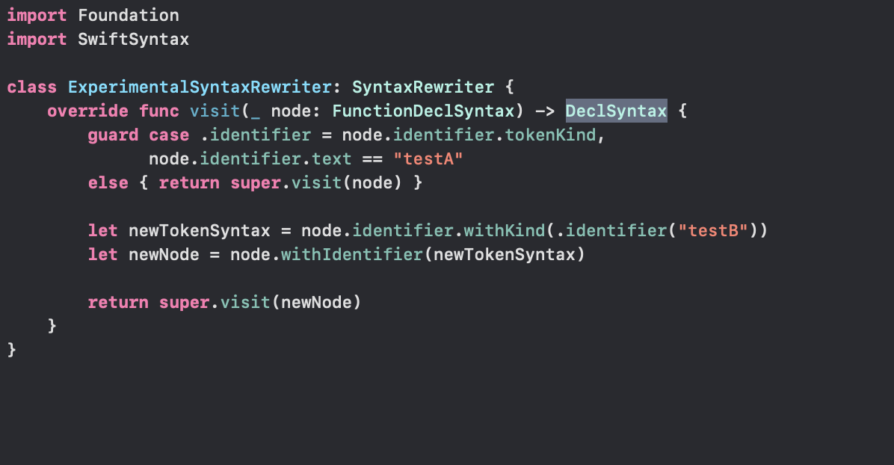
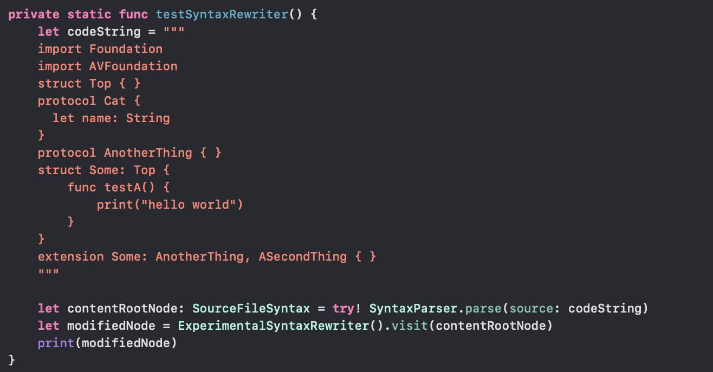

[toc]

##### SyntaxRewriter

So one way to modify code is to use `SyntaxRewriter` but for some reason its listed under Santax tree navigation section in the [documentation](https://github.com/apple/swift-syntax/blob/main/Sources/SwiftSyntax/Documentation.docc/Working%20with%20SwiftSyntax.md#navigating-the-syntax-tree) and not syntax tree modification.

A custom subclass of `SyntaxRewriter` needs to be created and then whatever kind of syntax node needs to be modified its corresponding function should be overridden (just how `SyntaxVisitor` is written too). The overridden functions though would need to return a `DeclSyntax` which is basically a new node to replace the current node being introspected. The rewriter is invoked using  a `visit()` function and it returns a modified syntax tree.

In the below example the function name 'testA' is changed to 'test B'.

| Custom SyntaxRewriter                            | Invoking the SyntaxRewriter                      |
| ------------------------------------------------ | ------------------------------------------------ |
|  |  |

[Dalton Sweeney's blog example](https://daltyboy11.github.io/fun-with-swift-syntax/#returning-a-new-tokensyntax-node) <br>

[A collection of useful SyntaxRewriter extensions](https://github.com/inamiy/SwiftRewriter/tree/master/Sources) <br>

All modifications of the syntax tree are expressed as in-place updates to an existing syntax tree, and return new syntax trees. There are a set of high-level APIs for expressing these modifications. In general, data in syntax nodes can be accessed via a getter and updated with a corresponding `with*` method. That is what is done in the above example using `withIdentifier()` function.

##### SyntaxFactory

`SyntaxFactory` APIs, allows you to generate entirely new Swift code from scratch. It isn't trivial, but is sometimes useful. Here is an example from [NSHipster](https://nshipster.com/swiftsyntax/).

```
let structKeyword = SyntaxFactory.makeStructKeyword(trailingTrivia: .spaces(1))

let identifier = SyntaxFactory.makeIdentifier("Example", trailingTrivia: .spaces(1))

let leftBrace = SyntaxFactory.makeLeftBraceToken()
let rightBrace = SyntaxFactory.makeRightBraceToken(leadingTrivia: .newlines(1))
let members = MemberDeclBlockSyntax { builder in
    builder.useLeftBrace(leftBrace)
    builder.useRightBrace(rightBrace)
}

let structureDeclaration = StructDeclSyntax { builder in
    builder.useStructKeyword(structKeyword)
    builder.useIdentifier(identifier)
    builder.useMembers(members)
}
```

The above code just generates this much.

```
struct Example {
}
```

##### SyntaxTransformVisitor

> The [GH documentation](https://github.com/apple/swift-syntax/blob/main/Sources/SwiftSyntax/Documentation.docc/Working%20with%20SwiftSyntax.md#navigating-the-syntax-tree) also talks about something called `SyntaxTransformVisitor`. "To provide a source transformation, use a `SyntaxTransformVisitor`. Types conforming to this protocol are given the chance to transform the nodes of a syntax tree into a user-defined result type. This can be anything from new syntax nodes in the case of a formatter, to an integer counter in the case of a lexical analyzer counting the number of lines in the source code."
>
> But not seeing any documentation for it. Has it been decommissioned?
