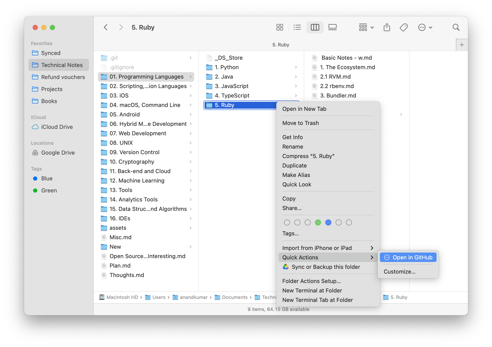
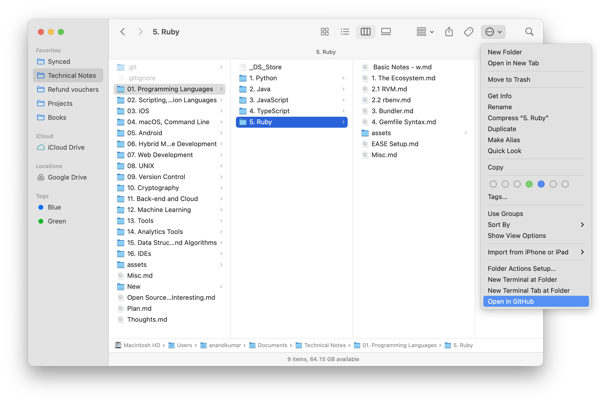
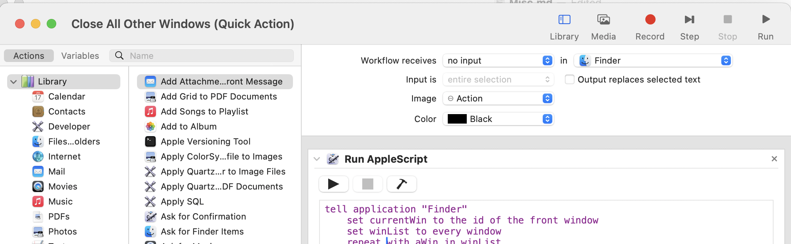
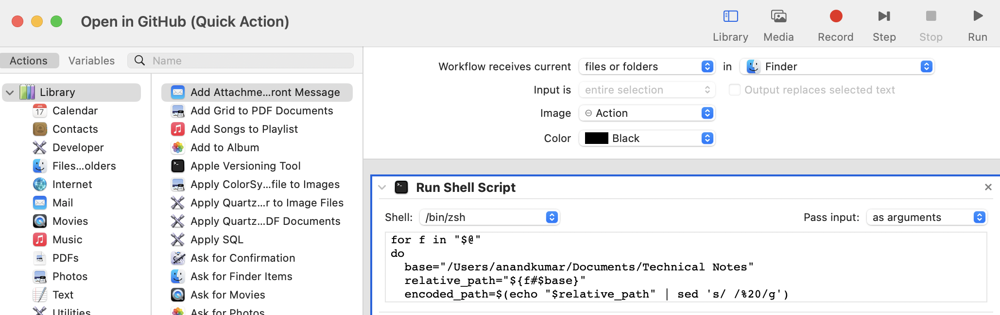
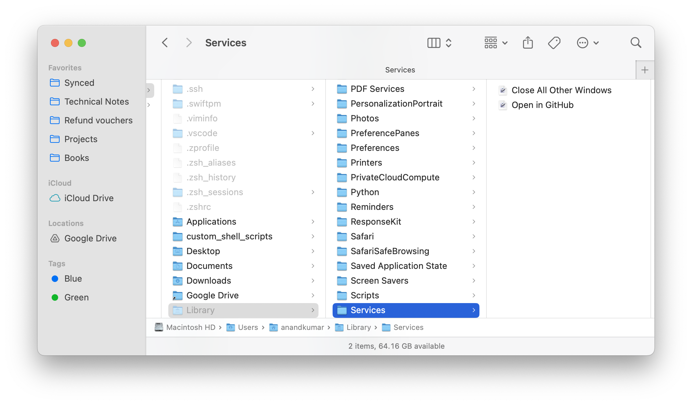

[toc]

[Documentation](https://support.apple.com/guide/automator/use-quick-action-workflows-aut73234890a/mac)

##### What are Finder Quick Actions

They are basically little workflows or commands you can run directly from the context menu (i.e. the menu that appears on right clicl) or the Preview pane in Finder. They are built in Automator or Shortcuts app.

They can appear in various places in Finder. For example,

| Menu option in `Finder > Services`.                          | Context Menu option 'Quick Actions'                          | Toolbar option                                               |
| ------------------------------------------------------------ | ------------------------------------------------------------ | ------------------------------------------------------------ |
|  |  |  |

##### How to create them using Automator

1. **Automator** > New document > **Quick Action**

2. Select inputs (some example below)  

   | Receives 'no input' in Finder                                | Receives 'current files or folders' in Finder, Pass input 'as arguments' |
   | ------------------------------------------------------------ | ------------------------------------------------------------ |
   |  |  |

3. Select action (some examples in above point itself - One runs an AppleScript, and the other runs a Shell Script')

4. Save it and give it a name

##### Where are they saved

They get saved in `~/Library/Services/`. It BTW is not a location where you can yourself put some files manually, it has to be done through Automator Quick Action.

##### How to assign keyboard shortcut to a script (QuickAction)

Go to **System settings** > Keyboard > Keyboard Shortcuts > **Services** > General and assign that quick action a keyboard shortcut.

